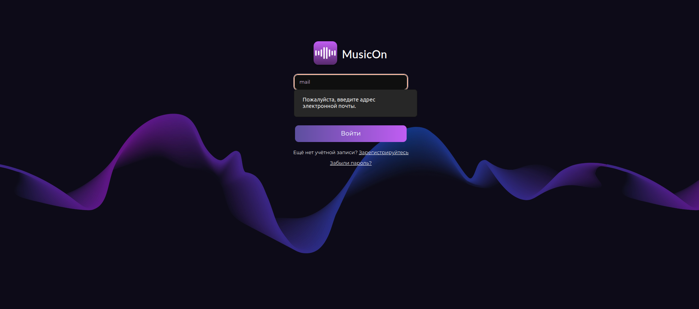
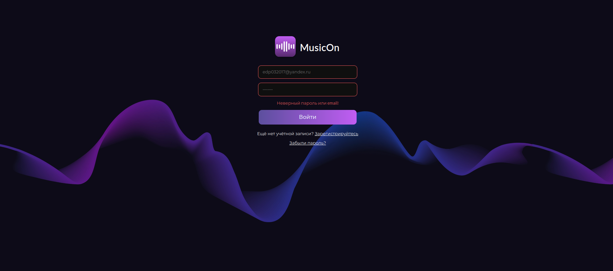
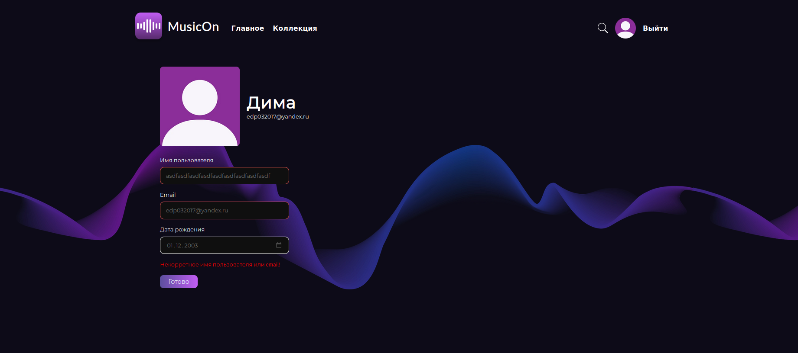
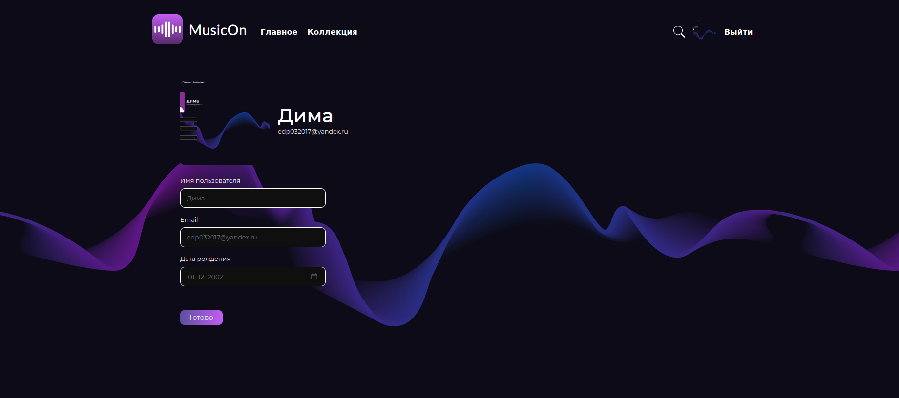
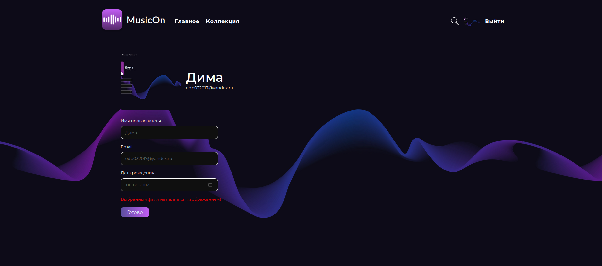
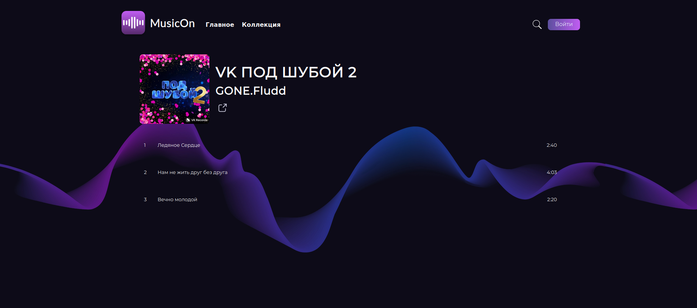

# Домашнее задание 1 по курсу QA команды AdDo

## Тестируемые части:
1. [Страница авторизации](#auth)
2. [Страница регистрации](#register)
3. [Хедер](#header)
4. [Главная страница с музыкой](#feed)
5. [Профиль](#me)
6. [Страница Альбома](#album)
7. [Страница Артиста](#artist)
8. [Страница Плейлиста](#playlist)
9. [Страница создания плейлиста](#playlist-create)
10. [Страница поиска](#search)
11. [Плеер](#player)

 
# Страница авторизации

1. Авторизация находится по [ссылке](https://musicon.space/login)

2. Поле email проверяется на регулярку вида *[*]@[*].[*]* В случае если инпут пользователя не подходит под регулярку, то пользователь получает
сообщение об ошибке

3. Пароль при авторизации проверяется на длину: его длина должна быть от 6 до 30 символов

4. При попытке авторизоваться за пользователя, не добавленного в базу, получаем сообщение об ошибке, что ввели неверный логин или пароль  

5. При переходе на [ссылку авторизации](https://musicon.space/login) уже авторизованного пользователя, его не перенаправляет на главную, а он получает возможность
авторизоваться снова.
6. При вводе логина и пароля, которые валидны и существуют в базе, пользователя перенаправляет на [главную](https://musicon.space/)

# Страница регистрации

1. При добавлении в имя пользователя и email любых символов кроме букв и цифр выводится корректное сообщение об ошибке.
Такое же сообщение выведется при попытке задать слишком короткий пароль.

2. При вводе разных паролей выводится корректное сообщение о том, что пароли не совпадают.

3. При попытке ввода даты ранее 01.01.1901 или позднее текущего дня выводится сообщение об ошибке.  

4. При вводе корректных данных и нажатии кнопки Зарегистрироваться регистрация успешно завершается.

# Хедер

Хедер для неавторизованного пользователя

Хедер для авторизованного пользователя

## Общее

* Хедер присутствует на каждой странице
* В хедере присутствует логотип, "Главное", "Коллекция", кнопка поиска
* Если у пользователя нет аватара, отображается аватар по умолчанию

## Логотип

* При нажатии происходит переправление на главную страницу

## Главное

* При нажатии на "Главное" открывается главная страница и изменяется цвет текста на акцентный

## Коллекция

* При нажатии на "Коллекция" открывается страница с любымии треками, альбомами и плейлистами, цвет текста меняется на акцентный

## Поисковая кнопка

* При нажатии элементы левее кноки "Поиск" и сама кпопка "Поиск" заменяются на input для поиска треков, исполнительней, альбомов и плейлистов, а также кнопки "Стрелка" и "Крестик" для скрытия поискового инпута и отображения исходных элементов хедера

* При вводе текста в input появляется всплывающее окно с резльтатами поиска

* При нажатии на кнопку "Крестик" или кпонку "Стрелка" скрывается поисковой инпут и отображается исходный элемент хедера

* При нажатии на кпопку "Войти" (неавторизованный пользователь) открывается страница логина

* При нажатии на аватар (авторизованный пользователь) открывается страница профиля

* При нажатии на кнопку "Выйти" (авторизованный пользователь) происходит разлогин и появляется попап с подтверждением выхода из аккаунта 

* При нажатии на кпонку "Отмена" скрывается попап и не происходит разлогин пользователя

* При нажатии на кпонку "Подтвердить" скрывается попап и происходит разлогин пользователя

# Главная страница с музыкой

* При нажатии на кпоку "Всё" отображаются рандомные треки и устанавливается текст заголовка: "Попробуйте новое" 

* При нажатии на кпоку "Новое" отображаются новые треки и устанавливается текст заголовка: "Новые релизы" 

* При нажатии на кпоку "Чарт" отображаются наиболее прослушиваемые треки и устанавливается текст заголовка: "Популярные альбомы" 

* При нажатии на кпоку "Подборки" отображаются наиболее залайканные треки и устанавливается текст заголовка: "Понравилось другим" 

# Профиль
1. У авторизованного пользователя в правом верхнем углу появляется дефолтная аватарка. При нажатии на нее мы переходим по [ссылке](https://musicon.space/profile)
и попадаем на страницу пользователя.

2. Маленький баг - Если пользователь не авторизован и руками вбивает урл https://musicon.space/profile, он все равно попадает на страницу с пустым профилем.

3. На этой странице можно поменять данные учетные записи со следующими ограничениями:
* Ограничение на длину имени пользователя(до 30 символов) и проверка поля email на регулярку email *[*]@[*].[*]* Если одно из условий не удовлетворяет мы получаем общее сообщение об ошибке   

* Ограничение на дату рождения: она должна варьироваться от 1.01.1901 до сегодняшнего дня(03.03.2024 на момент отчета). В ином случае получаем сообщение об ошибке, аналогичной той, что 
выводится при невалидном инпуте имени пользователя или email
* В случае если пользователь вводит валидные данные, то они сразу меняются без перезагрузки страницы. Если обновить - данные будут новые.
4. Пользователь может поменять аватарку на своей странице: для этого нужно нажать на текущую аватарку, откроется меню для выбора файла для загрузки. Поддерживаются все файлы из 
Content-Type: image/*, кроме gif. После выбора фото нужно нажать *готово*, в противном случае изменения не будут сохранены. Страницу также обновлять не нужно, аватарка меняется in-place.
После обновления страницы изменения остаются.

5. Если был выбран неподдерживаемый тип файла, пользователь увидит сообщение об ошибке.

# Страница альбома
## Общий функционал
1. При нажатии на картинку альбома пользователь попадает на страницу [альбома](https://musicon.space/album/71). Пользователь видит картинку альбома, имя артиста и список треков.

2. Имя артиста кликабельно - пользователь переходит на страницу исполнителя.
3. Есть кнопка *поделиться*, которая при нажатии копирует ссылку в буфер обмена, выводит сообщение, что ссылка скопирована.
4. При мыши на трек, он акцентно выделяется и становится доступна кнопка *многоточие*, если на нее нажать - высплывает попап, в котором есть две функции: поделиться и добавить в плейлист.
Кнопка поделиться работает как для авторизованных пользователей, так и не для авторизованных.
5. Маленький баг - Если перейти по ссылке https://musicon.space/album/1000000, то не будет сообщения 404, будет пустой экран. 
## Функционал для неавторизованного пользователя
* При нажатии на кнопку *добавить в плейлист* в попапе, будет сообщение, что нужно авторизоваться. 
* Можно прослушивать треки и пользоваться плеером(частью для неавторизованных пользователей)
## Функционал для авторизованного пользователя
* При нажатии на кнопку *добавить в плейлист* в попапе, будет предложен список плейлистов пользователя, он может выбрать, в какой именно плейлист добавить трек. После чего будет выведено сообщение,
что трек успешно добавлен в плейлист.
* Пользователь может нажать на кнопку лайка альбома, после чего альбом добавится в коллекцию пользователя  

# Страница артиста

# Страница плейлиста

# Страница создания плейлиста
### 1. Основной функционал

* При вводе некорректного названия плейлиста(пустой ввод, название с пробелами, использование некорректных символов: !"№;%:?*()_+=-`~\| и тд.)

* При нажатии кнопки Удалить, плейлист удаляется
* При нажатии кнопки Сохранить, в случае коррекктного имени плейлист создается
* При нажатии на аватар, открывается диалоговое окно выбора файла, при выборе картинки она загружается, при выборе некорректного файла выводится сообщение об ошибке

# Страница поиска

### 1. Основной функционал
* При нажатии на трек, он включается
* При нажатии на артиста, открывается страница артиста
* При нажатии на альбома, открывается страница альбома
* При нажатии на плейлиста, открывается страница плейлиста
* В случае отсутствия совпадений отображается соответствующая надпись

# Плеер

### 1. Основной функционал

* Основные кнопки работают исправно (переключение трека, пауза, громкость)
* Кнопка Перемешать подсвечивается если активна, функционал исправен

* Кнопка Зациклить подсвечивается если активна, в активном режиме один трек повторяется по кругу

* При включенном треке, имя артиста кликабельно, ссылка верно ведет на страницу артиста
* Кнопка Прочее вызывает всплывающее окно с кнопками добавить в плейлист и поделиться

* Кнопка Поделиться копирует в буфер обмена ссылку на текущий трек, выводится сообщение об этом
* Кнопка караоке отображает режим караоке при наличии текста у трека и пустое окно при отстутствии
* При нажатии на полоску прогресса трека, трек перематывается
### 2. Функционал при неавторизованном пользователе
* Кнопка Добавить в плейлист выводит сообщение о том что, пользователь не зарегистрирован или не создал плейлистов
* Кнопка Лайк не отображается

### 3. Функционал при неавторизованном пользователе
* Кнопка Добавить в плейлист выводит сообщение о том что, пользователь не зарегистрирован или не создал плейлистов или выводит список плейлистов
* Кнопка Лайк отображается
* При добавлении трека в конкретный плейлист отображается всплывающее окно о добавлении трека в плейлист

