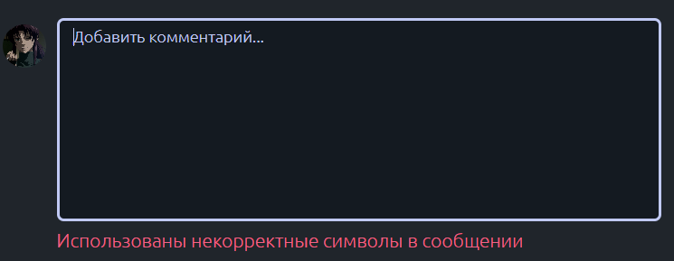

# Домашнее задание 1 по курсу QA команды AdDo

## Тестируемые части:
1. [Страница авторизации](#auth)
2. [Страница регистрации](#register)
3. [Хедер](#header)
4. [Главная страница с музыкой](#feed)
5. [Профиль](#me)
6. [Список треков](#tracks)
7. [Страница Альбома](#album)
8. [Страница Артиста](#artist)
9. [Страница Плейлиста](#playlist)
10. [Страница создания плейлиста](#playlist-create)
11. [Страница поиска](#search)
12. [Плеер](#player)

 
# Страница авторизации
Страница авторизации находится по [ссылке](https://musicon.space/login).

1. email валидируется с помощью регулярного выражения *[*]@[*].[*]*  
Если ввод пользователя не содержит почтовый домен, отделенный символом @, то будет выведено сообщение об ошибке.

2. Пароль при авторизации проверяется на длину: его длина должна быть от 6 до 30 символов.

3. При попытке авторизации с неверным логином или паролем выводится сообщение об ошибке.

4. При попытке авторизации с пустыми полями выводится сообщение об ошибке.

5. Если авторизованный пользователь снова переходит на [страницу авторизации](https://musicon.space/login),
правильно было бы перенаправить его на [главную страницу](https://musicon.space/). Однако пользователю предлагается снова авторизоваться.

6. При вводе корректных данных, которые существуют в базе, и нажатии кнопки "Войти" пользователя перенаправляет на [главную страницу](https://musicon.space/).  

> Тестовый аккаунт для проверки:  
> email: test@gmail.com  
> password: 1234567

# Страница регистрации

Страница регистрации находится по [ссылке](https://musicon.space/signup).

1. При добавлении в имя пользователя любых символов кроме латинских букв и цифр выводится сообщение об ошибке.
2. При добавлении в email любых символов кроме латинских букв и цифр выводится сообщение об ошибке.

3. Если введенный email не содержит почтовый домен, отделенный символом @,
то будет выведено сообщение об ошибке.

4. Пароль при регистрации проверяется на длину: его длина должна быть от 6 до 30 символов.

5. При попытке ввода разных паролей выводится сообщение об ошибке.

6. При попытке ввода даты ранее 01.01.1901 выводится сообщение об ошибке.

7. При попытке ввода даты позднее текущего дня выводится сообщение об ошибке.

8. При вводе корректных данных и нажатии кнопки "Зарегистрироваться" регистрация успешно завершается
и пользователя перенаправляет на [онбординг](https://musicon.space/onboard/genres).

# Хедер

Хедер для неавторизованного пользователя.

Хедер для авторизованного пользователя.

- Слева на хедере располагается группа элементов: логотип, "Главное" и "Коллекция".  
- Справа есть кнопка поиска.  
Также для неавторизованного пользователя отображается кнопка "Войти",
а для авторизованного - кнопка "Выйти" и аватар.  
Если у пользователя нет аватара, то отображается аватар по умолчанию.

1. При нажатии на логотип открывается [главная страница](https://musicon.space/feed/all).
2. При нажатии на "Главное" открывается [главная страница](https://musicon.space/feed/all),
цвет текста меняется на акцентный.

3. При нажатии на "Коллекция" открывается [коллекция пользователя](https://musicon.space/collection/tracks)
с любимыми треками, альбомами, плейлистами и исполнителями. Цвет текста меняется на акцентный.

4. При нажатии на кнопку "Поиск" появляется строка поиска.
Левая группа элементов (логотип, "Главное" и "Коллекция") скрывается.  
Также появляются кнопки "Стрелка" и "Крестик" для скрытия поисковой строки.

5. При вводе текста в поисковую строку появляется окно с результатами поиска.

6. При нажатии на кнопку "Крестик" или кнопку "Стрелка" строка поиска скрывается,
вновь появляется левая группа элементов.

7. При нажатии на кнопку "Войти", которая отображается у неавторизованного пользователя,
открывается [страница авторизации](https://musicon.space/login).

8. При нажатии на аватар, который отображается у авторизованного пользователя,
открывается [страница профиля](https://musicon.space/profile).

9. При нажатии на кнопку "Выйти", которая отображается у авторизованного пользователя,
появляется попап для подтверждения выхода из аккаунта.

10. При нажатии на кнопку "Подтвердить" попап скрывается и происходит разлогин пользователя.

11. При нажатии на кнопку "Отмена" попап просто скрывается, разлогин не происходит.

# Главная страница с музыкой

Главная страница с музыкой находится по [ссылке](https://musicon.space/feed/all).

1. При нажатии на кнопку ["Всё"](https://musicon.space/feed/all) отображаются рандомные треки и появляется заголовок "Попробуйте новое".

2. При нажатии на кнопку ["Новое"](https://musicon.space/feed/new) отображаются новые треки и появляется заголовок "Новые релизы".

3. При нажатии на кнопку ["Чарт"](https://musicon.space/feed/chart) отображаются наиболее прослушиваемые треки и появляется заголовок "Популярные альбомы".

4. При нажатии на кнопку ["Подборки"](https://musicon.space/feed/playlists) отображаются наиболее залайканные треки и появляется заголовок "Понравилось другим".

# Профиль
1. У авторизованного пользователя в правом верхнем углу появляется дефолтная аватарка. При нажатии на нее мы переходим по [ссылке](https://musicon.space/profile)
и попадаем на страницу пользователя.

2. Баг: если неавторизованный пользователь попробует перейти на [страницу профиля](https://musicon.space/profile),
то у него получится это сделать, и он увидит профиль с пустыми полями.

3. Баг: если при редактировании имени пользователя или email`а ввести недопустимый символ, например, смайлик,
то в сообщении об ошибке будут указаны оба поля.  
Хотя ожидалось упоминание только некорректного поля.

4. При попытке ввода имени пользователя длиннее 30 символов, будет выведено сообщение об ошибке.

5. При попытке ввода email`а, который не содержит почтовый домен, отделенный символом @,
(то есть не соответствует регулярке *[*]@[*].[*]*) будет выведено сообщение об ошибке.

6. Если пользователь вводит валидные данные и нажимает "Готово", то данные обновляются сразу без перезагрузки страницы.

7. Баг: отсутствуют границы для даты. Поэтому есть возможность поставить дату, которая не может быть днем рождения пользователя.

5. Пользователь может поменять аватарку на своей странице: для этого нужно нажать на текущую аватарку, откроется меню для выбора файла для загрузки. Поддерживаются все файлы из 
Content-Type: image/*, кроме gif. После выбора фото нужно нажать *готово*, в противном случае изменения не будут сохранены. Страницу также обновлять не нужно, аватарка меняется in-place.
После обновления страницы изменения остаются.

6. Если был выбран неподдерживаемый тип файла, пользователь увидит сообщение об ошибке.

# Список треков
## Общий функционал
1. При наведении мыши на трек он акцентно выделяется и становится доступна кнопка *многоточие*, если на нее нажать - высплывает попап, в котором есть две функции: поделиться и добавить в плейлист.

2. При нажатии кнопки *поделиться* ссылка на трек копируется в буфер обмена и выводится сообщение о том, что ссылка скопирована.
3. При нажатии кнопки *Play* появляется плеер в нижней части экрана и включается трек.
## Функционал для неавторизованного пользователя
4. При нажатии на кнопку *добавить в плейлист* в попапе, будет сообщение, что нужно авторизоваться.

5. Можно прослушивать треки и пользоваться плеером(частью для неавторизованных пользователей)
## Функционал для авторизованного пользователя
6. При нажатии на кнопку *добавить в плейлист* в попапе, будет предложен список плейлистов пользователя, он может выбрать, в какой именно плейлист добавить трек. 

После чего будет выведено сообщение, что трек успешно добавлен в плейлист.

# Страница альбома
1. При нажатии на картинку альбома пользователь попадает на страницу [альбома](https://musicon.space/album/71). Пользователь видит картинку альбома, имя артиста и список треков.

2. Имя артиста кликабельно - пользователь переходит на страницу исполнителя.
3. Маленький баг - Если перейти по ссылке https://musicon.space/album/(unreal_id), то не будет сообщения 404, будет пустой экран.
4. Пользователь может нажать на кнопку лайка альбома, после чего альбом добавится в коллекцию пользователя.

# Страница артиста
1. При нажатии на имя артиста пользователь попадает на страницу [артиста](https://musicon.space/artist/654)

2. При нажатии на значок *Поделиться* копируется корректная ссылка на эту страницу.
3. При нажатии на кнопку *Смотреть все* выводятся все треки этого исполнителя. Кнопка *Скрыть* возвращает как было.
4. Альбомы кликабельны. При нажатии на любой из альбомов пользователь переходит на страницу альбома.

# Страница плейлиста
1. На странице плейлиста есть функционал редактирования плейлиста и список треков.

См. [Список треков](#tracks)

# Страница создания плейлиста

1. При вводе некорректного названия плейлиста(пустой ввод) отображается сообщение об ошибке
2. При вводе некорректного названия плейлиста(название с пробелами) отображается сообщение об ошибке
3. При вводе некорректного названия плейлиста(использование некорректных символов: !"№;%:?*()_+=-`~\| и тд.) отображается сообщение об ошибке

4. При нажатии кнопки Удалить, плейлист удаляется
5. При вводе корректного названия и нажатии кнопки «Сохранить» плейлист создается
6. При нажатии на аватар, открывается диалоговое окно выбора файла, при выборе картинки она загружается, при выборе некорректного файла выводится сообщение об ошибке
7. При нажатии на аватар, открывается диалоговое окно выбора файла, при выборе некорректного файла выводится сообщение об ошибке

# Страница поиска

1. При нажатии на трек, он включается
2. При нажатии на артиста, открывается страница артиста
3. При нажатии на альбом, открывается страница альбома
4. При нажатии на плейлиста, открывается страница плейлиста
5. В случае отсутствия совпадений отображается надпись Трек/Альбом/Плейлист/Артист не найден

# Плеер

1. Кнопка "Следующий трек" работает исправно.
2. Кнопка "Пауза" работает исправно.
3. Кнопка "Плей" работает исправно.
4. Кнопка "Предыдущий трек" работает исправно.
5. Кнопка "Перемешать" подсвечивается после нажатия,
треки альбома/плейлиста начинают воспроизводиться в рандомном порядке.

Баг: при нажатии в этом режиме на кнопку "Предыдущий трек" включается предыдущий _**по порядку**_
в альбоме/плейлисте трек. То есть не тот, который ожидается.

6. Кнопка "Зациклить" подсвечивается после нажатия, один трек повторяется по кругу.

7. Имя артиста кликабельно, ссылка ведет на страницу этого артиста.
8. При нажатии на кнопку "Прочее" появляется выпадающее меню с кнопками "Поделиться" и "Добавить в плейлист".

Баг: выпадающее меню расположено слишком далеко от кнопки "Прочее".

9. Кнопка "Поделиться" копирует в буфер обмена ссылку на текущий трек, выводится сообщение об этом.

10. Кнопка "Текст" включает режим караоке, если у трека есть текст.  
Баг: если у трека нет текста, то кнопка "Текст" все равно доступна. При нажатии на нее пользователь видит пустой экран.

11. При нажатии на полоску прогресса трека, трек перематывается.

### Для неавторизованного пользователя
12. При нажатии на кнопку "Добавить в плейлист" выводится сообщение "У вас нет плейлистов или вы не авторизованы".

13. Кнопка "Лайк" не отображается.

### Для авторизованного пользователя
14. Если у пользователя нет ни одного плейлиста, то при нажатии на кнопку "Добавить в плейлист" выводится сообщение
"У вас нет плейлистов или вы не авторизованы".

15. Если у пользователя есть плейлисты, то при нажатии на кнопку "Добавить в плейлист" выводится список плейлистов.

16. При добавлении трека в конкретный плейлист отображается сообщение "Трек добавлен в плейлист".

16. При нажатии на кнопку "Лайк" она загорается акцентным цветом и трек добавляется в коллекцию.

