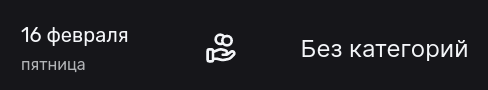

Тестовый аккаунт (Только что созданный):

```text
login: backender
password: Qwerty123
```

Тестовый аккаунт (Предзаполненный):

```text
login: frontender
password: Qwerty123
```

Авторизация нужна для тестирования всех страниц кроме логина и регистрации.


Содержание:

- [Логин](#логин)
- [Регистрация](#регистрация)
- [Шеринг](#шеринг)
- [Категории](#категории)
- [Профиль](#профиль)
- [Счета](#счета)
- [Транзакции](#транзакции)
- [Дэшборд](#дэшборд)


# Логин

| № Тест-кейса | Название проверки                                                                                                                                                                                                                                           | Результат    | Описание проблемы                                     | Скрин                                            |
|--------------|-------------------------------------------------------------------------------------------------------------------------------------------------------------------------------------------------------------------------------------------------------------|--------------|-------------------------------------------------------|--------------------------------------------------|
| 1            | Обязательные поля должны быть заполнены до подтверждения ввода данных.                                                                                                                                                                                      | Положительно |                                                       |                                                  | 
| 2            | При вводе количества знаков больше максимального отображается сообщение об ошибке.                                                                                                                                                                          | Положительно |                                                       |                                                  |
| 3            | При вводе количества знаков меньших минимального отображается сообщение об ошибке.                                                                                                                                                                          | Положительно |                                                       |                                                  |
| 4            | При вводе не существующих данных выводит ошибку                                                                                                                                                                                                             | Положительно |                                                       |                                                  |
| 5            | При корректном вводе логина (длина от 4 до 20 символов, должен содержать только латинские буквы и цифры, начинаться с буквы) и пароля (длина от 8 до 64 символов, только латинские буквы или цифры) происходит редирект на страницу https://hammywallet.ru/ | Положительно |                                                       |                                                  |
| 6            | При редиректе со страницы https://hammywallet.ru/registration на логин не сохраняются сообщение об ошибке                                                                                                                                                   | Отрицательно | Сохраняет ошибку в поле логина и пароля при редиректе |  |
| 7            | При нажатии на кнопку "Регистрация" происходит редирект на страницу https://hammywallet.ru/registration                                                                                                                                                     | Положительно |                                                       |                                                  |

# Регистрация

| № Тест-кейса | Название проверки                                                                                                                                                                                                                                           | Результат    | Описание проблемы                                     | Скрин                                            |
|--------------|-------------------------------------------------------------------------------------------------------------------------------------------------------------------------------------------------------------------------------------------------------------|--------------|-------------------------------------------------------|--------------------------------------------------|
| 1            | Обязательные поля должны быть заполнены до подтверждения ввода данных.                                                                                                                                                                                      | Положительно |                                                       |                  | 
| 2            | Текстовые поля допускают ввод только латинские букв или цифр (логин)                                                                                                                                                                                        | Положительно |                                                       |              | 
| 3            | Текстовое поле имени допускает использование специальных символов                                                                                                                                                                                           | Положительно |                                                       |                                                  |
| 4            | При вводе количества знаков больше максимального отображается сообщение об ошибке.                                                                                                                                                                          | Положительно |                                                       |                                                  |
| 5            | При вводе количества знаков меньших минимального отображается сообщение об ошибке.                                                                                                                                                                          | Положительно |                                                       |                                                  |
| 6            | При вводе не существующих данных выводит ошибку                                                                                                                                                                                                             | Положительно |                                                       |                                                  |
| 7            | При корректном вводе логина (длина от 4 до 20 символов, должен содержать только латинские буквы и цифры, начинаться с буквы) и пароля (длина от 8 до 64 символов, только латинские буквы или цифры) происходит редирект на страницу https://hammywallet.ru/ | Положительно |                                                       |                                                  |
| 8            | При редиректе со страницы https://hammywallet.ru/registration на логин не сохраняются сообщение об ошибке                                                                                                                                                   | Отрицательно | Сохраняет ошибку в поле логина и пароля при редиректе |  |
| 9            | При нажатии на кнопку "Вход" происходит редирект на страницу https://hammywallet.ru/login                                                                                                                                                                   | Положительно |                                                       |                                                  |

# Шеринг

| № Тест-кейса | Название проверки                                                                                                                                                                                                            | Результат    | Описание проблемы                                                                                                                                                                                                 | Скрин                                               |
| ------------ | ---------------------------------------------------------------------------------------------------------------------------------------------------------------------------------------------------------------------------- | ------------ | ----------------------------------------------------------------------------------------------------------------------------------------------------------------------------------------------------------------- | --------------------------------------------------- |
| 1            | На только что созданном аккаунте отсутствуют разделенные счета                                                                                                                                                               | Положительно |                                                                                                                                                                                                                   |                                                     |
| 2            | При добавлении самого себя в аккаунт (своего логина), должна быть отображена ошибка                                                                                                                                          | Отрицательно | При добавлении самого себя на странице ничего не отображается, а сервер кидает 400                                                                                                                                |         |
| 3            | При добавлении несуществующего логина, должна быть отображена ошибка                                                                                                                                                         | Отрицательно | При добавлении несуществующего логина, сервер кидает 404, но на самой странице не отображается ошибка                                                                                                             |      |
| 4            | При добавлении корректного пользователя (существующего логина), на странице должен отобразится аккаунт добавленного пользователя                                                                                             | Положительно |                                                                                                                                                                                                                   |                                                     |
| 5            | При добавлении пользователя, к счету к которому его уже добавили, должна быть отображена ошибка                                                                                                                              | Отрицательно | При добавлении пользователя, который уже был добален к счету на странице не отображается ошибки, хотя сервер возвращает ошибку 400                                                                                |        |
| 6            | После того как, пользователь поделился счетом, он должен быть отражен в https://hammywallet.ru/accounts у добавленного пользователя                                                                                          | Положительно |                                                                                                                                                                                                                   |                                                     |
| 7            | При добавлении транзакции на шеринговый аккаунт, транзакция должна отразится у всех пользователей подписанных на этот аккаунт и у владельца https://hammywallet.ru/accounts                                                  | Положительно |                                                                                                                                                                                                                   |                                                     |
| 8            | При добавлении транзакции, добавленным пользователем на шеринг аккаунт, у владельца корректно (на сумму, соответсвующую сумме транзакции) изменяется баланс на аккаунте на странице https://hammywallet.ru/accounts          | Положительно |                                                                                                                                                                                                                   |                                                     |
| 9            | При добавлении транзакции, добавленным пользователем на шеринг аккаунт, у владельца корректно (на сумму, соответсвующую сумме транзакции) изменяются графики, траты по категориям и баланс на главной https://hammywallet.ru | Положительно |                                                                                                                                                                                                                   |                                                     |
| 10           | После добавлении транзацкии на шеринговый аккаунт, в списке транзакций, шеринговый счет должен как-то помечаться, чтобы отличить его от своих счетов                                                                         | Отрицательно | Шеринговый счет помечается только при создании транзакции (слева пишется логин создателя аккаунта), а после создания транзакции, в списке транзакций он никак не выделяется. Невозжно отличить от своего аккаунта |  |
| 11           | После удаления пользователя со своего аккаунта все его транзакции должны быть удалены                                                                                                                                        | Положительно |                                                                                                                                                                                                                   |                                                     |
| 12           | После удаления пользователя со своего аккаунта, он должен изменить баланс счета, с учетом удаленных транзакций (если они были положительные то, снять с баланса такую сумму, если отрицательную то добавить)                 | Отрицательно | После удаления пользователя, его транзакции удаляются, но они никак не изменяют баланс счета к которому были привязаны                                                                                            |                                                     |
| 13           | При отписке пользователя с аккаунта, все транзакции должны быть удалены                                                                                                                                                      | Положительно |                                                                                                                                                                                                                   |                                                     |
| 14           | При отписке пользователя с аккаунта, баланс счета владельца должен быть изменен                                                                                                                                              | Отрицательно | После удаления пользователя, его транзакции удаляются, но они никак не изменяют баланс счета к которому были привязаны                                                                                            |                                                     |

# Категории

| № Тест-кейса | Название проверки                                                                                                                                                                                                                                     | Результат    | Описание проблемы                                                                                                                                                          | Скрин                                                                                 |
|--------------|-------------------------------------------------------------------------------------------------------------------------------------------------------------------------------------------------------------------------------------------------------|--------------|----------------------------------------------------------------------------------------------------------------------------------------------------------------------------|---------------------------------------------------------------------------------------|
| 1            | На только что созданном аккаунте присутствует 13 стандартных категорий (Дети, Забота о себе, Зарплата, Здоровье и фитнесс, Кафе и рестораны, Машина, Образование, Отдых и развлечения, Подарки, Покупки: одежда, техника, Проезд, Подписки, Продукты) | Положительно |                                                                                                                                                                            |                                                                                       |
| 2            | Создание валидной категории (длина от 1 до 20 любых символов)                                                                                                                                                                                         | Положительно |                                                                                                                                                                            |                                                                                       |
| 3            | Создание категории без названия                                                                                                                                                                                                                       | Отрицательно | Не выводится ошибка, что категорию без названия невозможно создать                                                                                                         |                                                                                       |
| 4            | Создание категории с эмодзи                                                                                                                                                                                                                           | Положительно |                                                                                                                                                                            |                                                                                       |
| 5            | Создание категории со спецсимволами                                                                                                                                                                                                                   | Положительно |                                                                                                                                                                            |                                                                                       |
| 6            | Создание категории длинной больше максимального значения (20 символов). Ожидается ошибка                                                                                                                                                              | Отрицательно | Кнопка выбора иконки растягивается из-за вывода ошибки                                                                                                                     |                                                   |
| 7            | Редактирование категории                                                                                                                                                                                                                              | Отрицательно | В инпуте находится нынешнее название категории, но иконка заменяется на дефолтную, вместо уже имеющейся. <br/> Сбрасывается скролл                                         |                                                   |
| 8            | Редактирование названия категории на новое длинной больше максимального значения (20 символов). Ожидается ошибка                                                                                                                                      | Отрицательно | Ошибка не отображается, вместо этого ререндерится страница                                                                                                                 |                                                                                       |
| 9            | Удаление категории, для которой не имеется транзакции                                                                                                                                                                                                 | Положительно |                                                                                                                                                                            |                                                                                       |
| 10           | Удаление категории, для которой имеется транзакция                                                                                                                                                                                                    | Отрицательно | Категория удалется из списка категорий. Ее невозможно выбрать при создании транзакций, но название и иконка категории не изменились - *1)*. <br/> Ожидалось увидеть - *2)* | 1)  <br/> 2)  |

# Профиль

| № Тест-кейса | Название проверки                                                                                                                                                            | Результат    | Описание проблемы                                                                                                                                                           | Скрин                                        |
|--------------|------------------------------------------------------------------------------------------------------------------------------------------------------------------------------|--------------|-----------------------------------------------------------------------------------------------------------------------------------------------------------------------------|----------------------------------------------|
| 1            | На только что созданном аккаунте установлена дефолтная аватарка с хомячком, поле бюджета пустое, поле имени пользователя содержит имя пользователя                           | Положительно |                                                                                                                                                                             |                                              |
| 2            | Изменение имени пользователя                                                                                                                                                 | Положительно |                                                                                                                                                                             |                                              |
| 3            | Изменение имени пользователя на пустое. Ожидается сообщение об ошибке                                                                                                        | Положительно |                                                                                                                                                                             |                                              |
| 4            | Изменение имени пользователя на длинной больше максимального (20 символов). Ожидается сообщение об ошибке                                                                    | Положительно |                                                                                                                                                                             |                                              |
| 5            | Изменение бюджета                                                                                                                                                            | Положительно |                                                                                                                                                                             |                                              |
| 6            | Изменение бюджета на пустое. Ожидается сообщение об ошибке                                                                                                                   | Положительно |                                                                                                                                                                             |                                              |
| 7            | Изменение бюджета с превышением макисмальной длины целой части. Ожидается сообщение об ошибке                                                                                | Положительно |                                                                                                                                                                             |                                              |
| 8            | Изменение бюджета с превышением макисмальной длины дробной части. Ожидается сообщение об ошибке                                                                              | Положительно |                                                                                                                                                                             |                                              |
| 9            | Изменение бюджета на нечисловое значение. Ожидается сообщение об ошибке                                                                                                      | Положительно |                                                                                                                                                                             |                                              |
| 10           | Изменение пароля                                                                                                                                                             | Отрицательно | Нерабочий функционал <br/> Заполняется поле ввода бюджета, которое подсвечивается красным из-за нечислового значения. Пароль не изменился. Запрос не отправляется на сервер |  |
| 11           | Изменение пароля. Форма заполнена пустыми значениями. Ожидается ошибка                                                                                                       | Отрицательно | Нерабочий функционал <br/> Заполняется поле ввода бюджета, которое подсвечивается красным из-за нечислового значения. Пароль не изменился. Запрос не отправляется на сервер |  |
| 12           | Изменение пароля. Значение текущий пароля неверное. Ожидается ошибка                                                                                                         | Отрицательно | Нерабочий функционал <br/> Заполняется поле ввода бюджета, которое подсвечивается красным из-за нечислового значения. Пароль не изменился. Запрос не отправляется на сервер |  |
| 13           | Изменение пароля. Значение нового пароля и его повтор не совпадают. Ожидается ошибка                                                                                         | Отрицательно | Нерабочий функционал <br/> Заполняется поле ввода бюджета, которое подсвечивается красным из-за нечислового значения. Пароль не изменился. Запрос не отправляется на сервер |  |
| 14           | Изменение аватара поддерживаемым типом файла                                                                                                                                 | Положительно |                                                                                                                                                                             |                                              |
| 15           | Изменение аватара неподдерживаемым типом файла. Ожидается сообщение об ошибке                                                                                                | Положительно |                                                                                                                                                                             |                                              |
| 16           | Экспорт CSV файла транзакций                                                                                                                                                 | Положительно |                                                                                                                                                                             |                                              |
| 17           | Импорт CSV файла транзакций c правильным расположением и названием столбцов (AccountIncome,AccountOutcome,Income,Outcome,Date,Payer,Description,Categories)                  | Положительно |                                                                                                                                                                             |                                              |
| 18           | Импорт CSV файла транзакций c неправильным расположением и названием столбцов (не совпадает с AccountIncome,AccountOutcome,Income,Outcome,Date,Payer,Description,Categories) | Положительно |                                                                                                                                                                             |                                              |
| 19           | Импорт не CSV файла                                                                                                                                                          | Отрицательно | Не выводится ошибка, что можно импортировать только CSV файлы                                                                                                               |                                              |
| 20           | При нажатии на кнопку "совместный доступ" происходит редирект на страницу шеринга                                                                                            | Положительно |                                                                                                                                                                             |                                              |
| 21           | При нажатии на кнопку "Категории" происходит редирект на страницу категорий                                                                                                  | Положительно |                                                                                                                                                                             |                                              |
| 22           | При нажатии на кнопку "Выйти" выходит из аккаунта                                                                                                                            | Положительно |                                                                                                                                                                             |                                              |

# Счета

| № Тест-кейса | Название проверки                                                                                                       | Результат    | Описание проблемы                                                                                                                                                    | Скрин                                    |
|--------------|-------------------------------------------------------------------------------------------------------------------------|--------------|----------------------------------------------------------------------------------------------------------------------------------------------------------------------|------------------------------------------|
| 1            | На только что созданном аккаунте отображаются 2 счета (Карта и Наличка) с 0 балансом                                    | Положительно |                                                                                                                                                                      |                                          |
| 2            | Созданный счет появляется для выбора в транзакциях                                                                      | Положительно |                                                                                                                                                                      |                                          |
| 3            | После удаления счета связанные транзакции удаляются                                                                     | Положительно | Только после обновления страницы                                                                                                                                     |                                          |
| 4            | Не должно быть возможности создать несколько счетов с одинаковым именем                                                 | Отрицательно | Создать несколько счетов с одинаковым именем получается, при этом они никак внешне нералзичимы кроме того, что на них разный баланс, так как это все же разные счета |  |
| 5            | Не допускает создание счета с пустым именем, выводит ошибку                                                             | Положительно |                                                                                                                                                                      |                                          |
| 6            | Не допускает изменение имени счета на пустое, выводит ошибку                                                            | Положительно |                                                                                                                                                                      |                                          |
| 7            | Не допускает создание счета с суммой денег нечислового значения (в т.ч. Infinity, NaN), пустой ввод, выводит ошибку     | Положительно |                                                                                                                                                                      |                                          |
| 8            | Не допускает изменение суммы денег на счету на нечислового значения (в т.ч. Infinity, NaN), пустой ввод, выводит ошибку | Положительно |                                                                                                                                                                      |                                          |
| 9            | Не допускает создание счета с очень большими сумами денег (максимум 8 цифр целой части числа), выводит ошибку           | Положительно |                                                                                                                                                                      |                                          |
| 10           | Не допускает изменение суммы на счету на очень большую (максимум 8 цифр целой части числа), выводит ошибку              | Положительно |                                                                                                                                                                      |                                          |
| 11           | Не допускает создание счета с слишком длинным именем (максимум 30 символов)                                             | Положительно |                                                                                                                                                                      |                                          |
| 12           | Не допускает изменение имени счета на слишком длинное (максимум 30 символов)                                            | Положительно |                                                                                                                                                                      |                                          |
| 13           | Допускает создание счета максимальной длины (30 русских символов)                                                       | Отрицательно | Создание счета из более чем 15 русских символов отображает тостер «Возникла непредвиденная ошибка», счет при этом не создается, сервер возвращает 400                |  |
| 14           | Допускает изменение имени счета на имя максимальной длины (30 русских символов)                                         | Положительно |                                                                                                                                                                      |                                          |
| 15           | Создание счета с именем из эмодзи                                                                                       | Положительно |                                                                                                                                                                      |                                          |
| 16           | Изменение имени счета на имя из эмодзи                                                                                  | Положительно |                                                                                                                                                                      |                                          |
| 17           | Создание счета с именем «alert('hello')», не должно быть алерта                                                         | Положительно |                                                                                                                                                                      |                                          |
| 18           | Изменение имени счета на «alert('hello')», не должно быть алерта                                                        | Положительно |                                                                                                                                                                      |                                          |
| 19           | После изменения имени счета имя также меняется в транзакциях                                                            | Положительно | Только после обновления страницы                                                                                                                                     |                                          |
| 20           | Баланс счета меняется при добавлении транзакции по нему                                                                 | Положительно |                                                                                                                                                                      |                                          |
| 21           | Допускает создание счета с нулем денег                                                                                  | Отрицательно | При вводе нуля выводит ошибку, что число не может начинаться с нуля, при оставлении поля пустым (есть плейсхолдер с числом 100500) тоже не работает                  |  |
| 22           | Допускает изменение суммы денег на счету на ноль                                                                        | Отрицательно | При вводе нуля выводит ошибку, что число не может начинаться с нуля, при оставлении поля пустым (есть плейсхолдер с текущим количеством денег на) тоже не работает   |  |
| 23           | При удалении счета бюджет на странице дашборда пересчитывается согласно удаленным транзакциям                           | Положительно |                                                                                                                                                                      |                                          |

# Транзакции

| № Тест-кейса | Название проверки                                                                                                                                                                                      | Результат    | Описание проблемы                                                                                                     | Скрин                                     |
| ------------ | ------------------------------------------------------------------------------------------------------------------------------------------------------------------------------------------------------ | ------------ | --------------------------------------------------------------------------------------------------------------------- | ----------------------------------------- |
| 1            | На только что созданном аккаунте отображается заглушка                                                                                                                                                 | Положительно |                                                                                                                       |                                           |
| 2            | Добавление валидной транзакции (в сумме числовое значение с максимум 8 цифр в целой части и 2 в дробной, дата в пределах 1900 и 2100 годов, описание и место платежа в пределах от 20 до 100 символов) | Положительно |                                                                                                                       |                                           |
| 3            | После удаления транзакции они не отображаются в статистике                                                                                                                                             | Положительно |                                                                                                                       |                                           |
| 4            | Не допускает создание транзакцию с пустой суммой, выводит ошибку                                                                                                                                       | Положительно |                                                                                                                       |                                           |                                                                                                                                                                      |                                          
| 5            | Не допускает создание транзакций с суммой денег нечислового значения (в т.ч. Infinity, NaN), пустой ввод, выводит ошибку                                                                               | Положительно |                                                                                                                       |                                           |
| 6            | Не допускает изменение суммы денег на транзакции на нечислового значения (в т.ч. Infinity, NaN), пустой ввод, выводит ошибку                                                                           | Положительно | При изменении транзакции поля для изменения складываются ошибкум не видно пока снова не откроешь изменение транзакции |                                           |
| 7            | Не допускает создание транзакций с очень большими сумами денег (максимум 8 цифр целой части числа), выводит ошибку                                                                                     | Положительно |                                                                                                                       |                                           |
| 8            | Не допускает изменение суммы на транзакции на очень большую (максимум 8 цифр целой части числа), выводит ошибку                                                                                        | Положительно | При изменении транзакции поля для изменения складываются ошибкум не видно пока снова не откроешь изменение транзакции |                                           |
| 9            | Не допускает создание транзакции с слишком длинным местом платежа и описанием (максимум 20 и 100 символов) выводит ошибку                                                                              | Положительно |                                                                                                                       |                                           |
| 10           | Не допускает изменение места платежа и описания транзакции на слишком длинное (максимум 20 и 100 символов соответственно)                                                                              | Положительно | Поля изменения скрываются, что не дает увидеть ошибку, до тех пор пока снова не нажать на транзакцию изменение        |                                           |
| 11           | Допускает создание транзакции максимальной длины (20 русских символов) в поле место платежа и в поле описание (100 русских символов)                                                                   | Положительно | Надпись наезжает на поля имени счета и верстка едет                                                                   |  |
| 12           | Допускает изменение транзакции максимальной длины в поле место платежа (20 русских символов) и в поле описание (100 русских символов)                                                                  | Положительно |                                                                                                                       |                                           |
| 13           | Создание транзакций с полями из эмодзи                                                                                                                                                                 | Положительно |                                                                                                                       |                                           |
| 14           | Изменение транзакций с полями из эмодзи                                                                                                                                                                | Положительно |                                                                                                                       |                                           |
| 15           | Создание транзакций с полями содержащими «alert('hello')», не должно быть алерта                                                                                                                       | Положительно |                                                                                                                       |                                           |
| 16           | Изменение транзакций с полями содержащими «alert('hello')», не должно быть алерта                                                                                                                      | Положительно |                                                                                                                       |                                           |
| 17           | После изменения суммы транзакции графики на доске меняются                                                                                                                                             | Положительно |                                                                                                                       |                                           |
| 18           | Баланс счета меняется при добавлении транзакции по нему                                                                                                                                                | Положительно |                                                                                                                       |                                           |
| 19           | Не Допускает создание транзакции с нулем денег                                                                                                                                                         | Положительно |                                                                                                                       |                                           |
| 20           | Не Допускает изменение суммы денег в транзакции на ноль                                                                                                                                                | Положительно | При изменении транзакции поля для изменения складываются ошибкум не видно пока снова не откроешь изменение транзакции |                                           |
| 21           | При удалении транзакции баланс счета и на странице дашборда пересчитывается согласно удаленным транзакциям                                                                                             | Положительно |                                                                                                                       |                                           |
| 22           | Не допускает создать транзакцию с пустым значением даты и выводит ошибку                                                                                                                               | Положительно |                                                                                                                       |                                           |
| 23           | Не допускает изменить транзакцию на пустое значение даты и выводит ошибку                                                                                                                              | Положительно | При изменении транзакции поля для изменения складываются ошибкум не видно пока снова не откроешь изменение транзакции |                                           |
| 24           | Не допускает создать транзакцию с значением даты раньше минимальной (1900) и выводит ошибку                                                                                                            | Положительно |                                                                                                                       |                                           |
| 25           | Не допускает изменить транзакцию с значением даты раньше минимальной (1900) и выводит ошибку                                                                                                           | Положительно | При изменении транзакции поля для изменения складываются ошибкум не видно пока снова не откроешь изменение транзакции |                                           |
| 26           | Фильтр по датам, где существует транзакция                                                                                                                                                             | Положительно |                                                                                                                       |                                           |
| 27           | Фильтр по датам, где не существует транзакций                                                                                                                                                          | Отрицательно | Выводится заглушка не очень понятно, что ничего не нашлось                                                            |  |
| 28           | Фильтр по категориям, где существует транзакция                                                                                                                                                        | Положительно |                                                                                                                       |                                           |
| 29           | Фильтр по категориям, где не существует транзакций                                                                                                                                                     | Отрицательно | Выводится заглушка не очень понятно, что ничего не нашлось                                                            |  |
| 30           | Фильтр по счетам, где существует транзакция                                                                                                                                                            | Положительно |                                                                                                                       |                                           |
| 31           | Фильтр по счетам, где не существует транзакций                                                                                                                                                         | Отрицательно | Выводится заглушка не очень понятно, что ничего не нашлось                                                            |  |
| 32           | Фильтр В расходе, где существует транзакция                                                                                                                                                            | Положительно |                                                                                                                       |                                           |
| 33           | Фильтр В расходе, где не существует транзакций                                                                                                                                                         | Отрицательно | Выводится заглушка не очень понятно, что ничего не нашлось                                                            |  |
| 34           | Фильтр В доходе, где существует транзакция                                                                                                                                                             | Положительно |                                                                                                                       |                                           |
| 35           | Фильтр В доходе, где не существует транзакций                                                                                                                                                          | Отрицательно | Выводится заглушка не очень понятно, что ничего не нашлось                                                            |  |
| 36           | Фильтр В доходе и в рассходе, где существует транзакция                                                                                                                                                | Отрицательно | Выводится заглушка не очень понятно, что ничего не нашлось                                                            |  |

# Дэшборд

| № Тест-кейса | Название проверки                                                                                                                                                                                                     | Результат    | Описание проблемы                                                                                                                                                                                                                                                                                                                                                          | Скрин                                                                                                                       |
|--------------|-----------------------------------------------------------------------------------------------------------------------------------------------------------------------------------------------------------------------|--------------|----------------------------------------------------------------------------------------------------------------------------------------------------------------------------------------------------------------------------------------------------------------------------------------------------------------------------------------------------------------------------|-----------------------------------------------------------------------------------------------------------------------------|
| 1            | На только что созданном аккаунте графики пусты, баланс нулевой, отображается информация как установить бюджет                                                                                                         | Положительно |                                                                                                                                                                                                                                                                                                                                                                            |                                                                                                                             |
| 2            | Добавление приходной транзакции текущего месяца отображается только на столбцовой диаграмме и балансе, но не изменяет круговую диаграмму                                                                              | Положительно |                                                                                                                                                                                                                                                                                                                                                                            |                                                                                                                             |
| 3            | Добавление расходной транзакции текущего месяца с категорией, еще не присутствующей на круговой диаграмме, добавляет эту категорию на круговую диаграмму, а так же изменяет столбцовую диаграмму и баланс             | Положительно |                                                                                                                                                                                                                                                                                                                                                                            |                                                                                                                             |
| 4            | Добавление расходной транзакции текущего месяца с категорией, присутствующей на круговой диаграмме, изменяет процент заполнения этой категории на круговой диаграмме, а так же изменяет столбцовую диаграмму и баланс | Положительно |                                                                                                                                                                                                                                                                                                                                                                            |                                                                                                                             |
| 5            | Добавление транзакции с датой месяца несовпадающего с текущим не изменяет диаграммы                                                                                                                                   | Положительно |                                                                                                                                                                                                                                                                                                                                                                            |                                                                                                                             |
| 6            | Добавление транзакции с большой суммой отображается на графиках и балансе                                                                                                                                             | Отрицательно | Если разница между транзакциями больше чем в ```100 раз``` на графике трат по категориям транзакцию с меньшей суммой не видно, а навсестись не получается тк слишком малая доля круга. Аналогично с графиком расходов доходов по дням если есть день с большой суммой доходов или расходов, то блоки дней с маленькими суммами не видно не видно и навестись не получается |        |
