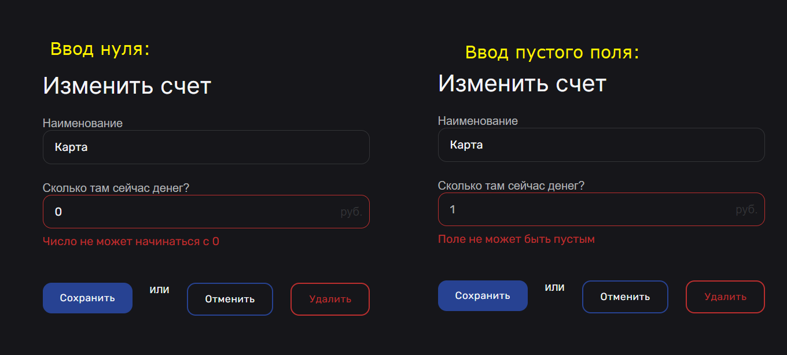

# Логин

| № Тест-кейса | Название проверки                                                                                         | Результат    | Описание проблемы                                     | Скрин                                |
|--------------|-----------------------------------------------------------------------------------------------------------|--------------|-------------------------------------------------------|--------------------------------------|
| 1            | Обязательные поля должны быть заполнены до подтверждения ввода данных.                                    | Отрицательно | Выводил ошибку до нажатия на кнопку Подтвердить       |  |
| 2            | Текстовые поля допускают ввод только латинских букв и цифр                                                | Отрицательно | Пароль должен быть и с латинскими буквами и с цифрами |  |
| 3            | При вводе количества знаков больше максимального отображается сообщение об ошибке.                        | Положительно |                                                       |                                      |
| 4            | При вводе количества знаков меньших минимального отображается сообщение об ошибке.                        | Положительно |                                                       |                                      |
| 5            | При вводе не существующих данных выводит ошибку                                                           | Положительно |                                                       |                                      |
| 6            | При корректном вводе логина и пароля происходит редирект на страницу https://hammywallet.ru/              | Положительно |                                                       |                                      |
| 7            | При редиректе со страницы https://hammywallet.ru/registration на логин не сохраняются сообщение об ошибке | Отрицательно | Сохраняет ошибку в поле логина и пароля при редиректе |                                      |
| 8            | При нажатии на кнопку "Регистрация" происходит редирект на страницу https://hammywallet.ru/registration   | Положительно |                                                       |                                      |

# Регистрация

| № Тест-кейса | Название проверки                                                                                         | Результат    | Описание проблемы                                     | Скрин                                |
|--------------|-----------------------------------------------------------------------------------------------------------|--------------|-------------------------------------------------------|--------------------------------------|
| 1            | Обязательные поля должны быть заполнены до подтверждения ввода данных.                                    | Отрицательно | Выводил ошибку до нажатия на кнопку Подтвердить       |      |
| 2            | Текстовые поля допускают ввод только латинские букв или цифр (логин)                                      | Отрицательно | Пароль должен быть и с латинскими буквами и с цифрами |  |
| 3            | Текстовое поле имени допускает использование специальных символов                                         | Положительно |                                                       |                                      |
| 4            | При вводе количества знаков больше максимального отображается сообщение об ошибке.                        | Положительно |                                                       |                                      |
| 5            | При вводе количества знаков меньших минимального отображается сообщение об ошибке.                        | Положительно |                                                       |                                      |
| 6            | При вводе не существующих данных выводит ошибку                                                           | Положительно |                                                       |                                      |
| 7            | При корректном вводе логина и пароля происходит редирект на страницу https://hammywallet.ru/              | Положительно |                                                       |                                      |
| 8            | При редиректе со страницы https://hammywallet.ru/registration на логин не сохраняются сообщение об ошибке | Отрицательно | Сохраняет ошибку в поле логина и пароля при редиректе |                                      |
| 9            | При нажатии на кнопку "Вход" происходит редирект на страницу https://hammywallet.ru/login                 | Положительно |                                                       |                                      |

# Шеринг

| № Тест-кейса | Название проверки                                                                                                                                                                                            | Результат    | Описание проблемы                                                                                                                                                                                                 | Скрин                                               |
|--------------|--------------------------------------------------------------------------------------------------------------------------------------------------------------------------------------------------------------|--------------|-------------------------------------------------------------------------------------------------------------------------------------------------------------------------------------------------------------------|-----------------------------------------------------|
| 1            | При добавлении самого себя в аккаунт (своего логина), должна быть отображена ошибка                                                                                                                          | Отрицательно | При добавлении самого себя на странице ничего не отображается, а сервер кидает 400                                                                                                                                |         |
| 2            | При добавлении несуществующего логина, должна быть отображена ошибка                                                                                                                                         | Отрицательно | При добавлении несуществующего логина, сервер кидает 404, но на самой странице не отображается ошибка                                                                                                             |      |
| 3            | При добавлении корректного пользователя (существующего логина), на странице должен отобразится аккаунт добавленного пользователя                                                                             | Положительно |                                                                                                                                                                                                                   |                                                     |
| 4            | При добавлении пользователя, к счету к которому его уже добавили, должна быть отображена ошибка                                                                                                              | Отрицательно | При добавлении пользователя, который уже был добален к счету на странице не отображается ошибки, хотя сервер возвращает ошибку 400                                                                                |        |
| 5            | После того как, пользователь поделился счетом, он должен быть отражен в [счетах](https://hammywallet.ru/accounts) у добавленного пользователя                                                                | Положительно |                                                                                                                                                                                                                   |                                                     |
| 6            | При добавлении транзакции на шеринговый аккаунт, транзакция должна отразится у всех пользователей подписанных на этот аккаунт и у владельца [Транзакции](https://hammywallet.ru/accounts)                    | Положительно |                                                                                                                                                                                                                   |                                                     |
| 7            | При добавлении транзакции, добавленным пользователем на шеринг аккаунт, у владельца корректно измеяется баланс на аккаунте на странице [счетов](https://hammywallet.ru/accounts)                             | Положительно |                                                                                                                                                                                                                   |                                                     |
| 8            | При добавлении транзакции, добавленным пользователем на шеринг аккаунт, у владельца корректно измеяются графики, траты по категориям и баланс на главной [странице](https://hammywallet.ru/)                 | Положительно |                                                                                                                                                                                                                   |                                                     |
| 9            | После добавлении транзацкии на шеринговый аккаунт, в списке транзакций, шеринговый счет должен как-то помечаться, чтобы отличить его от своих счетов                                                         | Отрицательно | Шеринговый счет помечается только при создании транзакции (слева пишется логин создателя аккаунта), а после создания транзакции, в списке транзакций он никак не выделяется. Невозжно отличить от своего аккаунта |  |
| 10           | После удаления пользователя со своего аккаунта все его транзакции должны быть удалены                                                                                                                        | Положительно |                                                                                                                                                                                                                   |                                                     |
| 11           | После удаления пользователя со своего аккаунта, он должен изменить баланс счета, с учетом удаленных транзакций (если они были положительные то, снять с баланса такую сумму, если отрицательную то добавить) | Отрицательно | После удаления пользователя, его транзакции удаляются, но они никак не изменяют баланс счета к которому были привязаны                                                                                            |                                                     |
| 12           | При отписки пользователя с аккаунта, все транзакции должны быть удалены (аналогино тест-кейсу 10)                                                                                                            | Положительно |                                                                                                                                                                                                                   |                                                     |
| 13           | При отписки пользователя с аккаунта, баланс счета владельца должен быть изменен (аналогично тест-кейсу 11)                                                                                                   | Отрицательно | Проблема подробно описана в тест-кейсе 11                                                                                                                                                                         |                                                     |

# Категории

| № Тест-кейса | Название проверки                                                      | Результат    | Описание проблемы                                                                                                                                                          | Скрин                                                                                 |
|--------------|------------------------------------------------------------------------|--------------|----------------------------------------------------------------------------------------------------------------------------------------------------------------------------|---------------------------------------------------------------------------------------|
| 1            | Создание категории без заведомых ошибок                                | Положительно |                                                                                                                                                                            |                                                                                       |
| 2            | Создание категории без названия                                        | Отрицательно | Не выводится ошибка, что категорию без названия невозможно создать                                                                                                         |                                                                                       |
| 3            | Создание категории с эмодзи                                            | Положительно |                                                                                                                                                                            |                                                                                       |
| 4            | Создание категории со спецсимволами                                    | Положительно |                                                                                                                                                                            |                                                                                       |
| 5            | Создание категории длинной более 20 символов. Ожидается ошибка         | Отрицательно | Кнопка выбора иконки растягивается из-за вывода ошибки                                                                                                                     |                                                   |
| 6            | Редактирование категории                                               | Отрицательно | В инпуте находится нынешнее название категории, но иконка заменяется на дефолтную, вместо уже имеющейся.   Сбрасывается скролл                                         |                                                   |
| 7            | Редактирование категории с длинной более 20 символов. Ожидается ошибка | Отрицательно | Ошибка не отображается, вместо этого ререндерится страница                                                                                                                 |                                                                                       |
| 8            | Удаление категории, для которой не имеется транзакции                  | Положительно |                                                                                                                                                                            |                                                                                       |
| 9            | Удаление категории, для которой имеется транзакция                     | Отрицательно | Категория удалется из списка категорий. Ее невозможно выбрать при создании транзакций, но название и иконка категории не изменились - *1)*.   Ожидалось увидеть - *2)* | 1)    2)  |
| 10           | Редирект на другие страница с помощью сайдбара                         | Положительно |                                                                                                                                                                            |                                                                                       |

# Профиль

| № Тест-кейса | Название проверки                                                                               | Результат    | Описание проблемы                                                                                                                                                           | Скрин                                        |
|--------------|-------------------------------------------------------------------------------------------------|--------------|-----------------------------------------------------------------------------------------------------------------------------------------------------------------------------|----------------------------------------------|
| 1            | Изменение имени пользователя                                                                    | Положительно |                                                                                                                                                                             |                                              |
| 2            | Изменение имени пользователя на пустое. Ожидается сообщение об ошибке                           | Положительно |                                                                                                                                                                             |                                              |
| 3            | Изменение имени пользователя длинной более 20 символов. Ожидается сообщение об ошибке           | Положительно |                                                                                                                                                                             |                                              |
| 4            | Изменение бюджета                                                                               | Положительно |                                                                                                                                                                             |                                              |
| 5            | Изменение бюджета на пустое. Ожидается сообщение об ошибке                                      | Положительно |                                                                                                                                                                             |                                              |
| 6            | Изменение бюджета с превышением макисмальной длины целой части. Ожидается сообщение об ошибке   | Положительно |                                                                                                                                                                             |                                              |
| 7            | Изменение бюджета с превышением макисмальной длины дробной части. Ожидается сообщение об ошибке | Положительно |                                                                                                                                                                             |                                              |
| 8            | Изменение бюджета на нечисловое значение. Ожидается сообщение об ошибке                         | Положительно |                                                                                                                                                                             |                                              |
| 9            | Изменение пароля                                                                                | Отрицательно | Нерабочий функционал   Заполняется поле ввода бюджета, которое подсвечивается красным из-за нечислового значения. Пароль не изменился. Запрос не отправляется на сервер |  |
| 10           | Изменение пароля. Форма заполнена пустыми значениями. Ожидается ошибка                          | Отрицательно | См. предыдущий пункт                                                                                                                                                        |  |
| 11           | Изменение пароля. Значение текущий пароля неверное. Ожидается ошибка                            | Отрицательно | См. предыдущий пункт                                                                                                                                                        |  |
| 12           | Изменение пароля. Значение нового пароля и его повтор не совпадают. Ожидается ошибка            | Отрицательно | См. предыдущий пункт                                                                                                                                                        |  |
| 13           | Изменение аватара поддерживаемым типом файла                                                    | Положительно |                                                                                                                                                                             |                                              |
| 14           | Изменение аватара неподдерживаемым типом файла. Ожидается сообщение об ошибке                   | Положительно |                                                                                                                                                                             |                                              |
| 15           | Экспорт CSV файла транзакций                                                                    | Положительно |                                                                                                                                                                             |                                              |
| 16           | Импорт CSV файла транзакций                                                                     | Положительно |                                                                                                                                                                             |                                              |
| 17           | Импорт CSV файла с несовпадающеми форматом записи транзакций                                    | Положительно |                                                                                                                                                                             |                                              |
| 18           | Импорт не CSV файла                                                                             | Отрицательно | Не выводится ошибка, что можно импортировать только CSV файлы                                                                                                               |                                              |
| 19           | Редирект на страницу шеринга                                                                    | Положительно |                                                                                                                                                                             |                                              |
| 20           | Редирект на страницу категорий                                                                  | Положительно |                                                                                                                                                                             |                                              |
| 21           | Выход из аккаунта                                                                               | Положительно |                                                                                                                                                                             |                                              |

# Счета

| № Тест-кейса | Название проверки                                                                                                                                                                    | Результат    | Описание проблемы                                                                                                                                                    | Скрин                                    |
|--------------|--------------------------------------------------------------------------------------------------------------------------------------------------------------------------------------|--------------|----------------------------------------------------------------------------------------------------------------------------------------------------------------------|------------------------------------------|
| 1            | Созданный счет появляется для выбора в транзакциях                                                                                                                                   | Положительно |                                                                                                                                                                      |                                          |
| 2            | После удаления счета связанные транзакции удаляются                                                                                                                                  | Положительно | Только после обновления страницы                                                                                                                                     |                                          |
| 3            | Возможность создать несколько счетов с одинаковым именем                                                                                                                             | Отрицательно | Создать несколько счетов с одинаковым именем получается, при этом они никак внешне нералзичимы кроме того, что на них разный баланс, так как это все же разные счета |  |
| 4            | Не допускает создание счета с пустым именем, выводит ошибку                                                                                                                          | Положительно |                                                                                                                                                                      |                                          |
| 5            | Не допускает изменение имени счета на пустое, выводит ошибку (аналогично тесту №4, но при изменении уже созданного счета)                                                            | Положительно |                                                                                                                                                                      |                                          |
| 6            | Не допускает создание счета с суммой денег нечислового значения (в т.ч. Infinity, NaN), пустой ввод, выводит ошибку                                                                  | Положительно |                                                                                                                                                                      |                                          |
| 7            | Не допускает изменение суммы денег на счету на нечислового значения (в т.ч. Infinity, NaN), пустой ввод, выводит ошибку (аналогично тесту №6, но при изменении уже созданного счета) | Положительно |                                                                                                                                                                      |                                          |
| 8            | Не допускает создание счета с очень большими сумами денег (максимум 8 цифр целой части числа), выводит ошибку                                                                        | Положительно |                                                                                                                                                                      |                                          |
| 9            | Не допускает изменение суммы на счету на очень большую (максимум 8 цифр целой части числа), выводит ошибку (аналогично тесту №8, но при изменении уже созданного счета)              | Положительно |                                                                                                                                                                      |                                          |
| 10           | Не допускает создание счета с слишком длинным именем (максимум 30 символов)                                                                                                          | Положительно |                                                                                                                                                                      |                                          |
| 11           | Не допускает изменение имени счета на слишком длинное (максимум 30 символов) (аналогично тесту №10, но при изменении уже созданного счета)                                           | Положительно |                                                                                                                                                                      |                                          |
| 12           | Допускает создание счета с 30 русскими символами                                                                                                                                     | Отрицательно | Создание счета из более чем 15 русских символов отображает тостер «Возникла непредвиденная ошибка», счет при этом не создается, сервер возвращает 400                |  |
| 13           | Допускает изменение имени счета на имя из 30 русских символов (аналогично тесту №12, но при изменении уже созданного счета)                                                          | Положительно |                                                                                                                                                                      |                                          |
| 14           | Создание счета с именем из эмодзи                                                                                                                                                    | Положительно |                                                                                                                                                                      |                                          |
| 15           | Изменение имени счета на имя из эмодзи (аналогично тесту №14, но при изменении уже созданного счета)                                                                                 | Положительно |                                                                                                                                                                      |                                          |
| 16           | Создание счета с именем «alert('hello')», не должно быть алерта                                                                                                                      | Положительно |                                                                                                                                                                      |                                          |
| 17           | Изменение имени счета на «alert('hello')», не должно быть алерта (аналогично тесту №16, но при изменении уже созданного счета)                                                       | Положительно |                                                                                                                                                                      |                                          |
| 18           | После изменения имени счета имя также меняется в транзакциях                                                                                                                         | Положительно | Только после обновления страницы                                                                                                                                     |                                          |
| 19           | Баланс счета меняется при добавлении транзакции по нему                                                                                                                              | Положительно |                                                                                                                                                                      |                                          |
| 20           | Допускает создание счета с нулем денег                                                                                                                                               | Отрицательно | При вводе нуля выводит ошибку, что число не может начинаться с нуля, при оставлении поля пустым (есть плейсхолдер с числом 100500) тоже не работает                  |  |
| 21           | Допускает изменение суммы денег на счету на ноль (аналогично тесту №20, но при изменении уже созданного счета)                                                                       | Отрицательно | При вводе нуля выводит ошибку, что число не может начинаться с нуля, при оставлении поля пустым (есть плейсхолдер с текущим количеством денег на) тоже не работает   |  |
| 22           | При удалении счета бюджет на странице дашборда пересчитывается согласно удаленным транзакциям                                                                                        | Положительно |                                                                                                                                                                      |                                          |

# Транзакции

| № Тест-кейса | Название проверки                                                                                                                                                                             | Результат    | Описание проблемы                                                                                                                                | Скрин                                     |
|--------------|-----------------------------------------------------------------------------------------------------------------------------------------------------------------------------------------------|--------------|--------------------------------------------------------------------------------------------------------------------------------------------------|-------------------------------------------|
| 1            | Добавление валидной транзакции                                                                                                                                                                | Положительно |                                                                                                                                                  |                                           |
| 2            | После удаления транзакции они не отображаются в статистике                                                                                                                                    | Положительно |                                                                                                                                                  |                                           |
| 3            | Не допускает создание транзакцию с пустой суммой, выводит ошибку                                                                                                                              | Положительно |                                                                                                                                                  |                                           |                                                                                                                                                                      |                                          |
| 4            | Не допускает создание транзакций с суммой денег нечислового значения (в т.ч. Infinity, NaN), пустой ввод, выводит ошибку                                                                      | Положительно |                                                                                                                                                  |                                           |
| 5            | Не допускает изменение суммы денег на транзакции на нечислового значения (в т.ч. Infinity, NaN), пустой ввод, выводит ошибку (аналогично тесту №6, но при изменении уже созданной транзакции) | Положительно | При изменении транзакции поля для изменения складываются ошибкум не видно пока снова не откроешь изменение транзакции                            |                                           |
| 6            | Не допускает создание транзакций с очень большими сумами денег (максимум 8 цифр целой части числа), выводит ошибку                                                                            | Положительно |                                                                                                                                                  |                                           |
| 7            | Не допускает изменение суммы на транзакции на очень большую (максимум 8 цифр целой части числа), выводит ошибку (аналогично тесту №8, но при изменении уже созданной транзакции)              | Положительно | Анлогично тест-кейсу №8 поля изменения скрываются, что не дает увидеть ошибку, до тех пор пока снова не нажать на транзакцию                     |                                           |
| 8            | Не допускает создание транзакции с слишком длинным местом платежа и описанием (максимум 20 и 100 символов) выводит ошибку                                                                     | Положительно |                                                                                                                                                  |                                           |
| 9            | Не допускает изменение места платежа и описания транзакции на слишком длинное (максимум 20 и 100 символов соответственно) (аналогично тесту №10, но при изменении уже созданной транзакции)   | Положительно | Аналогично предыдущим тест-кейсам поля изменения скрываются, что не дает увидеть ошибку, до тех пор пока снова не нажать на транзакцию изменение |                                           |
| 10           | Допускает создание транзакции с 20 русскими символами в поле место платежа и 100 русскими символами в поле описание                                                                           | Положительно | Надпись наезжает на поля имени счета и верстка едет                                                                                              |  |
| 11           | Допускает изменение транзакции с 20 русскими символами в поле место платежа и 100 русскими символами в поле описание (аналогично тесту №12, но при изменении уже созданной транзакции)        | Положительно |                                                                                                                                                  |                                           |
| 12           | Создание транзакций с полями из эмодзи                                                                                                                                                        | Положительно |                                                                                                                                                  |                                           |
| 13           | Изменение транзакций с полями из эмодзи (аналогично тесту №14, но при изменении уже созданного транзакций)                                                                                    | Положительно |                                                                                                                                                  |                                           |
| 14           | Создание транзакций с полями содержащими «alert('hello')», не должно быть алерта                                                                                                              | Положительно |                                                                                                                                                  |                                           |
| 15           | Изменение транзакций с полями содержащими «alert('hello')», не должно быть алерта (аналогично тесту №16, но при изменении уже созданной транзакции)                                           | Положительно |                                                                                                                                                  |                                           |
| 16           | После изменения суммы транзакции графики на доске меняются                                                                                                                                    | Положительно |                                                                                                                                                  |                                           |
| 17           | Баланс счета меняется при добавлении транзакции по нему                                                                                                                                       | Положительно |                                                                                                                                                  |                                           |
| 18           | Не Допускает создание транзакции с нулем денег                                                                                                                                                | Положительно |                                                                                                                                                  |                                           |
| 19           | Не Допускает изменение суммы денег в транзакции на ноль (аналогично тесту №20, но при изменении уже созданной транзакции)                                                                     | Положительно | см. Тест-кейсы на изменение такая же проблема                                                                                                    |                                           |
| 20           | При удалении транзакции баланс счета и на странице дашборда пересчитывается согласно удаленным транзакциям                                                                                    | Положительно |                                                                                                                                                  |                                           |
| 21           | Не допускает создать транзакцию с пустым значением даты и выводит ошибку                                                                                                                      | Положительно |                                                                                                                                                  |                                           |
| 22           | Не допускает изменить транзакцию на пустое значение даты и выводит ошибку (аналогично тесту №22, но при изменении уже созданной транзакции)                                                   | Положительно | см. Тест-кейсы на изменение такая же проблема                                                                                                    |                                           |
| 23           | Не допускает создать транзакцию с значением даты раньше 1900 и выводит ошибку                                                                                                                 | Положительно |                                                                                                                                                  |                                           |
| 24           | Не допускает изменить транзакцию с значением даты раньше 1900 и выводит ошибку (аналогично тесту №25, но при изменении уже созданной транзакции)                                              | Положительно | см. Тест-кейсы на изменение такая же проблема                                                                                                    |                                           |
| 25           | Фильтр по датам, где существует транзакция                                                                                                                                                    | Положительно |                                                                                                                                                  |                                           |
| 26           | Фильтр по датам, где не существует транзакций                                                                                                                                                 | Отрицательно | Выводится заглушка не очень понятно, что ничего не нашлось                                                                                       |  |
| 27           | Фильтр по категориям, где существует транзакция                                                                                                                                               | Положительно |                                                                                                                                                  |                                           |
| 28           | Фильтр по категориям, где не существует транзакций                                                                                                                                            | Отрицательно | Выводится заглушка не очень понятно, что ничего не нашлось                                                                                       |  |
| 29           | Фильтр по счетам, где существует транзакция                                                                                                                                                   | Положительно |                                                                                                                                                  |                                           |
| 30           | Фильтр по счетам, где не существует транзакций                                                                                                                                                | Отрицательно | Выводится заглушка не очень понятно, что ничего не нашлось                                                                                       |  |
| 31           | Фильтр В расходе, где существует транзакция                                                                                                                                                   | Положительно |                                                                                                                                                  |                                           |
| 32           | Фильтр В расходе, где не существует транзакций                                                                                                                                                | Отрицательно | Выводится заглушка не очень понятно, что ничего не нашлось                                                                                       |  |
| 33           | Фильтр В доходе, где существует транзакция                                                                                                                                                    | Положительно |                                                                                                                                                  |                                           |
| 34           | Фильтр В доходе, где не существует транзакций                                                                                                                                                 | Отрицательно | Выводится заглушка не очень понятно, что ничего не нашлось                                                                                       |  |
| 35           | Фильтр В доходе и в рассходе, где существует транзакция                                                                                                                                       | Отрицательно | Выводится заглушка не очень понятно, что ничего не нашлось                                                                                       |  |

# Дэшборд

| № Тест-кейса | Название проверки                                                         | Результат    | Описание проблемы                                                                                                                                                                                                                                                                                                                                  | Скрин                                                                               |
|--------------|---------------------------------------------------------------------------|--------------|----------------------------------------------------------------------------------------------------------------------------------------------------------------------------------------------------------------------------------------------------------------------------------------------------------------------------------------------------|-------------------------------------------------------------------------------------|
| 1            | Добавление транзакции отображается на графиках и балансе                  | Положительно |                                                                                                                                                                                                                                                                                                                                                    |                                                                                     |
| 2            | Добавление транзакции с большой суммой отображается на графиках и балансе | Отрицательно | Если разница между транзакциями большая на графике трат по категориям категория с меньшими тратами не видно, а навсестись не получается тк слишком малькая доля круга. Аналогично с графиком расходов доходов по дням если есть день с большой суммой доходов или расходов, то блоки дней с наибольшей разницей не видно и навестись не получается |       |