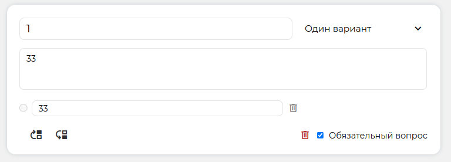
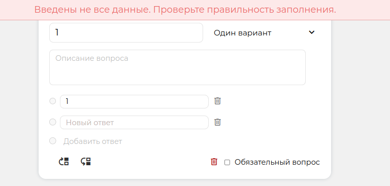
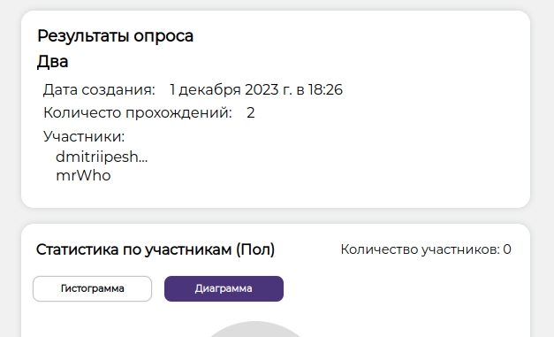

# Домашнее задание 1 по курсу QA команды Komisaki

## Состав команды
- Константин Горшков
- Александр Ларин
- Кирилл Лукьянов

## Тестовое окружение 
* Windows, Chrome 122.0.6261.12, 
* Windows, Yandex 24.3.209, 
* Ubuntu 22.4, Chrome 106.0.4998.76

### [Ссылка на проект](https://formhub.site/forms)

# Логин

| № Тест-кейса | Название проверки                                                                                                     | Результат    | Описание проблемы                                                                                                                                                                                                  | Скрин                                                                                                              |
|--------------|-----------------------------------------------------------------------------------------------------------------------|--------------|--------------------------------------------------------------------------------------------------------------------------------------------------------------------------------------------------------------------|--------------------------------------------------------------------------------------------------------------------|
| 1            | При вводе неполных данных выдается ошибка, вход не срабатывает.                                                       | Положительно |                                                                                                                                                                                                                    |                                                                                                                    | 
| 2            | При вводе неправильного формата почты выдается ошибка с примером правильного формата почты, вход не срабатывает.      | Положительно |                                                                                                                                                                                                                    |                                                                                                                    |
| 3            | При вводе слишком короткого пароля (< 8 символов) выдается ошибка, вход не срабатывает.                               | Положительно |                                                                                                                                                                                                                    |                                                                                                                    |
| 4            | При вводе не существующих данных выдается ошибка, вход не срабатывает.                                                | Положительно |                                                                                                                                                                                                                    |                                                                                                                    |
| 5            | При правильном вводе почты и пароля происходит переход на страницу опросов https://formhub.site/forms.                | Положительно |                                                                                                                                                                                                                    |                                                                                                                    |
| 6            | При нажатии кнопки "Показать пароль" отображаются символы пароля.                                                     | Положительно |                                                                                                                                                                                                                    |                                                                                                                    |
| 7            | При нажатии кнопки "Скрыть пароль" символы пароля перестают отображаться.                                             | Положительно |                                                                                                                                                                                                                    |                                                                                                                    |
| 8            | После входа в приложение, при нажатии на кнопку "Вернуться назад" в браузере, не должна отображаться страница логина. | Отрицательно | При нажатии на кнопку "Вернуться назад" в браузере после входа отображается страница логина, можно повторно войти. Также отображается аватарка и логин пользователя, которые должны появляться только после входа. |  |
| 9            | При нажатии на кнопку "Регистрация" происходит переход на страницу https://formhub.site/signup                        | Положительно |                                                                                                                                                                                                                    |                                                                                                                    |

# Регистрация

| № Тест-кейса | Название проверки                                                                                                                | Результат    | Описание проблемы                                                                                                                                                                                                                                | Скрин                                                                                                              |
|--------------|----------------------------------------------------------------------------------------------------------------------------------|--------------|--------------------------------------------------------------------------------------------------------------------------------------------------------------------------------------------------------------------------------------------------|--------------------------------------------------------------------------------------------------------------------|
| 1            | При вводе неполных данных выдается ошибка, регистрация не срабатывает.                                                           | Положительно |                                                                                                                                                                                                                                                  |                                                                                                                    | 
| 2            | При вводе некоректных символов в поле "Имя" выдается ошибка, регистрация не срабатывает.                                         | Положительно |                                                                                                                                                                                                                                                  |  | 
| 3            | При вводе неправильного формата почты выдается ошибка с примером правильного формата почты, регистрация не срабатывает.          | Положительно |                                                                                                                                                                                                                                                  |                                                                                                                    |
| 4            | При вводе слишком короткого username (< 4 символов) выдается ошибка, регистрация не срабатывает.                                 | Положительно |                                                                                                                                                                                                                                                  |   
| 5            | При вводе неправильного формата username выдается ошибка, регистрация не срабатывает.                                            | Положительно |                                                                                                                                                                                                                                                  | 
| 6            | При вводе слишком короткого пароля (< 8 символов) выдается ошибка, регистрация не срабатывает.                                   | Положительно |                                                                                                                                                                                                                                                  |  
| 7            | При вводе не совпадающего пароля в поле "Повторите пароль" выдается ошибка, регистрация не срабатывает.                          | Положительно |                                                                                                                                                                                                                                                  |                                                                                                                    |
| 8            | При правильном вводе данных происходит переход на страницу опросов https://formhub.site/forms.                                   | Положительно |                                                                                                                                                                                                                                                  |                                                                                                                    |
| 9            | При нажатии кнопки "Показать пароль" отображаются символы пароля в поле, где находится эта кнопка.                               | Положительно |                                                                                                                                                                                                                                                  |                                                                                                                    |
| 10           | При нажатии кнопки "Скрыть пароль" символы пароля перестают отображаться в поле, где находится эта кнопка.                       | Положительно |                                                                                                                                                                                                                                                  |                                                                                                                    |
| 11           | После регистрации в приложении, при нажатии на кнопку "Вернуться назад" в браузере, не должна отображаться страница регистрация. | Отрицательно | При нажатии на кнопку "Вернуться назад" в браузере после регистрации отображается страница регистрации, можно повторно зарегистрироваться. Также отображается аватарка и логин пользователя, которые должны появляться только после регистрации. |  |

# Список опросов

| № Тест-кейса | Название проверки                                                                                     | Результат    | Описание проблемы                                | Скрин                                                                                                              |
|--------------|-------------------------------------------------------------------------------------------------------|--------------|--------------------------------------------------|--------------------------------------------------------------------------------------------------------------------|
| 1            | При вводе в поле поиска названия опроса - он его находит                                              | Положительно |                                                  |                                                                                                                    |
| 2            | При вводе в поле поиска частичного названия опроса - он его находит                                   | Положительно |                                                  |                                                                                                                    |
| 3            | При вводе в поле поиска только части названия опроса - найдутся все совпадения                        | Положительно |                                                  |                                                                                                                    |
| 4            | При вводе в поле поиска несуществующего названия - ничего не выведет                                  | Положительно |                                                  |                                                                                                                    |
| 5            | При пустом поле поиска выдаются все опросы                                                            | Положительно |                                                  |                                                                                                                    |
| 6            | При нажатии на опрос происходит редирект на просмотр опроса https://formhub.site/forms/(номер_опроса) | Положительно |                                                  |                                                                                                                    |
| 7            | При попытке зайти неавторизованным произойдет редирект на страницу логина                             | Положительно |                                                  |                                                                                                                    |
| 8            | При неналичии опросов - будет отображена кнопка, предлагающаяя создать первый опрос                   | Положительно |                                                  |  |
| 9            | При вводе огромного сообщение в поле поиска сервис падает                                             | Отрицательно | Поле поиска не ограничено по количеству символов |  |
| 10           | При вводе спецсимвола в поле поиска не выдается ошибка                                                | Отрицательно | Поле поиска допускает спецсимволы                |  |

# Просмотр опроса (доступно только создателю опроса)

| № Тест-кейса | Название проверки                                                                                        | Результат    | Описание проблемы                                   | Скрин                                                                                                              |
|--------------|----------------------------------------------------------------------------------------------------------|--------------|-----------------------------------------------------|--------------------------------------------------------------------------------------------------------------------|
| 1            | При открытии окна опроса, как создать опроса, он отображается коррекно и без ошибок                      | Положительно |                                                     |                                                                                                                    | 
| 2            | При открытии окна опроса, как случайный пользователь, отобразится предупреждение и опрос не откроется    | Положительно |                                                     |                                                                                                                    | 
| 3            | Переход по ссылке на просмотр определенного опроса                                                       | Отрицательно | Ссылка на опрос не защищена от случайного посещения |  |
| 4            | При просмотре опроса, кнопки создателя опроса видны только ему                                           | Положительно |                                                     |                                                                                                                    |
| 5            | При нажатии конпки "Архивировать" - отобразится окно подтверждения действия                              | Положительно |                                                     |                                                                                                                    |
| 6            | При нажатии конпки "Поделиться" - отобразится окно с ссылкой на опрос                                    | Положительно |                                                     |                                                                                                                    |

# Прохождение опроса (доступно всем, кроме создателя опроса)

| № Тест-кейса | Название проверки                                                                                       | Результат    | Описание проблемы                              | Скрин                                                                                                              |
|--------------|---------------------------------------------------------------------------------------------------------|--------------|------------------------------------------------|--------------------------------------------------------------------------------------------------------------------|
| 1            | При нажатии кнопки "отправить" - результаты прохождения будут отправлены автору опроса                  | Положительно |                                                |                                                                                                                    |
| 2            | При прохождении опроса, не ответив на обезательные вопросы - вылезет предупреждение                     | Положительно |                                                |  |
| 3            | При нажатии кнопки "отменить выбор" - очистится поля выбора вопроса                                     | Положительно |                                                |                                                                                                                    |
| 4            | При попытке выбора нескольких ответов в вопросе с одним - останется все равно один                      | Положительно |                                                |                                                                                                                    |
| 5            | При вводе ответа в вопросе с текстовым ответом - он сохраняется в результаты                            | Положительно |                                                |                                                                                                                    |
| 6            | При вводе ответа в вопросе с текстовым ответом разрешены все символы и знаки                            | Отрицательно | Нет экранирования xss                          |  |
| 7            | При нажатии конпки "Задать вопрос" - отобразится окно с текстовым полем для вопроса автору опроса       | Положительно |                                                |                                                                                                                    |
| 8            | При вводе вопроса автору разрешены любые символы                                                        | Отрицательно | Нет экранирования xss                          |  |

# Создание/Редактирование опроса
Создание нового опроса и редактирование старого используют один и тот же интерфейс, следовательно, проверки функционала 
для этих экранов было решено свести в одну таблицу. 

| № Тест-кейса | Название проверки                                                                                  | Результат    | Описание проблемы                                           | Скрин                            |
|--------------|----------------------------------------------------------------------------------------------------|--------------|-------------------------------------------------------------|----------------------------------|
| 1            | При редактировании, все поля формы заполняются корректно редактируему опросу при открытии страницы | Положительно |                                                             |                                  |
| 2            | Текстовые поля допускают ввод только латинских и русских букв, знаков и цифр                       | Положительно |                                                             |                                  |
| 3            | Поля названий (опроса и вопросов) не могут оставаться пустыми при сохранении изменений             | Положительно |                                                             |                                  |
| 4            | При сохранении, пустые поля названий подсвечиваются красным                                        | Положительно |                                                             |                                  |
| 5            | Проставление анонимности убирает лимит прохождений                                                 | Положительно |                                                             |                                  |
| 6            | Проставление лимита больше 100 автоматически переводтится в число 100                              | Положительно |                                                             |                                  |
| 7            | Проставление лимита меньше 1 автоматически переводтится в "Без ограничений"                        | Положительно |                                                             |                                  |
| 8            | Неккоректно заданный лимит автоматически переводтится в "Без ограничений"                          | Положительно |                                                             |                                  |
| 9            | Не до конца заполненная дата архивации после сохранения остается пустой                            | Положительно |                                                             |                                  |
| 10           | Прошедшая на текущий момент дата переводится в пустой ввод                                         | Положительно |                                                             |                                  |
| 11           | Неккоректно заданная дата архивации автоматически переводтится в пустой ввод                       | Положительно |                                                             |                                  |
| 12           | При переключении типов вопроса, список ответов сохраняется неизменным                              | Положительно |                                                             |                                  |
| 13           | Удаление ответа не отражается на порядке и содержание других                                       | Положительно |                                                             |                                  |
| 14           | После добавления 12го ответа, кнопка "Добавить ответ" пропадает                                    | Положительно |                                                             |                                  |
| 15           | После удаления одного из 12 ответов, кнопка "Добавить ответ" возвращается                          | Отрицательно | Кнопка "Добавить ответ" не отобразилась вновь               |   |           
| 16           | Удаление вопроса не отражается на порядке и содержании других вопросов                             | Положительно |                                                             |                                  |           
| 17           | Поля ответов не могут оставаться пустыми при сохранении изменений                                  | Положительно |                                                             |                                  |
| 18           | При сохранении, пустые поля ответов подсвечиваются красным                                         | Отрицательно | Пустые посля не подсвечиваются и никак не указывают на себя |  |
| 19           | Поля ответов не могут повторяться внутри одного вопроса, при сохранении подсвечиваются красным     | Положительно |                                                             |                                  |
| 20           | Перемещение вопросов вверх и вниз происходит корректно                                             | Положительно |                                                             |                                  |           
| 21           | При перемещении первого вопроса вверх / последнего вниз ничего не происходит                       | Положительно |                                                             |                                  |           
| 22           | Кнопка "+" в крнце страницы добавляет новый пустой вопрос в конец списка                           | Положительно |                                                             |                                  |           
| 23           | При сохранении, опрос обновляется/создается корректно с введенной информацией                      | Положительно |                                                             |                                  |
| 24           | При выходе со страницы редактирования/создания опроса, появляется окно подтверждения               | Положительно |                                                             |                                  |

# Результаты опроса

| № Тест-кейса | Название проверки                                                                            | Результат    | Описание проблемы                             | Скрин                            |
|--------------|----------------------------------------------------------------------------------------------|--------------|-----------------------------------------------|----------------------------------|
| 1            | Корректно отображаются название, дата создания и кол-во прохождений опроса                   | Положительно |                                               |                                  |
| 2            | Для анонимного опроса отображается соответствующая надпись                                   | Положительно |                                               |                                  |
| 3            | Для неанонимного опроса отображается список участников                                       | Положительно |                                               |                                  |
| 4            | Кол-во участников в статистике и кол-во прохождений совпадают                                | Отрицательно | Кол-во участников в статистике всегда равно 0 |  |
| 5            | Корректно отображаются название, описание, список ответов для каждого вопроса                | Положительно |                                               |                                  |
| 6            | Подсчет количества данных ответов на каждый вариант ответа и процентного отношений корректен | Положительно |                                               |                                  |
| 7            | Переключение между диаграммой и гистограммой работает правильно                              | Положительно |                                               |                                  |
| 8            | Диаграмма отображается соответственно данным                                                 | Положительно |                                               |                                  |
| 9            | Гистограмма отображается соответственно данным                                               | Положительно |                                               |                                  |
| 10           | Ответы для вопроса типа "Текст (абзац)" отображаются списком данных ответов                  | Положительно |                                               |                                  |
| 11           | Экспорт данных в формат Excel происходит нормально, браузер скачивает файл                   | Положительно |                                               |                                  |
| 12           | Экспорт данных в формат CSV происходит нормально, браузер скачивает файл                     | Положительно |                                               |                                  |

# Чат

| № Тест-кейса | Название проверки                                                                                 | Результат    | Описание проблемы                            | Скрин                                                                                                              |
|--------------|---------------------------------------------------------------------------------------------------|--------------|----------------------------------------------|--------------------------------------------------------------------------------------------------------------------|
| 1            | При отправке сообщения - оно доходит до адресата                                                  | Положительно |                                              |  |
| 2            | При отправке длинного сообщения - оно не переносится на следующую строку и нет ограничеия символы | Отрицательно | Поле сообщения не ограничено и нету переноса |  |

# Профиль пользователя

| № Тест-кейса | Название проверки                                                                                                                                                         | Результат    | Описание проблемы                                                                             | Скрин                                                                                                              |
|--------------|---------------------------------------------------------------------------------------------------------------------------------------------------------------------------|--------------|-----------------------------------------------------------------------------------------------|--------------------------------------------------------------------------------------------------------------------|
| 1            | При нажатии на кнопку "Мои опросы" на странице профиля происходит редирект на страницу опросов пользователя https://formhub.site/forms                                    | Положительно |                                                                                               |                                                                                                                    |
| 2            | При нажатии на кнопку "Редактировать профиль" на странице профиля происходит редирект на страницу редактирования профиля пользователя https://formhub.site/profile/update | Положительно |                                                                                               |                                                                                                                    |
| 3            | При загрузке неправильного формата аватарки выдается ошибка с примером нужных форматов, предпросмотр аватарки не меняется.                                                | Положительно |                                                                                               |                                                                                                                    | 
| 4            | При загрузке правильного формата аватраки предпросмотр корректно меняется, даже при разных разрешениях изображения.                                                       | Положительно |                                                                                               |                                                                                                                    | 
| 5            | При нажатии кнопки "Удалить аватарку" предпросмотр корректно меняется.                                                                                                    | Положительно |                                                                                               |                                                                                                                    | 
| 6            | При нажатии кнопки "Удалить аватарку" у пользователя предпросмотр не меняется.                                                                                            | Положительно |                                                                                               |                                                                                                                    | 
| 7            | При вводе неправильного формата почты выдается ошибка с примером правильного формата почты, сохранение не срабатывает.                                                    | Положительно |                                                                                               |                                                                                                                    |
| 8            | При вводе некоректных символов в поле "Имя" выдается ошибка, сохранение не срабатывает.                                                                                   | Положительно |                                                                                               |                                                                                                                    | 
| 9            | При вводе слишком короткого username (< 4 символов) выдается ошибка, сохранение не срабатывает.                                                                           | Положительно |                                                                                               |                                                                                                                    |
| 10           | При вводе неправильного формата username выдается ошибка, сохранение не срабатывает.                                                                                      | Положительно |                                                                                               |                                                                                                                    |
| 11           | При вводе правильного формата username сохранение срабатывает.                                                                                                            | Отрицательно | При вводе правильного формата username и нажатии кнопки "Сохранение" выдается ошибка сервера. |  |
| 12           | При изменении старого пароля и вводе других данных выдается ошибка о том, что старый пароль неверный, сохранение не срабатывает.                                          | Отрицательно | При изменении старого пароля и вводе других данных выдается ошибка сервера.                   |  |
| 13           | При вводе слишком короткого пароля (< 8 символов) в любом поле выдается ошибка, сохранение не срабатывает.                                                                | Положительно |                                                                                               |                                                                                                                    |
| 14           | При вводе не совпадающего пароля в поле "Повторите пароль" выдается ошибка, сохранение не срабатывает.                                                                    | Положительно |                                                                                               |                                                                                                                    |
| 15           | При правильном изменении данных происходит переход на страницу профиля с новыми данными пользователя https://formhub.site/profile                                         | Положительно |                                                                                               |                                                                                                                    |
| 16           | При нажатии кнопки "Показать пароль" отображаются символы пароля в поле, где находится эта кнопка.                                                                        | Положительно |                                                                                               |                                                                                                                    |
| 17           | При нажатии кнопки "Скрыть пароль" символы пароля перестают отображаться в поле, где находится эта кнопка.                                                                | Положительно |                                                                                               |                                                                                                                    |

# Выпадающее меню пользователя в шапке сайта

| № Тест-кейса | Название проверки                                                                                                                                                       | Результат    | Описание проблемы | Скрин |
|--------------|-------------------------------------------------------------------------------------------------------------------------------------------------------------------------|--------------|-------------------|-------|
| 1            | При нажатии на имя пользователя или аватарку на шапке сайта открывается выпадающее меню с кнопками.                                                                     | Положительно |                   |       |
| 2            | При нажатии на кнопку "Профиль" в выпадающем меню происходит редирект на страницу профиля https://formhub.site/profile                                                  | Положительно |                   | 
| 3            | При нажатии на кнопку "Мои опросы" в выпадающем меню происходит редирект на страницу опросов пользователя https://formhub.site/forms                                    | Положительно |                   |       |
| 4            | При нажатии на кнопку "Выйти" в выпадающем меню происходит выход из аккаунта и редирект на главную страницу https://formhub.site                                        | Положительно |                   |       |
| 5            | После выхода из аккаунта, при нажатии на кнопку "Вернуться назад" в браузере происходит редирект на страницу логина с ошибкой о том, что пользователь не авторизирован. | Положительно |                   |       |
