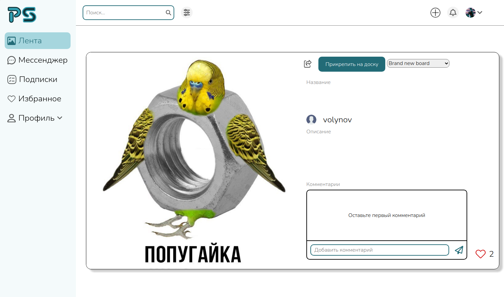
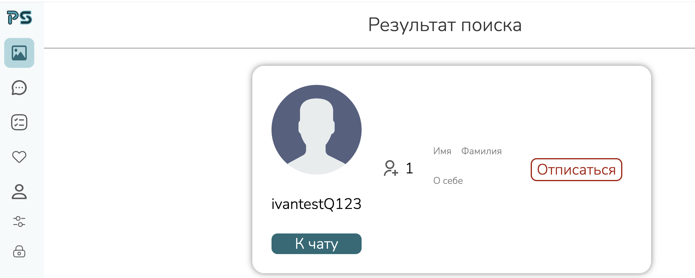

# Обеспечение качества

**Домашнее задание №1** в рамках 3-го семестра программы по Веб-разработке **_Образовательного центра VK x МГТУ им.Н.Э.Баумана_** (ex. "Технопарк") по дисциплине "Обеспечение качества"

#### Команда: OND team

#### Состав команды:

1. Мамадаев Муслим ([Telegram](https://t.me/muslimitsuhide), [VK](https://vk.com/muslimitsuhide))
2. Роман Сулайманов
3. Артем Арзамасцев
4. Максим Зубков

#### Деплой: [PinSpire](https://pinspire.site/)

#### Данные тестового пользователя: 
* **Имя пользователя:** QAtestUser
* **Пароль:** Tester123
---

#### Содержание:

1. [Регистрация](#1)
2. [Авторизация](#2)
3. [Страница ленты](#3)
4. [Пины](#4)
5. [Доски](#5)
6. [Функционал лайков и комментариев](#6)
7. [Функционал уведомлений](#7)
8. [Поиск](#8)
9. [Подписки](#9)
10. [Профиль](#10)
11. [Мессенджер](#11)
12. [Навигация](#12)

---

# Регистрация

[Ссылка](https://pinspire.site/signup)

**Положительные тест-кейсы:**

1. При нажатии на кнопку **"Войти"** произойдет редирект на страницу авторизации.
2. При нажатии на кнопку в виде крестика в левом верхнем углу закроется окно регистрации.
3. При вводе любого набора символов в input поля **"Пароль"** или **"Повтор пароля"** текст отображается в виде точек.
4. Успешная регистрация и дальнейший редирект на главную страницу с лентой при заполнении всех input полей валидными данными и нажатии на кнопку **"Создать аккаунт"**:
    * Input поле **"Имя пользователя"** должно содержать любой набор символов длиной от 4 до 50 символов, состоящий только из букв латинского алфавита, цифр и символов разделитей ("_", "-");
    * Input поле **"Почта"** должно содержать любой существующий почтовый адрес;
    * Input поле **"Пароль"** должно содержать любой набор символов длиной от 8 до 50 символов, состоящий только из букв латинского алфавита (причем имеющего хотя бы одну букву в верхнем регистре), цифр и специальных символов;
    * Input поле **"Повторите пароль"** должно содержать тот же набор символов, что и input поле **"Пароль"**.

**Негативные тест-кейсы:**

1. При нажатии на кнопку **"Создать аккаунт"** с пустыми input полями возникают сообщения под каждым из полей с информацией о том, что его нужно заполнить и сами input поля выделяются красным цветом.
2. При вводе эмодзи в любое input поле и дальнейшем нажатии на кнопку **"Создать аккаунт"** под этим полем возникает сообщение о том, что оно содержит недопустимые символы и само input поле выделится красным цветом.
3. При вводе букв русского алфавита и специальных символов в input поле **"Имя пользователя"** и дальнейшем нажатии на кнопку **"Создать аккаунт"** под полем возникает сообщение о том, что оно содержит недопустимые символы и само input поле выделится красным цветом.
4. При вводе в input поле **"Почта"** набора символов, не содержащих "@" и дальнейшем нажатии на кнопку **"Создать аккаунт"** под полем возникает сообщение о том, что оно должено содержать символ "@" и само input поле выделится красным цветом.
5. При вводе в input поле **"Имя пользователя"** того имени, которое уже зарегистрировано и дальнейшем нажатии на кнопку **"Создать аккаунт"** над кнопкой возникает сообщение о том, что такой пользователь уже зарегистрирован (например, имя пользователя: **QAtestUser**).
6. При вводе в input поле **"Имя пользователя"** набора символов длиной до 4 символов и дальнейшем нажатии на кнопку **"Создать аккаунт"** под полем возникает сообщение с информацией о том, что оно должно состоять из набора символов длиной более 4 символов и само input поле выделится красным цветом.
7. При вводе в input поле **"Почта"** набора символов длиной до 4 символов и дальнейшем нажатии на кнопку **"Создать аккаунт"** под полем возникает сообщение с информацией о том, что оно должно состоять из набора символов длиной более 4 символов и само input поле выделится красным цветом.
8. При вводе в input поле **"Пароль"** набора символов длиной до 8 символов и дальнейшем нажатии на кнопку **"Создать аккаунт"** под полем возникает сообщение с информацией о том, что оно должно состоять из набора символов длиной более 8 символов и само input поле выделится красным цветом.
9. При вводе в input поле **"Почта"** набора символов длиной более 50 символов и дальнейшем нажатии на кнопку **"Создать аккаунт"** под полем возникает сообщение с информацией о том, что оно должно состоять из набора символов длиной не более 50 символов и само input поле выделится красным цветом.
11. При вводе в input поле **"Пароль"** набора символов длиной более 50 символов и дальнейшем нажатии на кнопку **"Создать аккаунт"** под полем возникает сообщение с информацией о том, что оно должно состоять из набора символов длиной не более 50 символов и само input поле выделится красным цветом.
10. При вводе в input поле **"Имя пользователя"** набора символов длиной более 50 символов и дальнейшем нажатии на кнопку **"Создать аккаунт"** под полем возникает сообщение с информацией о том, что оно должно состоять из набора символов длиной не более 50 символов и само input поле выделится красным цветом.
12. При вводе в input поля **"Пароль"** и **"Повтор пароля"** набора символов длиной от 8 до 50 символов, но не имеющего символа латинского алфавита в верхнем регистре и дальнейшем нажатии на кнопку **"Создать аккаунт"** под полями возникают сообщения с информацией о том, что поля должны содержать символ в верхнем регистре и сами input поля выделятся красным цветом.
13. При вводе в input поля **"Пароль"** и **"Повтор пароля"** различающихся наборов символов и дальнейшем нажатии на кнопку **"Создать аккаунт"** под полями возникают сообщения с информацией о том, что поля не совпадают и сами input поля выделятся красным цветом.
12. [**БАГ**] При вводе некорректных данных в input поля и нажатии на кнопку **"Создать аккаунт"** появляются сообщения под полями и сами поля выделяются красным цветом, но при повторном вводе данных сообщения не исчезают и цвет символов внутри полей остается красным (см. скриншот).

  

# Авторизация

[Ссылка](https://pinspire.site/login)

**Положительные тест-кейсы:**

1. При нажатии на кнопку **"Регистрация"** произойдет редирект на страницу авторизации.
2. При вводе верного имени пользователя в input поле **"Имя пользователя"** , пароля в поле **"Пароль"** и дальнейшем нажатии на кнопку **"Войти"** происходит перенаправление на главную страницу с лентой, где в хэдере появляется аватарка пользователя.

**Негативные тест-кейсы:**

1. При нажатии на кнопку **"Войти"** с пустыми input полями возникают сообщения под каждым из полей с информацией о том, что его нужно заполнить и сами input поля выделяются красным цветом.
2. При вводе в input поля **"Имя пользователя"** или **"Пароль"** неверных данных и дальнейшем нажатии на кнопку **"Войти"** над кнопкой возникает сообщение с информацией о том, что введено неверное имя пользователя или пароль и сами input поля выделятся красным цветом.
3. [**БАГ**] При вводе некорректных данных в input поле **"Пароль"** и нажатии на кнопку **"Войти"** появляется сообщение под полем и само поле выделяется красным цветом, но при повторном вводе данных сообщение не исчезает и цвет символов внутри поля остается красным (см. скриншот).

  

# Страница ленты

[Ссылка](https://pinspire.site/)

## Неавторизованный пользователь

**Положительные тест-кейсы:**

1. Приветственный лейбл в начале ленты отображается корректно.

  

2. Кнопка **"Вход"** в хэдере отображается корректно и верно отрабатывают редирект пользователя на страницу авторизации.
3. Кнопка **"Регистрация"** в хэдере отображается корректно и верно отрабатывает редирект пользователя на страницу регистрации.
4. При наведении курсора на пин он затемняется и появляется возможность поставить лайк. При дальнейшем нажатии на иконку лайка произойдет редирект на страницу авторизации.

**Негативные тест-кейсы:**

1. [**БАГ**] При быстром скролле вниз пины не успевают прогрузиться и приходится находится на пустой странице какое-то время (см. скриншот)

  

## Авторизованный пользователь

**Положительные тест-кейсы:**

1. Аватарка пользователя в хэдере отображается корректно.

  

2. Кнопка для создания пина/доски в хэдере отображается корректно.

  

3. Кнопка для просмотра уведомлений в хэдере отображается корректно.

  

4. Input поле для ввода поискового запроса отображается корректно.

  

5. Кнопка для выбора фильтров поиска отображается корректно.

  

6. При наведении курсора на любой из пинов он затемняется и появляется возможность поставить лайк.

  

7. Sidebar отображается корректно.

  

# Пины

[Ссылка](https://pinspire.site/pin/208)

**Положительные тест-кейсы:**

  

1. При открытии пина из ленты, пин и информация о нем отображается корректно.
2. При открытии пина из профиля пользователя, пин и информация о нем отображается корректно.
3. При открытии пина из поиска, пин и информация о нем отображается корректно.
4. При открытии пина из доски, пин и информация о нем отображается корректно.
5. При открытии своего пина присутствуют кнопки удаления и редактирования.

  

6. Редактирование названия и описания пина производится успешно.
7. Удаление пина производится успешно.
8. Создание пина происходит успешно.

**Негативные тест-кейсы:**

1. При наличии пустых полей названия или описания, поля ввода не отмечаются дефолтными фразами (например: "у пина отсутствует описание").
2. **[БАГ]** При выборе картинки во время создания пина, не отображается ее миниатюра.

  

3. **[БАГ]** Не работает drag&drop.
4. **[БАГ]** Не всегда отображается сообщение об ошибке при загрузке фотографии большого размера (более 10МБ).
5. Цензурирование контента работает успешно. Фильтруются файлы с неприличным содержанием, а также гуси.

  

6. Работает проверка неподходящего формата (поддерживаемые форматы: png, jpg, jpeg).

  

7. Работает проверка неподходящего размера файла (допустимые размеры файла: 100-6000 px).

  

# Доски

**Положительные тест-кейсы:**

1. Прикрепеление пина к доске производится успешно.
2. Создание доски с пинами производится успешно.
3. Создание доски без пинов производится успешно.
4. Редактирование названия и описания доски производится успешно.
5. Удаление доски производится успешно.
6. Невозможно прикрепить пин на доску без авторизации.

**Негативные тест-кейсы:**

1. **[БАГ]** При повторном прикреплении пина к доске, прикрепления не происходит, но при этом отсутствует уведомление, о том, что пин уже имеется на выбранной доске.
2. **[БАГ]** При нажатии на кнопку "Назад" на странице создания доски, создается доска без пинов.
3. Можно создать доску с пустым названием и описанием.

# Функционал лайков и комментариев

**Положительные тест-кейсы:**

1. Лайки ставятся корректно. При лайке счетчик увеличивается на 1.
2. Лайки удаляются корректно. При снятии лайка счетчик уменьшается на 1.
3. На лайкнутых пинах отображается красное сердечко, на остальных - серое.

  

4. Комментарии оставляются успешно.
5. Ненормативная лексика в комментариях после перезагрузки страницы заменяется на символы "*".

  

6. Комментарий успешно отправляется по нажатию клавиши Enter.

**Негативные тест-кейсы:**

1. При попытке поставить лайк пину неавторизованным пользователем, пользователя перекидывает на страницу авторизации.
2. При попытке оставить комментарий неавторизованным пользователем, пользователя перекидывает на страницу авторизации.
3. **[БАГ]** Присутствуют случаи ошибочной фильтрации текста в комментариях: слова, не содержащие неприличного контента попадают под цензуру.

  

# Функционал уведомлений

Важная особенность уведомлений заключается в том, что они запланированно живут в рамках одной загрузки приложения.

**Положительные тест-кейсы:**

1. При отправке пользователю сообщения, он об этом получает уведомление, в случае нахождения пользователя на всех страницах, где необходимо такое поведение (все кроме чата с отправителем).

  

2. При нахождении в чате с другим пользователем, уведомления о приходе от него новых сообщений пользователь не получает.
3. Если у пользователя есть неочищенные уведомления, то у значка с уведомлениями (колокольчик) появляется уведомительная точка.

  

4. При нажатии на значок с уведомлениями (колокольчик), и при этом он без уведомительной точки в углу, то пользователь видит надпись: "Нет уведомлений".

  

5. При нажатии на значок с уведомлениями (колокольчик) с уведомительной точки в углу (такое состояние он принимает, когда у пользователя есть неудаленные уведомления), у пользователя появляется окошко со всеми уведомлениями о новых сообщениях, которые он еще не прочитал либо не удалил.

  

6. При нажатии на корзину рядом с уведомлением, оно исчезает, и пользователь больше его не видит.
7. При клике на уведомление о приходе нового сообщения, пользователь попадает в переписку с отправителем этого сообщения, при этом уведомление пропадает.
8. При нажатии на надпись "Очистить все" в окошечке с уведомлениями, они все стираются.
9. При условии разрешения уведомления от сайта в браузере, пользователь, находясь на другой вкладке или свернув браузер, дополнительно получает уведомление от браузера о приходе нового сообщения.
10. **[БАГ]** Если у пользователя не очищены все уведомления, то последующие приходы уведомлений он никак не различает.
Все новые уведомления о приходе сообщений (начиная со второго), сопровождаются неизменным состоянием значка уведомлений 

  

**Негативные тест-кейсы:**

1. **[БАГ]** При прочтении сообщения от пользователя, отличным от перехода в переписку по клику на уведомление способом, то уведомление о приходе этого сообщения остается.
2. **[БАГ]** При преходе по клику на уведомеление в переписку с пользователем, исчезает только уведомление, по которому был произведен клик, в случае если имеются еще уведомления о приходе от этого пользователя сообщений, которые были прочитаны при переходе, они остаются.
3. **[БАГ]** При нахождении на сайте довольно небольшое время (более 1 минуты) без перезагрузки и получения каких-либо уведомлений, работоспособность уведомлений теряется. В таком случае пользователь больше уведомлений не получает.

# Поиск

##### \*Поисковая выдача считается релевантной в том случае, когда все результаты содержат в себе непрывную последовательность символов без учета регистра, которая была введена в поле поиска.

**Положительные тест-кейсы:**

1. При не нахождении данных релевантных поисковому запросу, пользователь ожидаемо получает сообщение: "Ничего не найдено" и видит кнопку "На главную", нажав на которую, он может вернуться на главную.

  

2. При выборе категории поиска (Люди/Пины/Доски) пользователь получает результат только из этой категории (Люди/Пины/Доски) релевантный поисковому запросу.
3. Input поле поиска при вводе длинной последовательности (выходящей за рамки поля по длине) отображает последние помещающиеся символы. Впереди стоящие символы последовательности скрываются.

  

4. При переходе по другим страницам, ввод в окно поиска сохраняется, категория тоже.

**Негативные тест-кейсы:**

1. **[БАГ]** При вводе символов отличных от английского алфавита и цифр, поиск приводит пользователя на ненайденную страницу.

  

2. **[БАГ]** При выбранных категория "Люди" или "Доски", не пустом поле ввода и неоднакратном нажатии на лупу, URI в навигационном поле браузера излишне видоизменяется, такое должно происходить только при первом нажатии.

  

# Подписки

[Ссылка](https://pinspire.site/subscriptions)

**Положительные тест-кейсы:**

1. Переходя в профиль любого другого пользователя, на котого еще нет подписки, пользователь видит кнопку "Подписаться" бирюзового цвета, нажав на которую он становится подписчиком выбранного пользователя, и теперь этот пользователь будет отображаться у него на странице подписок, до тех пор, пока пользователь от него не отпишется.

  

2. Переходя в профиль любого другого пользователя, на котого есть подписка, пользователь видит кнопку "Отписаться" красного цвета, нажав на которую он отписывается от выбранного пользователя, и теперь этот пользователь перестанет отображаться у него на странице подписок, пока снова пользователь на него не подпишется.

  

3. При вводе символов в окно ввода на странице подписок, количество отображаемых подписок сокращается или никак не меняется, остаются только соответсвующие фильтру пользователи (содержащие в своем пользовательском имени введенную последовательность символов)

  

**Негативные тест-кейсы:**

1. **[БАГ]** При вводе последовательности символов, длина которой превышает длину окна ввода, ввод сохраняет возможность обрезаться под длину, при этом он стабильно выходит на один символ за пределы окна.

# Профиль

[Ссылка](https://pinspire.site/profile)

**Положительные тест-кейсы:**

1. При открытии страницы с пинами и досками пользователя список пинов и досок отображается корректно, количество пинов/досок, а также аватарка профиля синхронизированы.

  

2. При открытии страницы профиля данные форм и аватарка отображаются корректно

  

3. При загрузке картинки с поддерживаемым расширением и размером аватарка пользователя корректно обновляется
4. При введении данных в корректном текстовом формате (цифры, латинские символы, кириллица - кроме имени пользователя) и при нажатии на “сохранить” данные пользователя успешно обновляются
5. В блоке “Безопасность” данные почты и аватарка пользователя отображаются корректно

  

6. **[БАГ]** При смене аватарки картинка на странице профиля и в шапке не синхронизируются до обновления страницы

  

**Негативные тест-кейсы:**

1. При введении данных с использованием специальных символов, символов кириллицы(в поле “Имя пользователя”) выводится информативное сообщение об ошибке, инпут подсвечиваются красным цветом
2. При введении пароля длиной более 50 символов выводится сообщение об ошибке "Длина пароля должна быть менее 50 символов"
При введении пароля с использованием только символов в верхнем регистре выводится сообщение "Пароль должен содержать символ в нижнем регистре"
3. При вводе почты некорректного формата (без “@”, некорректный домен) выводится соответствующее сообщение об ошибке, инпут подсвечиваются красным цветом
4. При вводе пароля длиной менее 8 символов высвечивается соответствующее сообщение об ошибке, инпут подсвечиваются красным цветом
5. Если пароли не совпадают, высвечивается соответствующее сообщение об ошибке, инпут подсвечиваются красным цветом
6. **[БАГ]** При неуспешной попытке обновить аватарку высвечивается неинформативное сообщение “Эта аватарка не подойдет”

  

# Мессенджер

[Ссылка](https://pinspire.site/messenger)

**Положительные тест-кейсы:**

1. При открытии мессенджера количество доступных чатов отображается корректно, то есть оно равно количеству заведенных переписок.
2. Сообщения чата отображаются корректно, текст сообщения совпадает с тем, что ввел пользователь ранее, последовательность сообщений отсортирована по времени отправки.
3. Сообщения отправляются корректно, присутствует анимация процесса отправки и успешного результата
4. Сообщения собеседника отображаются корректно и синхронизированы.
5. Анимация прочтения сообщения присутствует, синхронизирована с действием пользователя на другой стороне.
6. Работает отправка сообщения по кажатию на клавишу Enter.
7. Поиск пользователя работает корректно, результаты соответствуют условию фильтрации, регистр символов не влияет на результат.
8. **[БАГ]** Иногда сообщения не отправляются и исчезают после обновления страницы.

  

  

# Навигация

**Положительные тест-кейсы:**

1. При нажатии на логотип сервиса происходит редирект на главную страницу с лентой.
2. При нажатии на иконки sidebar’а соответствующие страницы отображаются корректно (на мобильных устройствах).

  

3. При нажатии на кнопку “Лента” в sidebar’е редирект на главную страницу происходит корректно.
4. При нажатии на кнопку “Мессенджер” в sidebar’е редирект на страницу с чатами происходит корректно.
5. При нажатии на кнопку “Подписки” в sidebar’е редирект на страницу с подписками происходит корректно.
6. При нажатии на кнопку “Избранное” в sidebar’е редирект на страницу с лайкнутыми пинами происходит корректно.
7. При нажатии на кнопку “Профиль” в sidebar’е редирект на страницу профиля пользователя происходит корректно.
9. При нажатии на кнопку “Данные аккаунта” в sidebar’е редирект на страницу с данными аккаунта пользователя происходит корректно.
10. При нажатии на кнопку “Безопасность” в sidebar’е редирект на страницу с данными аккаунта, связанными с безопасностью, происходит корректно.
11. При нажатии на кнопку “Создать пин” в хэдере редирект на форму для создания пина отрабатывает корректно.
12. При нажатии на кнопку “Создать доску” в хэдере редирект на форму для создания доски отрабатывает корректно.

**Негативные тест-кейсы:**

1. При намеренном изменении текущего URL на некорректный (в т.ч. попытка выбора несуществующих пина/доски) отображается страница 404.
2. [**БАГ**] Вместо отображения “404-ой” страницы при попытке получить несуществующий профиль отображается пустая страница.

