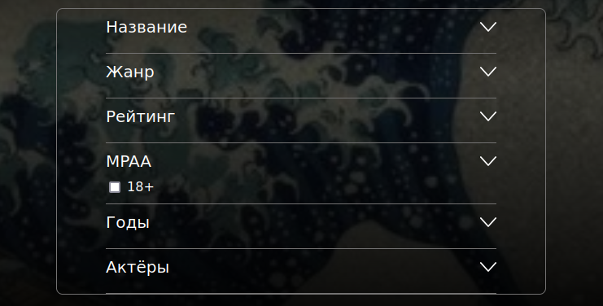
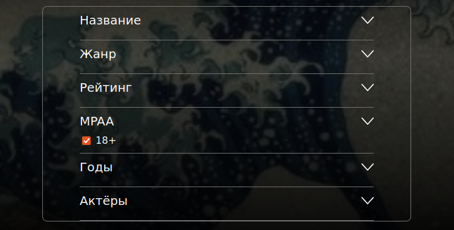

# Расширенный поиск по фильмам и актерам

## Поиск по фильмам

* При вводе названия фильма (любой длинной), рейтинга от 0 до 10, даты выпуска от текущего времени и позже, выборе определенных жанров, в ответе возвращаются соответствующие фильмы.
* При нажатии на кнопку поиска без настройки фильтров выдаются все существующие фильмы.
* При выборе определенных жанров будут выдаваться соответствующие фильмы.
* __BUG:__ При вводе символов в поля рейтинга поиск выдаёт список всех фильмов.

* Когда флажок в неактивном положении выдаётся список фильмов вне зависимости от возрастных ограничений.

* Когда флажок в активном положении выдаётся список фильмов только 18+.

* __BUG:__ При вводе нулевого дня и нулевого месяца ещё не наступившего года в ответе возвращаются все существующие фильмы.

* При вводе валидного диапазона дат в ответе возвращаются соответствующие фильмы.
* При вводе одного актёра поиск фильма срабатывает полностью.
* __BUG:__ При вводе нескольких актёров поиск фильма срабатывает только по первому актёру.

## Поиск по актерам

* При нажатии кнопки “Показать результат” выдаются все актеры/фильмы
* при вводе, с полным соответствием, искомого параметра целевому, выводиться соответствующий актер
* Если при поиске ничего не найдено, то выдается соответствующее сообщение
