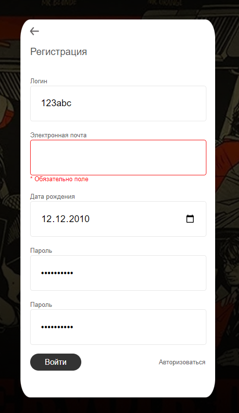
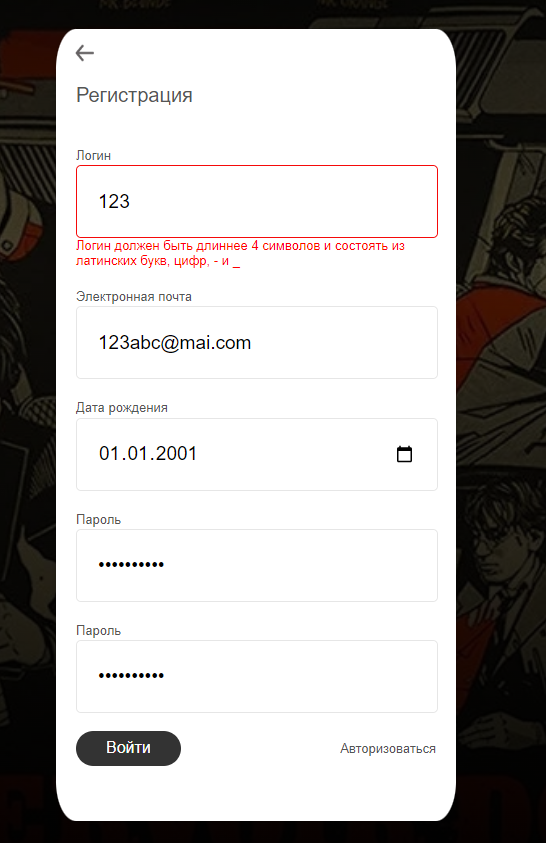
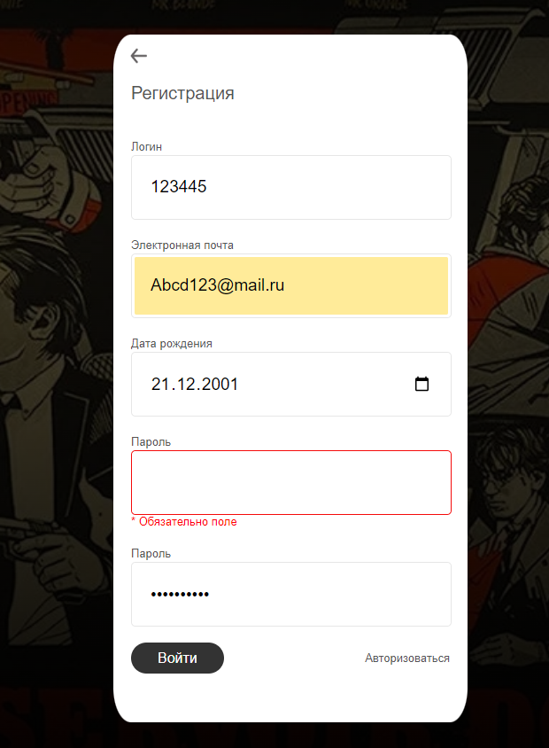

## Авторизация и регистрация

## Регистрация

1. Поле e-mail
    * При заполнении реальным e-mail регистрации проходит успешно. Регулярное выражение валидирующее поле e-mail:
    ``
        /^[a-zA-Z0-9.]+@[a-zA-Z0-9.]+$/
    ``
    * При пустом поле появляется ошибка: `` *Обязательное поле ``
    
    * При заполнении поля невалидной почтой (без символа @) появляется ошибка.
    * __Bug__ При заполнении кириллицей появляется ошибка (хотя есть адреса и домены с кириллическими символами).
    * При наличии в базе введенной почты выдается ошибка в том, что такая почта уже существует.

1. Поле имени пользователя
    * При заполнении латиницей или цифрами от 4 символов и выше, регистрация проходит успешно.
    * При пустом поле появляется ошибка.
    * При заполнении кириллицей появляется ошибка.
    * При заполнении поля 3 символами и меньше появляется ошибка: `` Логин должен быть длиннее 4 символов и состоять из латинских букв, цифр, - и _ ``.
    
    * При заполнении смайликом появляется ошибка: `` Логин должен быть длиннее 4 символов и состоять из латинских букв, цифр, - и _ ``.
    
    * При заполнении спец. символами возникает ошибка: `` Логин должен быть длиннее 4 символов и состоять из латинских букв, цифр, - и _ ``.
    
    * При наличии в базе введенного логина выдается ошибка: `` Логин уже используется ``.
    

1. Поля пароля и подтверждения пароля
    * При заполнении валидным паролем (латиницей длиннее 8 символов и содержащим хотя бы 1 цифру и 1 букву) регистрация проходит успешно.
    * При пустых полях появляется ошибка: `` * Обязательно поле ``.
    
    * При заполненном верхнем поле пароль и пустом нижнем, появляется ошибка: `` * Обязательно поле ``. 
    
    * При заполненном нижнем поле пароль и пустом верхнем, появляется ошибка: `` * Обязательно поле ``. 
    
    * При несоответствии полей пароля и повторения пароля появляется ошибка: `` Пароли не одинаковые ``.
    
    * При заполнении кириллицей появляется ошибка: `` Пароль должен содержать не менее 8 символов, иметь хотя бы одну заглавную букву, строчную латинскую букву и цифру ``.
    
    * При заполнении пароля без цифр появляется ошибка: `` Пароль должен содержать не менее 8 символов, иметь хотя бы одну заглавную букву, строчную латинскую букву и цифру ``.
    * При заполнении пароля без букв появляется ошибка: `` Пароль должен содержать не менее 8 символов, иметь хотя бы одну заглавную букву, строчную латинскую букву и цифру ``.
    * При попытке заполнения пароля меньше чем 8 символами (латиницей и содержащим хотя бы 1 цифру и 1 букву), появляется ошибка: `` Пароль должен содержать не менее 8 символов, иметь хотя бы одну заглавную букву, строчную латинскую букву и цифру ``.

1. Поле дня рождения
    * При вводе дня больше 6 лет назад регистрация проходит успешно.
    * При попытке ввода дня меньше 6 лет назад выдается ошибка.
    * __Bug__ При попытке ввода дня больше 100 лет назад выдается ошибка, хотя есть люди старше 100 лет.
    * Ввод любых символов, помимо цифр блокируется.

## Авторизация

* При вводе существующего имени и правильного пароля авторизации (и аутентификация) проходят успешно. Успешная вход в аккаунт.
* При вводе неправильного пароля появляется ошибка `` Ошибка пароля или логина ``.

* При вводе несуществующего имени появляется ошибка `` Ошибка пароля или логина ``.
* При нажатии кнопки “Войти” с незаполненным полем имени появляется ошибка`` * Обязательно поле ``.
* При нажатии кнопки “Войти” с незаполненным полем пароля появляется ошибка `` * Обязательно поле ``.

## Интеграция

* После успешной регистрации происходит автоматическая авторизация ([успешный вход на главную страницу](https://movie-hub.ru)).
* В случае неуспешного заполнения хотя бы одного и полей, регистрация блокируется.
* При нажатии кнопки "Зарегистрироваться" произойдет [переход на страницу регистрации](https://movie-hub.ru/registration).
* При нажатии кнопки "Авторизоваться" произойдет [переход на страницу авторизации](https://movie-hub.ru/login).
