## Профиль донатера [Страница профиля донатера](https://my-kopilka.ru/profile24)


Подготовка: зайдем как донатер

### Положительные кейсы

1. При нажатии на шестеренку всплывает окно статуса 


При вводе текста состоящего из букв, цифр, символов(любых) ПР: "a2efvs32tg$#t13g" после нажатия
"ок", все сохраняется и отображается рядом с именем без изменений. После нажатия
вне всплывающего окна возврат в профиль.

### Баги в профиле донатера

1. В пустом профиле некорректно отображается поле "пожертвовано" необходимо
  показывать ничего или "0" пользователю.


2. Надпись "Подписки" расположена внизу бокса, а не по центру. 


3. Не подписывается "у вас нет подписок" или "вы еще ни на кого не подписаны".


4. При нажатии вне окна статуса, ничего не происходит. Предполагается закрытие окна, т.к. это
   общепринятое и ожидаемое поведение.

5. Уязвимость при вводе в поле статуса:
```
5sas df
```
Код исполняется и вставляется в верстку


А при перезагрузке уже просто как текст:


6. При нажатии ок в всплывающем окне статуса более 1 раза, кол-во запросов отправляемых на сервер
за раз начинает расти на 1 с каждым разом (2,3,4...). Должен быть один запрос всегда


## Профиль автора [Страница профиля автора](https://my-kopilka.ru/profile26)


Подготовка: зайдем как донатер.

Так как в приложении профиль автора является расширением профиля донатера,
будем тестировать только дополнительную функциональность.

### Положительные кейсы

1.  При нажатии на шестеренку всплывает окно "об авторе". 
Далее при вводе текста состоящего из букв, цифр, символов(любых) ПР: "a2efvs32tg$#t13g" после
нажатия ок, все сохраняется и отображается рядом с именем без изменений. После нажатия
мимо всплывающего окна происходит возврат в профиль.

### Баги профиля автора

1. В профиле отображается надпись "Цели", хотя нет возможности их добавить,
нельзя показывать пользователям функционал, который не работает.


2. Отображаются надписи "Лента" и "Медиа", хотя никаких кнопок переключения нет, нужно убрать 


3. Баги заполнения поля "об авторе" аналогичные заполнению поля "статус"
  [баги-статуса-в-профиле](#баги-в-профиле-донатера)

## Настройки профиля [Страница настроек](https://my-kopilka.ru/settings)


### Положительные кейсы

1. При нажатии "выбрать файл" и выборе файла формата png, jpg до 10Мб файл начинает отображаться
   в окне редактирования, а после нажатия "сохранить" перенаправляется на основную страницу
профиля, где видно фото (также фото появляется в навбаре)

2. При вводе старого пароля и вводе нового пароля дважды,
удовлетворяющего условиям:
   * 8 или более символов
   * Строчные латинские буквы
   * Заглавные латинские буквы
   * Цифры
   * Специальные символы (#?!@$%^&*-)

пароль успешно меняется и перенаправляется на главную страницу.

3. При изменении логина на удовлетворяющий условиям:
   * Логин должен быть от 3 до 16 символов
   * может содержать только цифры, латинские буквы и символы тире "-" и нижнее подчеркивание "_"

логин успешно меняется и перенаправляется на страницу профиля.

### Негативные кейсы

1. Загружая фото профиля, при выборе файла расширения не png или jpg внизу страницы появляется
сообщение об ошибке.


2. Загружая фото профиля, при выборе файла > 10 Mb появляется внизу сообщение об ошибке.

3. При отправке нового пароля, не удовлетворяющего требованиям выше, появляется
     сообщение об ошибке.


4. При отправке несовпадающих новых паролей появляется соответствующее сообщение об ошибке.


5. При отправке совпадающих новых и старого пароля появляется сообщение об ошибке.


6. При вводе логина, неудовлетворяющего условиям:
  * Логин должен быть от 3 до 16 символов
  * может содержать только цифры, латинские буквы и символы тире "-" и нижнее подчеркивание "_"

появляется сообщение с требованиями для логина.

### Баги настроек профиля

1. Уязвимость. При выборе файла другого формата, но с измененным расширением на png или jpg
  файл успешно загружается.
  Пример: исполняемый файл с расширением png
2. При отправке неправильного или пустого поля "старый пароль", перенаправляется на страницу
профиля без сообщения об ошибке.
3. При вводе логина, неудовлетворяющего условиям выше, не выводится ошибка с требованиями к логину:


## Пост (создание, изменение, удаление)

Подготовка: зайдем как автор

### Положительные кейсы

1. После нажатия на кнопку "Новый пост" в [профиле](https://my-kopilka.ru/profile26) 
появляется форма создания поста.


При корректном заполнении поста (заполнен заголовок, текст,
корректные форматы файлов[фото png, jpeg], видео[mp4], аудио[mp3], файлы (без ограничений),
общем объеме вложений до 100Мб и выборе одного из уровней подписки)
пост создается и после перенаправления на профиль мы видим свой пост в ленте.

2. После нажатия на кебаб-меню у поста появляется выбор "редактировать пост".


После прикрепления любого вложения (фото, видео...) оно отображается с надписью снизу удалить,
  и после нажатия на эту кнопку вложение пропадает.


3. После нажатия на кебаб-меню у поста появляется выбор "удалить пост". И после нажатия на нее
пост пропадает

### Негативные кейсы

1. В создании поста при вводе пустого заголовка или текста поста появляется сообщение об ошибке.


2. В создании поста, если не выбрать уровень подписки, то появляется сообщение об ошибке.


3. В создании поста, при добавлении общего объема файлов, превышающих 100 Мб 
появляется сообщение об ошибке.


Ввиду проверки негативных кейсов тут через создание, через редактирование их проверять не будем.

### Баги поста(создание, изменение, удаление)

1. Если перетянуть фото в редакторе поста, то оно продублируется (без кнопки удалить)


А после публикации фото уже одно


### Навбар\Хедер

### Положительные кейсы

1. Без авторизации. При нажатии "войти" переходит на форму входа https://my-kopilka.ru/login.
2. Без авторизации. При нажатии "регистрация" переходит на форму регистрации https://my-kopilka.ru/register.

3. После авторизации. При нажатии на "поиск автора" всплывают подсказки


По ходу ввода имени происходит уточнение, а после нажатия перенаправляется на страницу автора.

4. После авторизации. При нажатии на иконку\аватарку дропдаун-меню показывает содержимое. А далее
при выборе "Мой профиль" перенаправляется на мой профиль https://my-kopilka.ru/profile26
5. После авторизации. При нажатии на иконку\аватарку дропдаун-меню показывает содержимое. А далее
   при выборе "Настройки аккуанта" перенаправляется на настройки https://my-kopilka.ru/settings
6. После авторизации. При нажатии на иконку\аватарку дропдаун-меню показывает содержимое. А далее
   при выборе "Аналитика" перенаправляется на статистику https://my-kopilka.ru/statistic
7. После авторизации. При нажатии "выйти" перенаправляется на форму входа
https://my-kopilka.ru/login

### Баги навбара/хедера

1. Смещенное положение иконки автора на центр В Firefox 123.0 (64-bit)


### Лента на главной странице [Страница ленты](https://my-kopilka.ru/feed)

Подготовка: зайти как донатер и подписаться на двух авторов

### Положительные кейсы 

1. Посты обоих авторов отображаются в ленте 

### Баги ленты

1. В ленте в запросе постов приходят все посты с датой создания
0001.01.01 00:00 и соответственно не в правильном порядке отображаются.


хотя при переходе в ленту отдельного автора даты корректно отображаются 


2. В постах в ленте отображаются значки "комментирования" и "переслать", выглядят как кнопки, но при 
нажатии ничего не происходит. 


## Авторизация [Страница авторизации]([https://my-kopilka.ru/login])

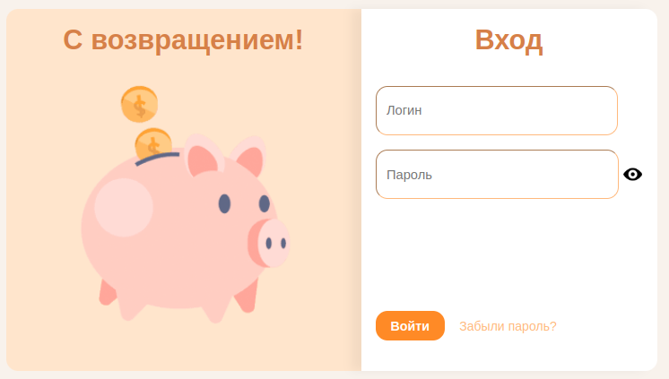

### Положительные кейсы

1. При вводе верных логина и пароля уже существующего пользователя открывается страница профиля, в навбаре появляется кнопка "Выйти", кнопки настроек профиля, поиск.
2. При нажатии на кнопку "Зарегистрироваться" происходит переход на страницу регистрации.
3. При нажатии на кнопку "Показать пароль", пароль показывается.

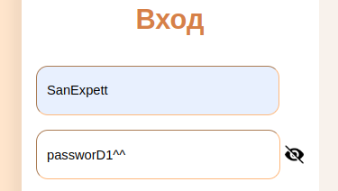

### Негативные кейсы

1. При вводе неверного пароля при верном логине получаем сообщение "Неправильный логин или пароль".

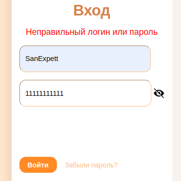

2. При вводе несуществующего логина получаем сообщение "Неправильный логин или пароль".
3. При вводе только логина без пароля получаем сообщение "Неправильный логин или пароль".
4. При вводе только пароля без логина получаем сообщение "Неправильный логин или пароль".

### Баги
1. При нажатии на кнопку "Забыли пароль?" вылетает ошибка 404. 

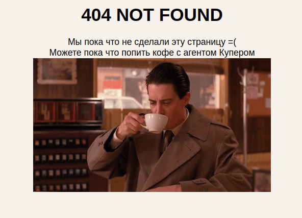

## Регистрация

[Страница регистрации]([https://my-kopilka.ru/register])

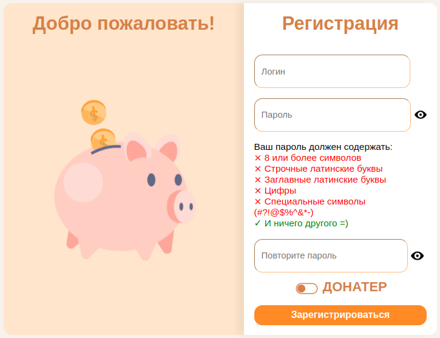

### Положительные кейсы 

1. При вводе корректного логина и пароля, выборе статуса "Донатер", и нажатии кнопки "Зарегистрироваться", открывается страница профиля, в навбаре появляется кнопка "Выйти", кнопки настроек профиля, поиск.
2. При вводе корректного логина и пароля, выборе статуса "Автор", и нажатии кнопки "Зарегистрироваться", открывается страница профиля, в навбаре появляется кнопка "Выйти", кнопки настроек профиля, поиск.

### Негативные кейсы

1. При пустом вводе (не ввели ни логин, ни пароль) и нажатии кнопки "Зарегистрироваться" получаем сообщение "Логин должен быть от 3 до 16 символов и может содержать только цифры, латинские буквы и - _.", так же происходит верная валидация пустого пароля, требования к паролю верно подсвечиваются.

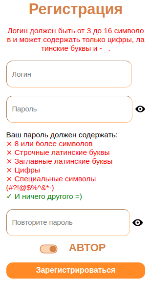

2. При вводе пустого логина и корректного пароля и нажатии кнопки "Зарегистрироваться" получаем сообщение "Логин должен быть от 3 до 16 символов и может содержать только цифры, латинские буквы и - _."
3. При вводе корректного логина и корректного пароля, но пустом поле "Повторите пароль" получаем сообщение "Пароли не совпадают"

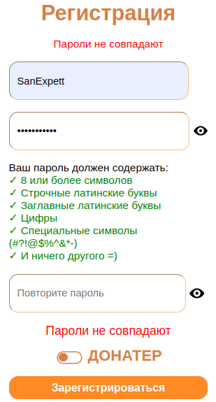

4. При вводе корректного логина отстутствии пароля в поле "Пароль", но введенном пароле в поле "Повторите пароль" получаем сообщение "Пароли не совпадают"
5. При вводе пароля короче 8 символов получаем сообщение "Пароль должен быть длиннее 8 символов и содержать буквы разных регистров, цифры и специальные символы."

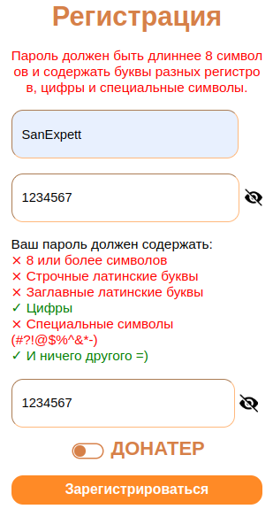

6. При вводе пароля без строчных латинских букв получаем сообщение "Пароль должен быть длиннее 8 символов и содержать буквы разных регистров, цифры и специальные символы."
7. При вводе пароля без заглавных латинских букв получаем сообщение "Пароль должен быть длиннее 8 символов и содержать буквы разных регистров, цифры и специальные символы."
8. При вводе пароля без цифр получаем сообщение "Пароль должен быть длиннее 8 символов и содержать буквы разных регистров, цифры и специальные символы."
9. При вводе пароля без специальных символов (#?!@$%^&*-) получаем сообщение "Пароль должен быть длиннее 8 символов и содержать буквы разных регистров, цифры и специальные символы."
10. При вводе пароля из 8 и более символов, содержащий латинские строчные и заглавные буквы, цифры и спец. символы, но кроме этого что то еще получаем сообщение "Пароль должен быть длиннее 8 символов и содержать буквы разных регистров, цифры и специальные символы."

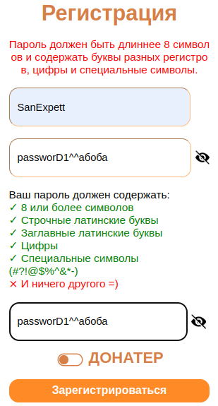

## Комментарии

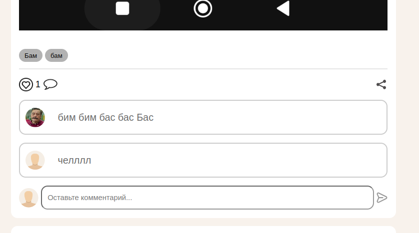

Предварительно авторизуемся, перейдем на страниницу какого либо автора, перейдем на страницу автора Barinov.

### Положительные кейсы 

1. Выберем пост, который мы будем комментировать, введем комментарий в поле "Оставьте комментарий" и нажем кнопку, чтобы оставить комментарий. Комментарий успшено оставлен.

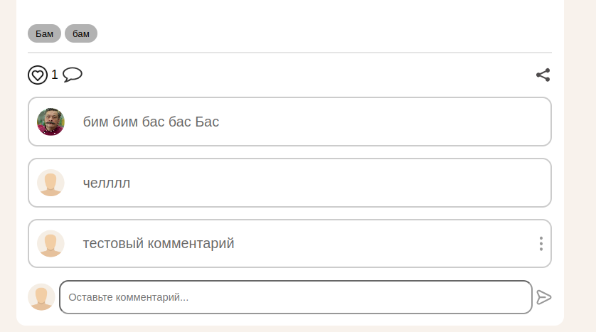

2. Попробуем удалить комментарий. Выберем написанный комментарий и нажмем кнопку "Удалить комментарий"

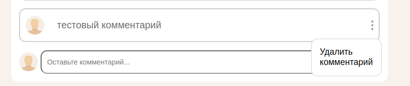

Комментарий успешно удален.

### Негативные кейсы 

1. Попробуем оставить пустой комментарий. Нажмем кнопку, чтобы оставить комментарий, не вводя никакого текста. Получаем сообщение "Комментарий не может быть пустым".

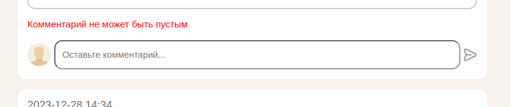

### Баги 

1. Введем длинный комментарий, явно больше ширины одного экрана. Оставим этот комментарий. Комментарий отображается некорректно, он оставляется в одну строку без переноса.

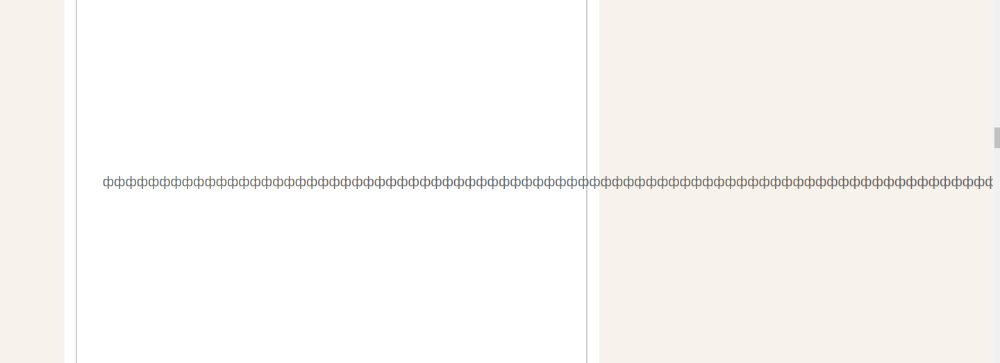

## Лайки

Предварительно авторизуемся, перейдем на страниницу какого-либо автора, перейдем на страницу автора Barinov.

### Положительные кейсы 

1. Выберем пост, который будем лайкать, нажем на кнопку лайка. Лайк успешно оставлен. 

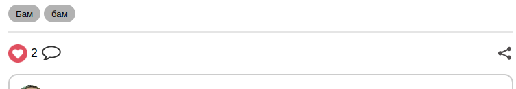

2. Попробуем убрать оставленный лайк, нажмем на кнопку лайка. Лайк успешно убран.

## Донаты

### Положительные кейсы

1. Вводится сумма больше десяти, пишется непустое сообщение, подтверждается оплата, донат приходит автору в течении минуты
2. Вводится сумма больше десяти, пустое сообщение, подтверждается оплата, донат приходит автору в течении минуты

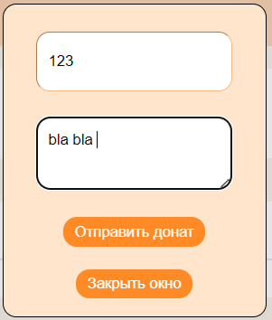
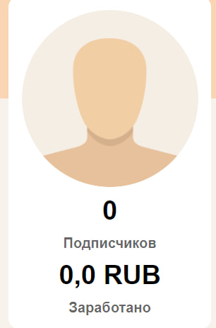
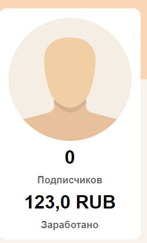

### Негативные кейсы

1. Вводится сумма меньше десяти, высвечивается ошибка

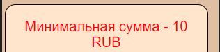

2. Вводится отрицательная сумма, высвечивается ошибка


3. Вводится сумма больше десяти, пишется любое сообщение, оплата не подтверждается, донат не приходит

### Баги

1. Сообщения, отправляемые пользователями в донатах, никак не отображаются ни автору, ни донатеру

## Подписки 

### Положительные кейсы

1. При нажатии кнопки "Отслеживать"

- Кнопка меняется на "Перестать отслеживать"
- Увеличивается счетчик подписчиков на 1

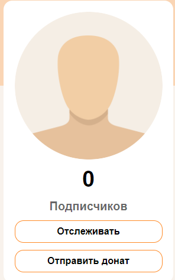
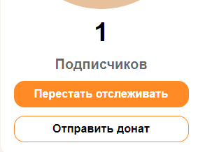

2. При нажатии кнопки "Перестать отслеживать" подписка пропадает:
 - Кнопка меняется на "Отслеживать"
 - Уменьшается счетчик подписчиков на 1
3. При нажатии любой кнопки "Подписаться" происходит редирект на страницу оплаты, оплата подтверждается:

- осуществляется подписка выбранной категории в течении минуты
- Автору приходят деньги за подписку в течении минуты
- Увеличивается счетчик подписчиков на 1

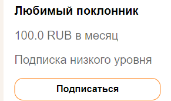

6. При нажатии кнопки "Перестать отслеживать" при платной подписки:
- Уменьшается счетчик подписчиков на 1
- Подписка пропадает
- Деньги перестают приходить автору

7. При нажатии кнопки "Отписаться" при платной подписки:
- Уменьшается счетчик подписчиков на 1
- Подписка пропадает
- Деньги перестают приходить автору

### Баги

1. Для некоторых авторов в какой-то момент перестают работать подписки.
После совершения подписки, интерфейс остается таким, будто подписки нет,
счетчик подписчиков застывает на 1, однако если перейти в ленту, то можно заметить,
что посты отслеживаются.

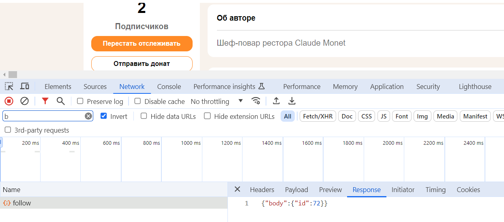

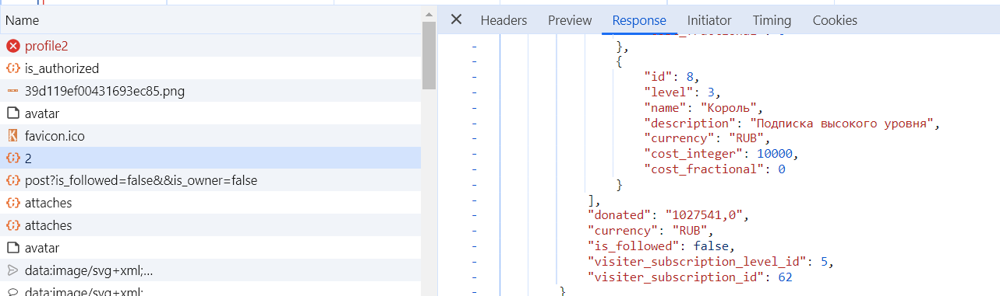

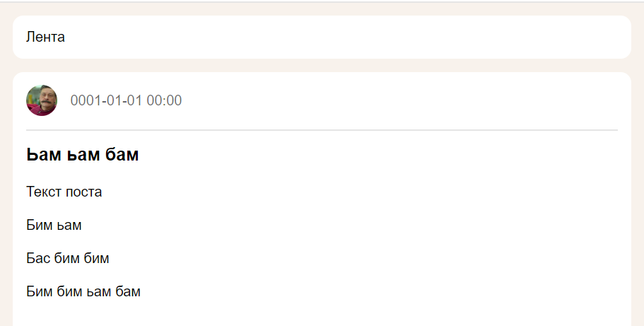

## Аналитика

### Положительные кейсы:

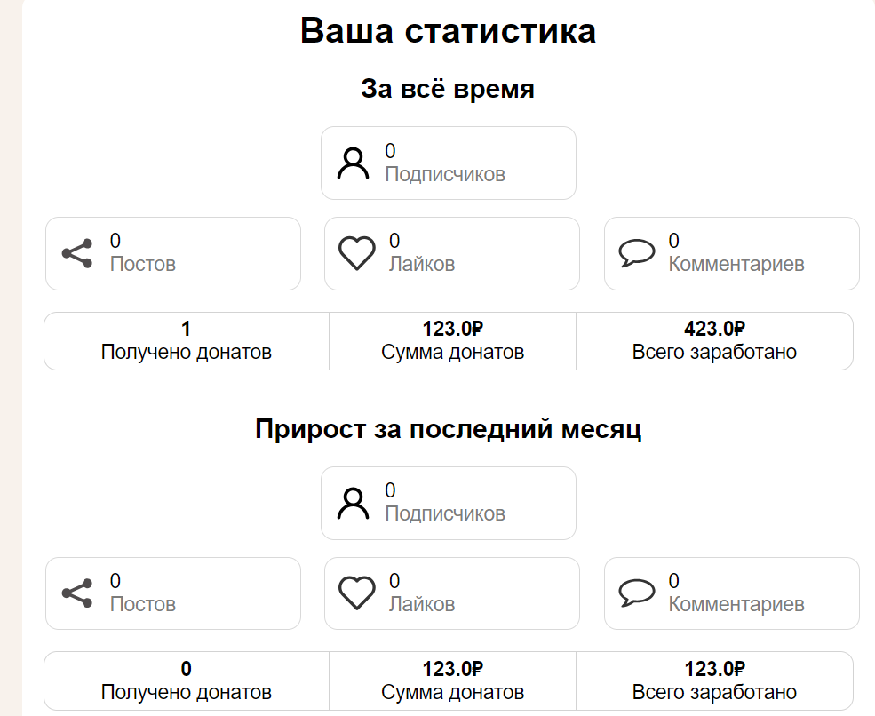

1. Подписаться на автора, числа в статистиках по подпискам автора в течение минуты увеличатся на 1
2. Отписаться от автора, числа в статистиках по подпискам автора в течение минуты уменьшатся на 1
3. Создать пост, числа в статистиках по постам автора в течение минуты увеличатся на 1
4. Удалить пост, числа в статистиках по постам автора в течение минуты уменьшатся на 1
5. Поставить лайк, числа в статистиках по лайкам автора в течение минуты увеличатся на 1
6. Убрать лайк, числа в статистиках по лайкам автора в течение минуты уменьшится на 1
7. Оставить комментарий, число в статистиках по комментариям в течение минуты увеличится на 1
8. Убрать комментарий, число в статистиках по комментариям в течение минуты уменьшится на 1
9. Отправить донат, число в статистиках по количеству донатов в течение минуты увеличатся на 1
10. Отправить донат, число в статистиках по сумме донатов в течение минуты увеличатся на сумму доната
11. Оформить платную подписку, число в статистике по сумме заработанного увеличивается каждую минуту на стоимость подписки


### Баги

1. Можно открыть аналитику будучи залогиненым как донатер, что как будто бы не имеет смысла

## Теги

### Положительные кейсы

Подготовка: зайдем как автор

1. **Создание поста с одним тегом**: 

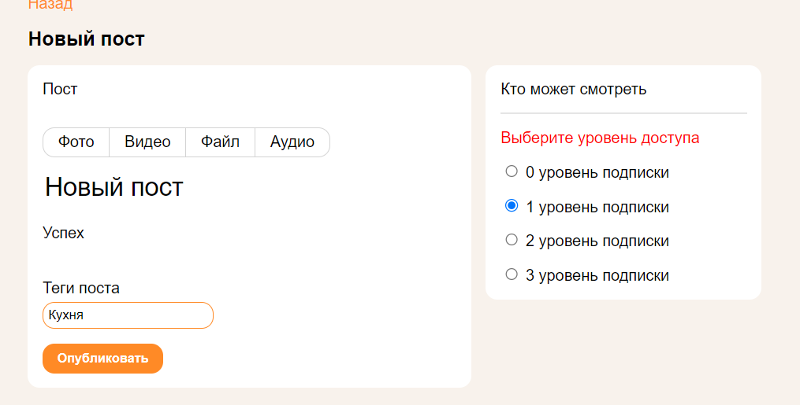 

**Результат**: создается пост с одним тегом, который виден автору:

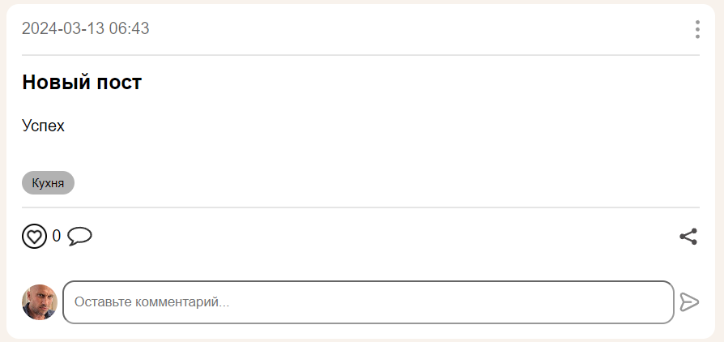

2. **Создание поста с несколькими тегами**:

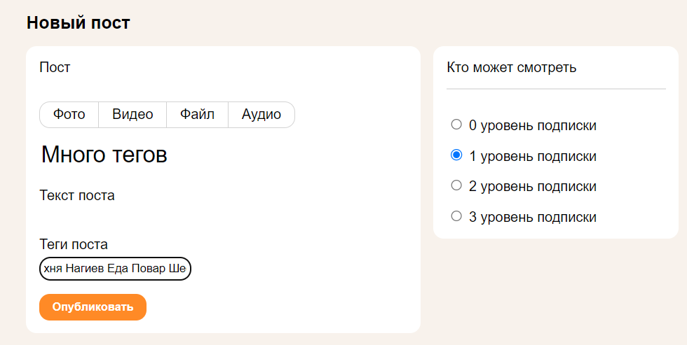

**Результат**:

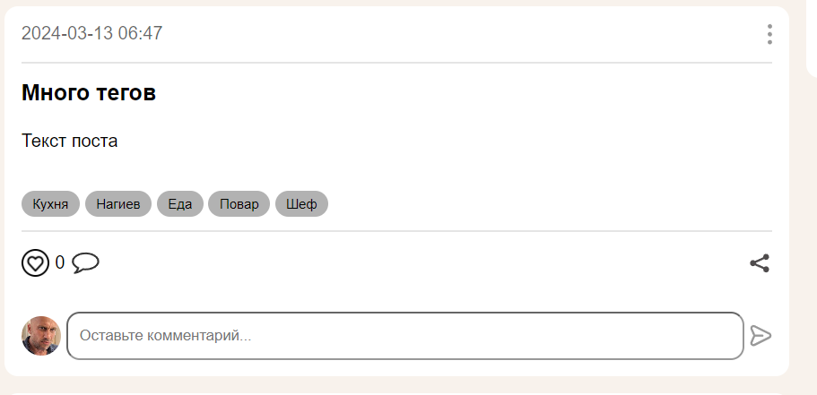

3. **Добавим много пробелов в названии тега**:

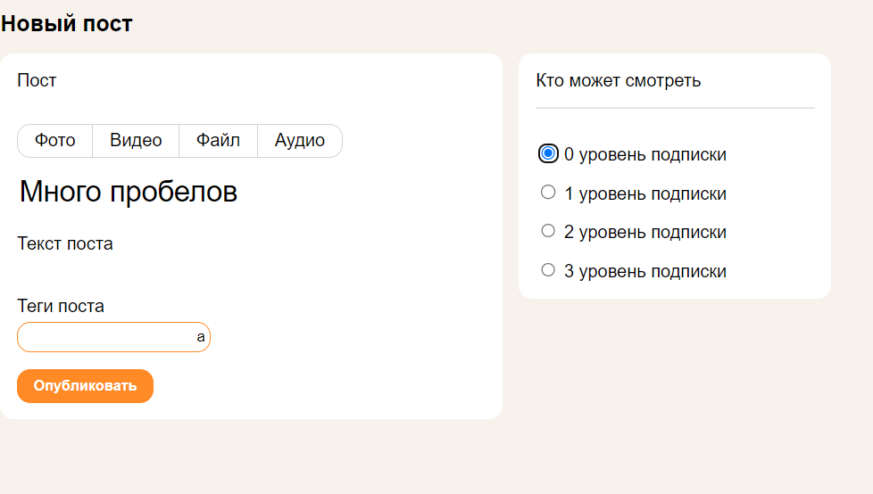

**Резльтат** (отображается без лишних пробелов):


4. **Производим переход по тегу**:

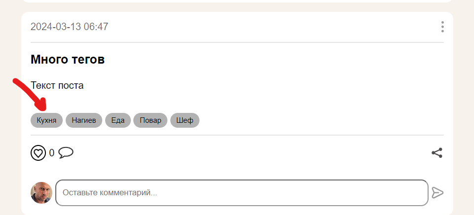

**Результат**:

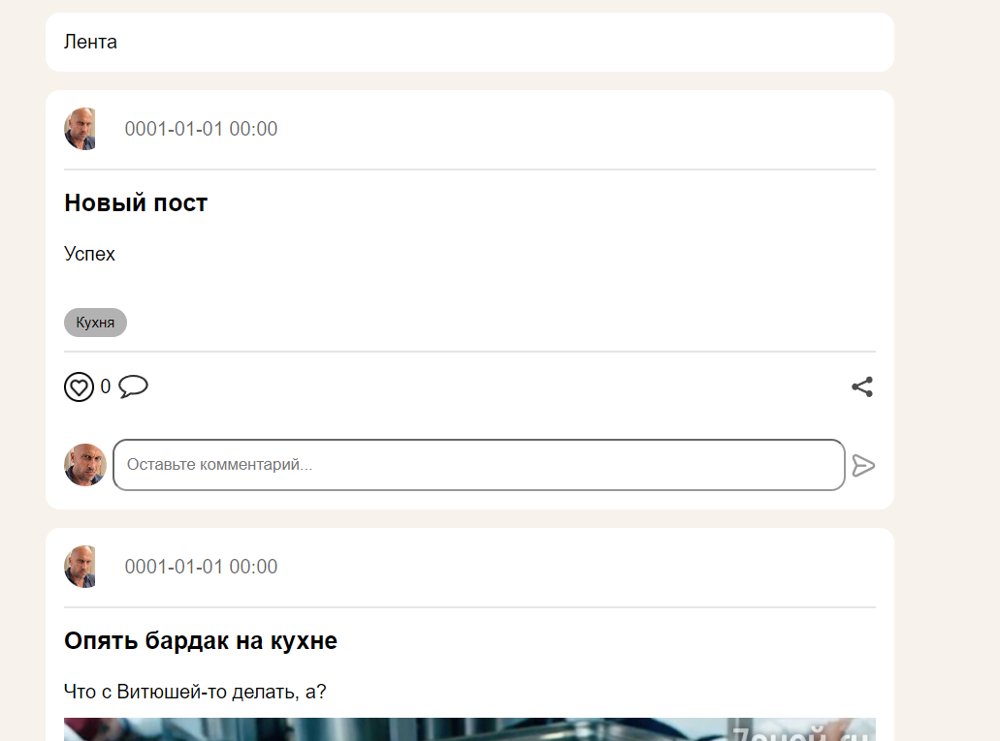

5. **Регистрируемся или автроризуемся за донатера, пытаемся посмотреть его ленту по тегу**:

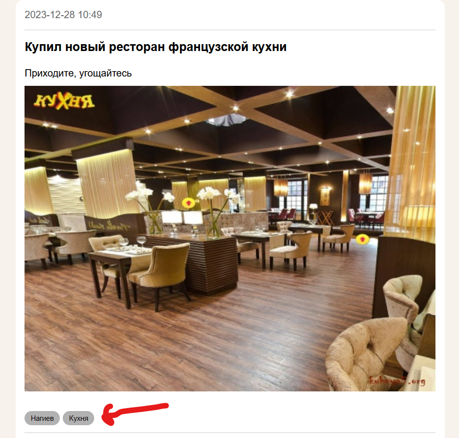

**Результат**:

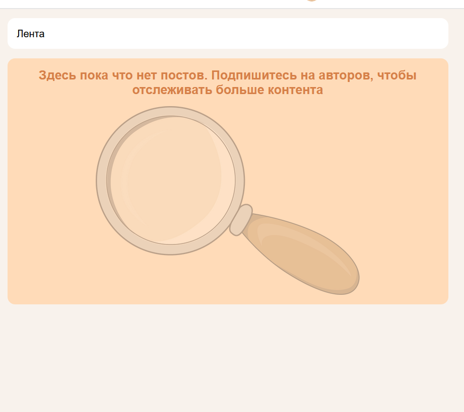

### Баги Тегов

1. **Неправильная дата в ленте по тегам**:

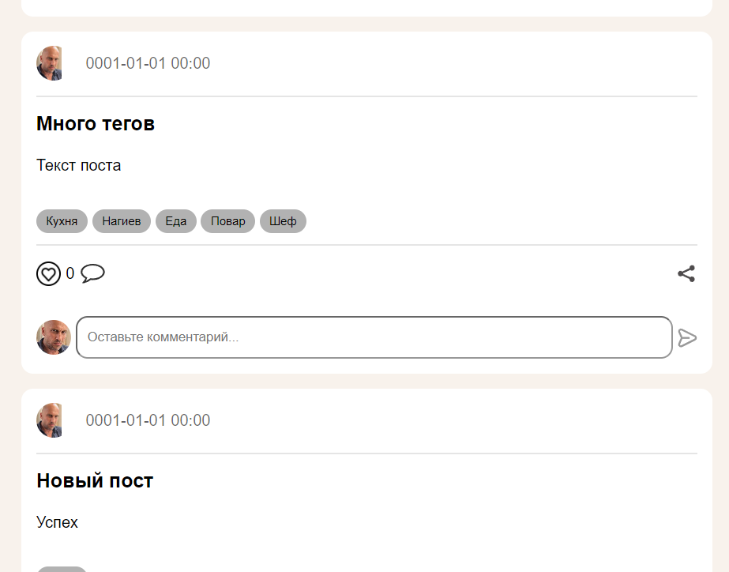 

2. **Недетерминированный порядок тегов в посте (скорее недостаток), пример до и после перезагрузки страницы**:

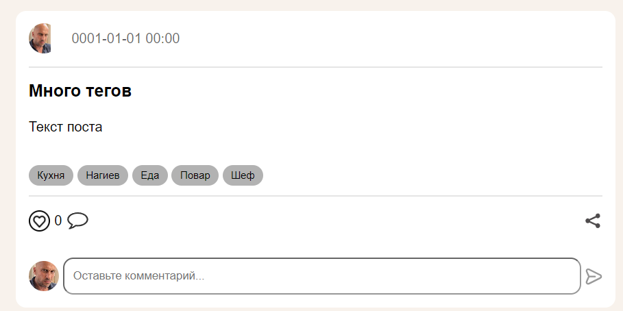 

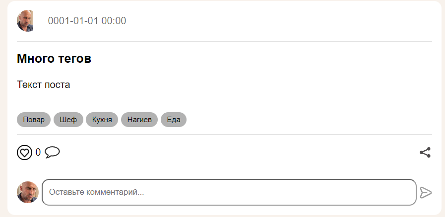

3. **Не отображается список постов по тегу у донатера в ленте постов по тегу при нажатии на тег**:


