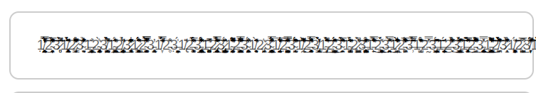
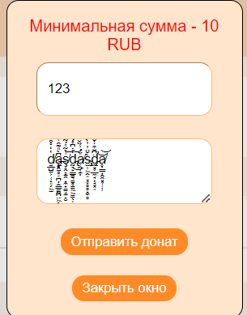
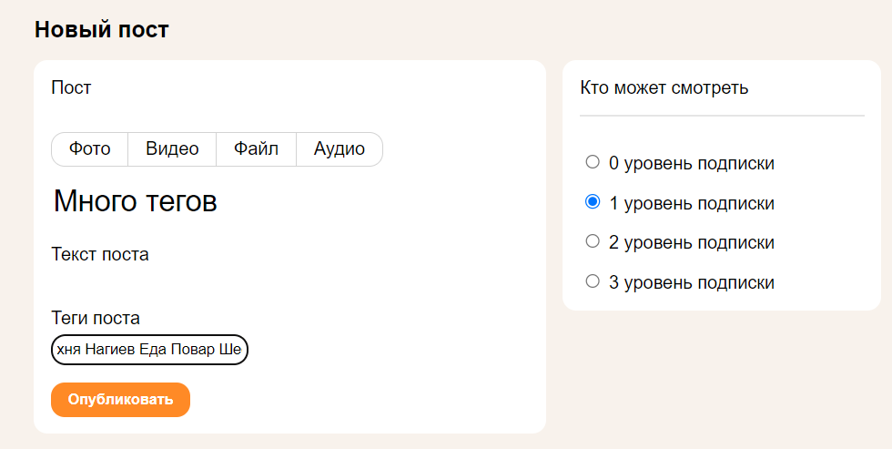
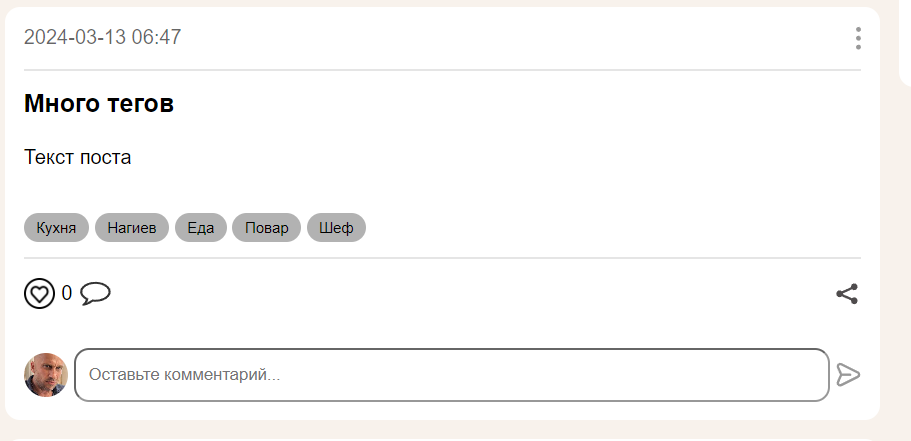
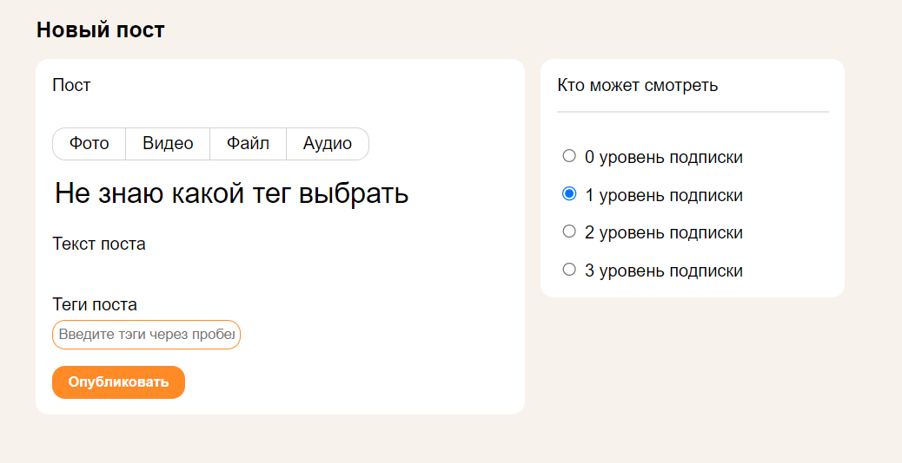
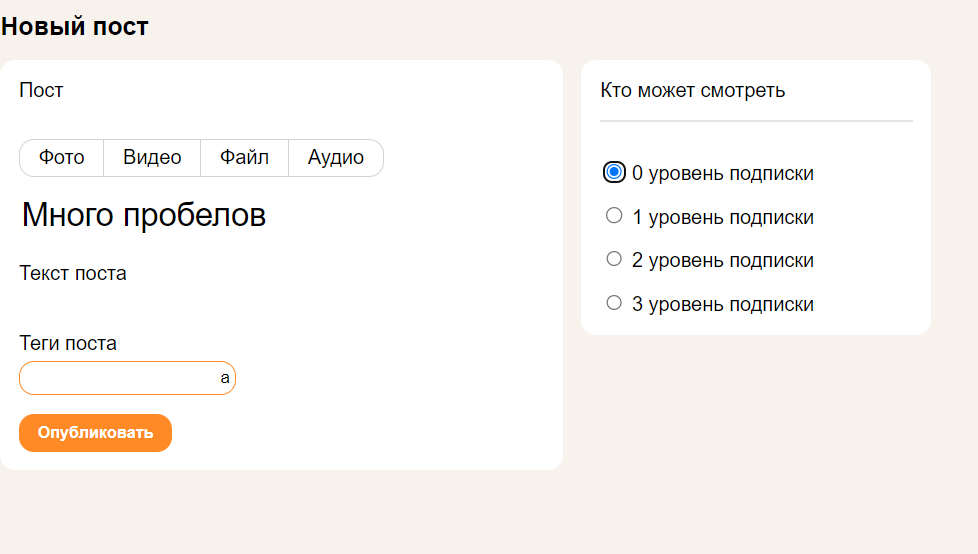
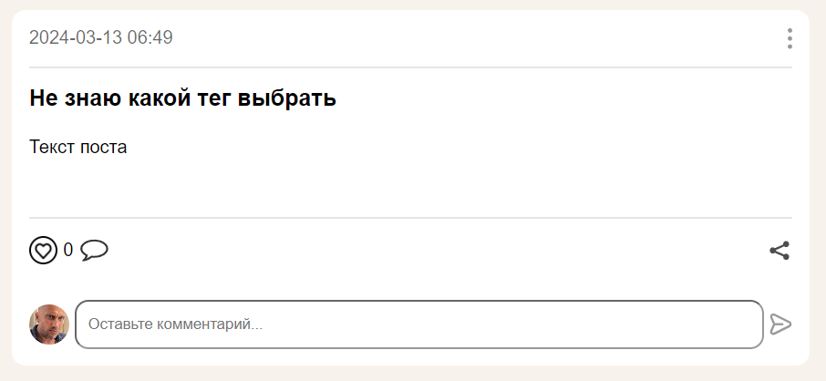
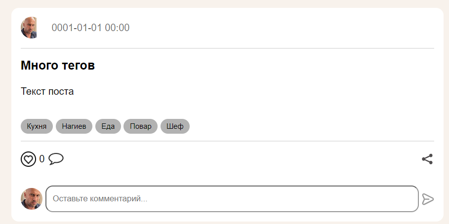
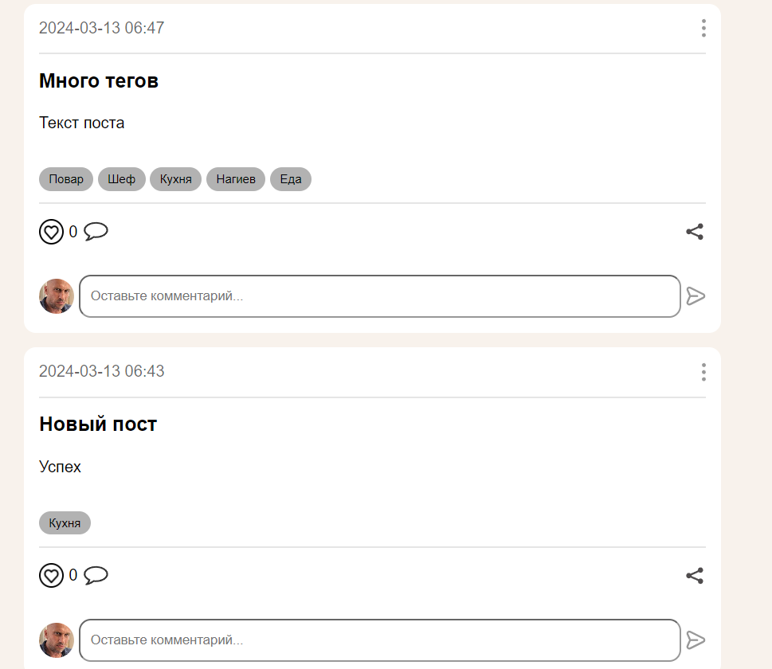
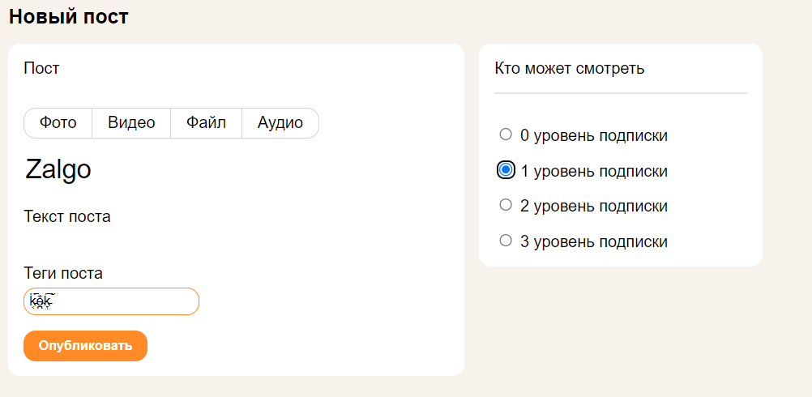

## Профиль донатера
https://my-kopilka.ru/profile24

Логин: vilin_donater

Пароль: 1234!@#$qwerQWER


1. **В профиле отображаются:**
* Имя пользователя
* Базовое фото аватара
* Кол-во пожертвованных денег
* Подписки пользователя или заглушка (пояснение, что,
  чтобы видеть контент, нужно подписаться на авторов).

### Баги отображения профиля донатера
* В пустом профиле не корректно отображается поле "пожертвовано" необходимо
   показывать ничего или "0" пользователю, чтобы не запутывать его.


* Надпись "Подписки" съезжает вниз бокса
* Не подписывается "у вас нет подписок" или "вы еще ни на кого не подписаны", может
  запутать пользователя


2. **Заполнение статуса** 
* При нажатии на шестеренку всплывает окно статуса 


* При вводе текста состоящего из букв, цифр, символов(любых) ПР: "a2efvs32tg$#t13g"
после нажатия ок все сохраняется и отображается рядом с именем без изменений.
* При нажатии мимо всплывающего окна возврат в профиль.

### Баги статуса в профиле

* При нажатии мимо окна статуса, ничего не происходит. Предполагается закрытие окна, т.к. это
   общепринятое и ожидаемое поведение.
* Уязвимость при вводе в поле статуса:
```
5sas df
```
Код исполняется и вставляется в верстку


А при перезагрузке уже просто как текст


* Хорошо бы поменять шестеренку на "Изменить статус", т.к. не понятно,
шестеренка подразумевает настройки 
* При нажатии ок в всплывающем окне статуса более 1 раза, кол-во запросов отправляемых на сервер
за раз начинает расти на 1 с каждым разом (2,3,4...). Должен быть один запрос всегда


## Профиль автора
https://my-kopilka.ru/profile26

Логин: vilin_author

Пароль: 1234!@#$qwerQWER

Так как он во многом похож на профиль донатера, буду тестировать только 
дополнительную функциональность


1. **В профиле автора отображаются:**
* Имя пользователя
* Базовое фото аватара
* Кол-во подписчиков
* Кол-во заработанных денег
* Список уровней подписок
* Лента или заглушка(поясняющая, что тут будет лента после подписки)

### Баги отображения профиля донатера
* В профиле отображается "Цели" хотя нет возможности их добавить, нельзя показывать пользователям
  функционал, который не работает


* Отображаются надписи "Лента" и "Медиа" хотя никаких кнопок переключения нет, нужно убрать медиа,
  чтобы не запутывать пользователя.


2. **Заполнение "об авторе"**
* При нажатии на шестеренку всплывает окно "об авторе"
* При вводе текста состоящего из букв, цифр, символов(любых) ПР: "a2efvs32tg$#t13g"
  после нажатия ок все сохраняется и отображается рядом с именем без изменений.
* При нажатии мимо всплывающего окна возврат в профиль.

### Баги заполнения "об авторе"
* Аналогичные заполнения статуса [баги-статуса-в-профиле](#баги-статуса-в-профиле)


## Настройки профиля
https://my-kopilka.ru/settings

Логин: vilin_author

Пароль: 1234!@#$qwerQWER


1. **Возврат к основной странице профиля**

При нажатии на кнопку "вернуться к профилю" происходит возврат к основной странице профиля
https://my-kopilka.ru/profile26.
2. **Загрузка фото профиля**

* При нажатии "выбрать файл" и выборе файла формата png, jpg до 10Мб файл начинает отображаться
   в окне редактирования, а после нажатия "сохранить" перенаправляется на основную страницу профиля,
   где видно фото(также фото появляется в nav баре)
* При выборе файла расширения не png или jpg внизу страницы появляется сообщение об ошибке.


* При выборе файла > 10 Mb появляется внизу сообщение об ошибке.

### Баги загрузки фото профиля
* Уязвимость. При выборе файла другого формата, но с измененным расширением на png
  файл успешно загружается.
  Пр: исполняемый файл с расширением png


3. **Смена пароля**

* При вводе старого пароля и вводе нового пароля дважды,
удовлетворяющего условиям:
  * 8 или более символов
  * Строчные латинские буквы
  * Заглавные латинские буквы
  * Цифры
  * Специальные символы (#?!@$%^&*-)

пароль успешно меняется и перенаправляется на главную страницу.
* При отправке нового пароля, не удовлетворяющего требованиям выше, появляется
сообщение об ошибке.


* При отправке не совпадающих новых паролей появляется соответствующее сообщение об ошибке.


* При отправке совпадающих новых и старого пароля появляется сообщение об ошибке.


### Баги смены пароля
* При отправке не правильного или пустого поля старый пароль перенаправляется на страницу профиля
без сообщения об ошибке.

4. **Смена логина**
* При изменении логина на удовлетворяющий условиям:
  * Логин должен быть от 3 до 16 символов 
  * может содержать только цифры, латинские буквы и - _

логин успешно меняется и перенаправляется на страницу профиля
* При вводе логина, неудовлетворяющего условиям выше появляется сообщение с правилами для логина.

### Баги смены логина
* При вводе логина, неудовлетворяющего условиям выше, выводится не понятная ошибка с правилами, 
а это:


### Баги всего профиля
* При успешном изменении профиля нет сообщения о том, что поменялось что-то, можно не понять.
* Надпись справа "Профиль" похожа на кнопку, хотя не является ей, это ухудшает ux.
  Дать возможность перейти в профиль через неё или убрать совсем.


## Пост (создание, изменение, удаление)

Логин: vilin_author

Пароль: 1234!@#$qwerQWER

**1. Создание поста** 
* После нажатия на кнопку "Новый пост" в профиле(https://my-kopilka.ru/profile26) 
появляется форма создания поста.


При корректном заполнении поста(заполнен заголовок, текст,
корректные форматы файлов[фото png, jpeg], видео[mp4], аудио[mp3], файлы(без ограничений),
общем объеме вложений до 100Мб и выборе одного из уровней подписки)
пост создается и после перенаправления на профиль мы видим свой пост в ленте.
* При добавлении общего объема файлов, превышающих 100 Мб появляется сообщение об ошибке.


* При вводе пустого заголовка или текста поста появляется сообщение об ошибке.


* Если не выбрать уровень подписки, то появляется сообщение об ошибке.


* При нажатии кнопки назад происходит возврат к профилю.

### Баги создания поста
* В отображении поста для автора нет информации об уровне подписки для доступа к нему, видно только 
в меню редактирования. Плохо с точки зрения ux.


2. **Редактирование поста**
* После нажатия на кебаб-меню у поста появляется выбор "редактировать пост".


* После прикрепления любого вложения(фото, видео...) оно отображается с надписью снизу удалить,
  и после нажатия на эту кнопку вложение пропадает.


* При нажатии кнопки "назад" происходит возврат к профилю.

Ввиду проверки негативных кейсов в создании поста, здесь их проверять не будем.

### Баги редактирования поста

* Если перетянуть фото в редакторе объявления, то оно почему-то продублируется(без кнопки удалить)


А после публикации фото уже одно


* Нет ограничения на длину тега.


**3. Удаление поста** 
* После нажатия на кебаб-меню у поста появляется выбор "удалить пост". И после нажатия на нее
пост пропадает

### Навбар\Хедер
Логин: vilin_author

Пароль: 1234!@#$qwerQWER

1. **Изначальный вид хедера**

https://my-kopilka.ru/feed


* При нажатии "войти" переходит на форму входа https://my-kopilka.ru/login.
* При нажатии "регистрация" переходит на форму регистрации https://my-kopilka.ru/register.

2. **Навбар после авторизации**


* При нажатии на "поиск автора" всплывают подсказки


    * По ходу ввода имени происходит уточнение, а после нажатия перенаправляется на страницу автора.

* При нажатии на иконку\аватарку дропдаун-меню показывает содержимое.


    * При выборе "Мой профиль" перенаправляется на мой профиль
    * При выборе "Настройки аккуанта" перенаправляется на настройки
    * При выборе "Аналитика" перенаправляется на статистику

* При нажатии "выйти" перенаправляется на форму входа

### Лента на главной странице
1. **Отображение ленты**

https://my-kopilka.ru/feed


Подготовка:

Логин: vilin_author

Пароль: 1234!@#$qwerQWER

необходимо изначально подписаться на двух авторов через поиск авторов и переход на страницу автора.

Должны отображаться:
* **Доступные посты**
    * Название 
    * Описание 
    * Вложения
    * Иконка автора
    * Дата публикации
    * Теги
    * Лайки 
    * Комментарии
* **Недоступные посты** 


    * Заголовок поста, оставленный автором
    * Надпись о необходимом уровне подписки для доступа
* **Также должны быть посты обоих авторов в ленте**

### Баги ленты
* В ленте в запросе постов приходят все посты с датой создания
0001.01.01 00:00 и соответственно не в правильном порядке отображаются.


хотя при переходе в ленту отдельного автора даты корректно отображаются 


* В постах в ленте отображаются значки "комментирования" и "переслать", выглядят как кнопки, но при 
нажатии ничего не происходит. 


## Авторизация

[Страница авторизации]([https://my-kopilka.ru/login])


### Положительные кейсы
1. При вводе верных логина и пароля уже существующего пользователя (в нашем случае пользователь с логином - SanExpett и паролем - passworD1^^) открывается страница профиля, в навбаре появляется кнопка "Выйти", кнопки настроек профиля, поиск.
2. При нажатии на кнопку "Зарегистрироваться" происходит переход на страницу регистрации.
3. При нажатии на кнопку "Показать пароль", пароль показывается.


### Негативные кейсы
1. При вводе неверного пароля при верном логине получаем сообщение "Неправильный логин или пароль".


2. При вводе несуществующего логина получаем сообщение "Неправильный логин или пароль".
3. При вводе только логина без пароля или пароля без логина получаем сообщение "Неправильный логин или пароль".

### Баги
1. При нажатии на кнопку "Забыли пароль?" вылетает ошибка 404. 


## Регистрация

[Страница регистрации]([https://my-kopilka.ru/register])


### Положительные кейсы 
1. При вводе корректного логина и пароля (в нашем случае пользователь с логином - SanExpett и паролем - passworD1^^), выборе статуса "Донатер", и нажатии кнопки "Зарегистрироваться", открывается страница профиля, в навбаре появляется кнопка "Выйти", кнопки настроек профиля, поиск.
2. При вводе корректного логина и пароля (в нашем случае пользователь с логином - SanExpett и паролем - passworD1^^), выборе статуса "Автор", и нажатии кнопки "Зарегистрироваться", открывается страница профиля, в навбаре появляется кнопка "Выйти", кнопки настроек профиля, поиск.

### Негативные кейсы
1. При пустом вводе (не ввели ни логин, ни пароль) и нажатии кнопки "Зарегистрироваться" получаем сообщение "Логин должен быть от 3 до 16 символов и может содержать только цифры, латинские буквы и - _."


2. При вводе пустого логина и корректного пароля и нажатии кнопки "Зарегистрироваться" получаем сообщение "Логин должен быть от 3 до 16 символов и может содержать только цифры, латинские буквы и - _."
3. При вводе корректного логина и корректного пароля, но пустом поле "Повторите пароль" получаем сообщение "Пароли не совпадают"


4. При вводе корректного логина отстутствии пароля в поле "Пароль", но введенном пароле в поле "Повторите пароль" получаем сообщение "Пароли не совпадают"
5. При вводе пароля короче 8 символов получаем сообщение "Пароль должен быть длиннее 8 символов и содержать буквы разных регистров, цифры и специальные символы."


6. При вводе пароля без строчных латинских букв получаем сообщение "Пароль должен быть длиннее 8 символов и содержать буквы разных регистров, цифры и специальные символы."
7. При вводе пароля без заглавных латинских букв получаем сообщение "Пароль должен быть длиннее 8 символов и содержать буквы разных регистров, цифры и специальные символы."
8. При вводе пароля без цифр получаем сообщение "Пароль должен быть длиннее 8 символов и содержать буквы разных регистров, цифры и специальные символы."
9. При вводе пароля без специальных символов (#?!@$%^&*-) получаем сообщение "Пароль должен быть длиннее 8 символов и содержать буквы разных регистров, цифры и специальные символы."
10. При вводе пароля из 8 и более символов, содержащий латинские строчные и заглавные буквы, цифры и спец. символы, но кроме этого что то еще получаем сообщение "Пароль должен быть длиннее 8 символов и содержать буквы разных регистров, цифры и специальные символы."


## Комментарии


Предварительно авторизуемся, перейдем на страниницу какого либо автора, например, автора Barinov.

### Положительные кейсы 
1. Выберем пост, который мы будем комментировать, введем наш комментарий в поле "Оставьте комментарий" и нажем кнопку, чтобы оставить комментарий. Комментарий успшено оставлен.


2. Попробуем удалить наш комментарий. Выберем написанный нами комментарий и нажмем кнопку "Удалить комментарий"


Комментарий успешно удален.

### Негативные кейсы 
1. Попробуем оставить пустой комментарий. Нажмем кнопку, чтобы оставить комментарий, не вводя никакого текста. Получаем сообщение "Комментарий не может быть пустым".


### Баги 

1. Введем длинный комментарий, явно больше ширины одного экрана. Оставим этот комментарий. Комментарий отображается некорректно, он оставляется в одну строку без переноса.


2. Попробуем оставить комментарий, содержащий Zalgo text, комментарий будет оставлен успешно.



## Лайки
Предварительно авторизуемся, перейдем на страниницу какого-либо автора, например, автора Barinov.
### Положительные кейсы 
1. Выберем пост, который будем лайкать, нажем на кнопку лайка. Лайк успешно оставлен. 


2. Попробуем убрать оставленный нами лайк, нажмем на кнопку лайка. Лайк успешно убран.

## Донаты

### Положительные кейсы

1. Вводится сумма больше десяти, пишется непустое сообщение, подтверждается оплата, донат приходит автору в течении минуты
2. Вводится сумма больше десяти, пустое сообщение, подтверждается оплата, донат приходит автору в течении минуты


### Негативные кейсы

1. Вводится сумма меньше десяти, высвечивается ошибка
2. Вводится отрицательная сумма, высвечивается ошибка
3. Вводится сумма больше десяти, пишется любое сообщение, оплата не подтверждается, донат не приходит


### Баги

1. Сообщения в донатах нигде не отображаются
2. На Zalgo-текст в сообщнии к донатам нет ошибки



## Подписки

### Положительные кейсы

1. При нажатии кнопки "Остлеживить" осуществляется подписка
2. При нажатии кнопки "Остлеживить" увеличивает счетчик подписчиков на 1
3. При нажатии кнопки "Перестать отслеживать" попдиска пропадает
4. При нажатии кнопки "Перестать отслеживать" уменьшается счетчик подписчиков на 1
5. При нажатии любой кнопки "Подписаться" происходит редирект на страницу оплаты, оплата подтверждается

- осуществляется подписка выбранной категории в течении минуты
- Автору приходят деньги за подписку в течении минуты
- Увеличивается счетчик подписчиков на 1


6. При нажатии кнопки "Перестать отслеживать" при платной подписки:

- Уменьшается счетчик подпичиков на 1
- Подписка пропадает
- Деньги перестают приходить автору

7. При нажатии кнопки "Отписаться" при платной подписки:

- Уменьшается счетчик подпичиков на 1
- Подписка пропадает
- Деньги перестают приходить автору


### Баги
1. Для некоторых авторов в какой-то момент перстают работать подписки. После совершения подписки, интерфейс остается таким, будто подписки нет, счетчик подписчиков застывает на 1, однако если перейти в ленту, то можно заметить, что посты отслеживаются.


## Аналитика

### Положительные кейсы:


1. Подписаться на автора, числа в статистиках по подпискам автора в течении минуты увеличатся на 1
2. Отписаться от автора,  числа в статистиках по подпискам автора в течении минуты уменьшатся на 1
3. Создать пост, числа в статистиках по постам автора в течении минуты увеличатся на 1
4. Удалить пост, числа в статистиках по постам автора в течении минуты уменьшатся на 1
5. Поставить лайк, числа в статистиках по лайкам автора в течении минуты увеличатся на 1
6. Убрать лайк, числа в статистиках по лайкам автора в течении минуты уменьшится на 1
7. Оставить комментарий, число в статистиках по комментариям в течении минуты увеличится на 1
8. Убрать комментарий, число в статистиках по комментариям в течении минуты уменьшится на 1
9. Отправить донат, число в статистиках по количеству донатов в течении минуты увеличатся на 1
10. Отправить донат, число в статистиках по сумме донатов в течении минуты увеличатся на сумму доната
11. Оформить платную попдиску, число в статитстике по сумме заработанного увеличивается каждую минуту на стоимость подписки

# Теги
## Положительные кейсы
- создание поста с одним тегом: 

- результат:
создается пост с одним тегом, который виден автору:

- cоздание поста с несколькими тегами:

- результат:

- создание поста без тегов:

- результат:
- добавим много пробелом в названии тега:

- резльтат (корректно отображается):


- производим переход по тегу:

- результат:

- регистрируемся за гостя, пытаемся посмотреть его ленту по тегу:

- результат:


## Баги
- неправильная дата в ленте по тегам:
 
- недетерминированный порядок тегов в посте (скорее недостаток):
 

- недетерминированный порядок постов в ленте по тегам (нет сортировки по дате):


- поплыла верстка navbara на mozilla:

- сломанный поиск по тегам для не аккаунтов автора:


## Негативные кейсы
- ввод zalgo текста в названии тега:

- результат:

- попытка js-инъекции:

- результат (код не отработал):


