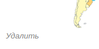

## Профиль донатера


1. **В профиле отображаются:**
* Имя пользователя
* Базовое фото аватара
* Кол-во пожертвованных денег
* Подписки пользователя или заглушка (пояснение, что,
  чтобы видеть контент, нужно подписаться на авторов).

### Баги отображения профиля донатера
* В пустом профиле не корректные отображается поле "пожертвовано" необходимо
   показывать ничего или 0 пользователю, чтобы он не запутывать пользователя


* Надпись "Подписки" съезжает вниз бокса
* Не подписывается у вас нет подписок или вы еще ни на кого не подписаны, может
  запутать пользователя


2. **Заполнение статуса** 
* При нажатии на шестеренку всплывает окно статуса 


* При вводе текста состоящего из букв, цифр, символов(любых) ПР: "a2efvs32tg$#t13g"
после нажатия ок все сохраняется и отображается рядом с именем без изменений.
* При нажатии мимо всплывающего окна возврат в профиль.

### Баги статуса в профиле
<a name="bugs_status"></a>
* При нажатии мимо окна статуса, ничего не происходит. Предполагается закрытие окна, т.к. это
   общепринятое и ожидаемое поведение.
* Уязвимость при вводе в поле статуса:
```
5sas df
```
Код исполняется и вставляется в верстку


А при перезагрузке уже просто как текст


* Хорошо бы поменять шестеренку на "Изменить статус", т.к. не понятно,
шестеренка подразумевает настройки 
* При нажатии ок в всплывающем окне статуса более 1 раза, кол-во запросов отправляемых на сервер
за раз начинает расти на 1 с каждым разом (2,3,4...). Должен быть один запрос всегда


## Профиль автор

Так как он во многом похож на профиль донатера, буду тестировать только 
дополнительную функциональность


1. **В профиле автора отображаются:**
* Имя пользователя
* Базовое фото аватара
* Кол-во подписчиков
* Кол-во заработанных денег
* Список уровней подписок
* Лента или заглушка(поясняющая, что тут будет лента после подписки)
* 
### Баги отображения профиля донатера
* В профиле отображается "Цели" хотя нет возможности их добавить, нельзя показывать пользователям
  функционал, который не работает


* Отображаются надписи "Лента" и "Медиа" хотя никаких кнопок переключения нет, нужно убрать медиа,
  чтобы не запутывать пользователя.


2. **Заполнение "об авторе"**
* При нажатии на шестеренку всплывает окно "об авторе"
* При вводе текста состоящего из букв, цифр, символов(любых) ПР: "a2efvs32tg$#t13g"
  после нажатия ок все сохраняется и отображается рядом с именем без изменений.
* При нажатии мимо всплывающего окна возврат в профиль.

### Баги заполнения "об авторе"
* Аналогичные заполнения статуса [баги-статуса-в-профиле](#баги-статуса-в-профиле)


## Настройки профиля


1. **Возврат к основной странице профиля**

При нажатии на кнопку "вернуться к профилю" происходит возврат к профилю
2. **Загрузка фото профиля**

* При нажатии "выбрать файл" и выборе файла формата png, jpg до 10Мб файл начинает отображаться
   в окне редактирования, а после нажатия сохранить перенаправляется на основную страницу профиля,
   где видно фото(также фото появляется в nav баре)
* При выборе файла расширения не png или jpg внизу страницы появляется сообщение об ошибке.


* При выборе файла > 10 Mb появляется внизу сообщение об ошибке.

### Баги загрузки фото профиля
* Уязвимость. При выборе файла другого формата, но с измененным расширением на png
  файл успешно загружается.
  Пр: исполняемый файл с расширением png


3. **Смена пароля**

* При вводе старого пароля и вводе нового пароля дважды,
удовлетворяющего условиям:
  * 8 или более символов
  * Строчные латинские буквы
  * Заглавные латинские буквы
  * Цифры
  * Специальные символы (#?!@$%^&*-)

пароль успешно меняется и перенаправляется на главную страницу.
* При отправке нового пароля, не удовлетворяющего требованиям выше, появляется
сообщение об ошибке.


* При отправке не совпадающих новых паролей появляется соответствующее сообщение об ошибке.


* При отправке совпадающих новых и старого пароля появляется сообщение об ошибке.


### Баги смены пароля
* При отправке не правильного или пустого поля старый пароль перенаправляется на страницу профиля
без сообщения об ошибке.

4. **Смена логина**
* При изменении логина на удовлетворяющий условиям:
  * Логин должен быть от 3 до 16 символов 
  * может содержать только цифры, латинские буквы и - _

логин успешно меняется и перенаправляется на страницу профиля
* При вводе логина, неудовлетворяющего условиям выше появляется сообщение с правилами для логина.

### Баги смены логина
* При вводе логина, неудовлетворяющего условиям выше, выводится не понятная ошибка с правилами, 
а это


### Баги всего профиля
* При успешном изменении профиля нет сообщения о том, что поменялось что-то, можно не понять.
* Надпись справа "Профиль" похожа на кнопку, хотя не является ей, это ухудшает ux.
  Дать возможность перейти в профиль через неё или убрать совсем.


## Пост (создание, изменение, удаление)

**1. Создание поста** 
* После нажатия на кнопку "Новый пост" в профиле появляется форма создания поста 


При корректном заполнении поста(заполнен заголовок, текст,
корректные форматы файлов[фото png, jpeg], видео[mp4], аудио[mp3], файлы(без ограничений),
общем объеме вложений до 100Мб и выборе одного из уровней подписки)
пост создается и после перенаправления на профиль мы видим свой пост в ленте.
* При добавлении общего объема файлов, превышающих 100 Мб появляется сообщение об ошибке.


* При вводе пустого заголовка или текста поста появляется сообщение об ошибке.


* Если не выбрать уровень подписки, то появляется сообщение об ошибке.


* При нажатии кнопки назад происходит возврат к профилю.

### Баги создания поста
* В отображении поста для автора нет информации об уровне подписки для доступа к нему, видно только 
в меню редактирования. Плохо с точки зрения ux.


2. **Редактирование поста**
* После нажатия на кебаб-меню у поста появляется выбор "редактировать пост".


* После прикрепления любого вложения(фото, видео...) оно отображается с надписью снизу удалить,
  и после нажатия на эту кнопку вложение пропадает.



* При нажатии кнопки назад происходит возврат к профилю.

* При добавлении тегов через пробел в профиле они отображаются как отдельные теги.

Ввиду проверки негативных кейсов в создании поста, здесь их проверять не будем.

### Баги редактирования поста

* Если перетянуть фото в редакторе объявления, то оно почему-то продублируется(без кнопки удалить)


А после публикации фото уже одно


* Нет ограничения на длину тега.


**3. Удаление поста** 
* После нажатия на кебаб-меню у поста появляется выбор "удалить пост". И после нажатия на нее
пост пропадает

### Навбар\Хедер
1. **Изначальный вид хедера**


* При нажатии войти переходит на форму входа.
* При нажатии регистрация переходит на форму регистрации.

2. **Навбар после авторизации**


* При нажатии на "поиск автора" всплывают подсказки


    * По ходу ввода имени происходит уточнение, а после нажатия перенаправляется на страницу автора.

* При нажатии на иконку\аватарку дропдаун меню показывает содержимое.


    * При выборе "Мой профиль" перенаправляется на мой профиль
    * При выборе "Настройки аккуанта" перенаправляется на настройки
    * При выборе "Аналитика" перенаправляется на статистику

* При нажатии "выйти" перенаправляется на форму входа

### Лента на главной странице
1. **Отображение ленты**


Подготовка:
необходимо изначально подписаться на двух авторов через поиск авторов и переход на страницу автора.

Должны отображаться:
* **Доступные посты**
    * Название 
    * Описание 
    * Вложения
    * Иконка автора
    * Дата публикации
    * Теги
    * Лайки 
    * Комментарии
* **Недоступные посты** 


    * Заголовок поста, оставленный автором
    * Надпись о необходимом уровне подписки для доступа
* **Также должны быть посты обоих авторов в ленте**

### Баги ленты
* В ленте в запросе постов приходят все посты с датой создания
0001.01.01 00:00 и соответственно не в правильном порядке отображаются.


хотя при переходе в ленту отдельного автора даты корректно отображаются 


* В постах в ленте отображаются значки "комментирования" и "переслать", выглядят как кнопки, но при 
нажатии ничего не происходит. 


## Теги
### Положительные кейсы

1. **Создание поста с одним тегом**: 
 
**Результат**: создается пост с одним тегом, который виден автору:

2. **Создание поста с несколькими тегами**:

**Результат**:

3. **Добавим много пробелов в названии тега**:

**Резльтат** (отображается без лишних пробелов):

4. **Производим переход по тегу**:

**Результат**:

5. **Регистрируемся или автроризуемся за донатера, пытаемся посмотреть его ленту по тегу**:

**Результат**:


### Баги Тегов
1. **Неправильная дата в ленте по тегам**:
 
2. **Недетерминированный порядок тегов в посте (скорее недостаток), пример до и после перезагрузки страницы**:
 

3. **Недетерминированный порядок постов в ленте по тегам (нет сортировки по дате)**:


4. **Поплыла верстка navbara на mozilla**:

5. **Сломанный поиск по тегам для аккаунтов не автора (не отображается список постов по тегу у донатера в ленте постов по тегу)**:


### Негативные кейсы
1. **Ввод zalgo текста в названии тега**:

**Результат**:

2. **Попытка js-инъекции**:

**Результат (код не отработал)**:

