# MovieHub

[Ссылка на проект](https://movie-hub.ru/)

Проект "Кинопоиск" команды _Вкладыши_

__MovieHub__ - это агрегатор фильмов, сериалов, актёров, режиссеров и пр. В нашем сервисе пользователь получает:

- Сервис предоставляет возможность поиска фильма по тегам, году выпуска, актёрам, названию и т. д.
- Пользователи могут обсуждать понравившиеся фильмы, оценивать их и влиять на выбор других пользователей.
- Сервис предлагает подборку фильмов по тегам.
- Сервис помогает отслеживать последние фильмы и оставаться в курсе всех новинок.
- Сервис предоставляет информацию об актёрах.
- Сервис предоставляет пользователю возможность сохранять интересные ему фильмы и актеров в избранном.

## Тестовые отчеты

- [Страница фильма](#filmPage)
- [Страница актера](#actorPage)
- [Авторизация и регистрация](#regAuth)
- [Настройки](#setup)
- [Статистика](#stats)
- [Расширенный поиск по фильму и актеру](#extendedSearch)

Параметры тестового аккаунта:

<a id="testAc"></a>

``` JSON
    login: Abcd;
    password: Abcd123456;
```

## Страница фильма:

<a id="filmPage"></a>

[URL с карточками фильмов](https://movie-hub.ru/films/?title=&date_from=&date_to=&rating_from=&rating_to=&mpaa=&genre=&actors=)
Для дальнейших проверок необходима авторизация на сервисе. [Тестовый аккаунт](#testAc)

1. Отзывы на странице фильма
    - Форма отзыва представляет собой белый прямоугольник со скругленными краями на 7px. В котором присутствует поле ввода отзыва с надписью "Ваш отзыв". Также кнопка цвета #333333 "Отправить отзыв" с размером 200px * 35px в левом нижнем углу формы. В правом нижнем углу формы содержится выпадающий список содержащий числа оценок от 1 до 10 размером 39px * 50p со скруглением 20px.</br>
    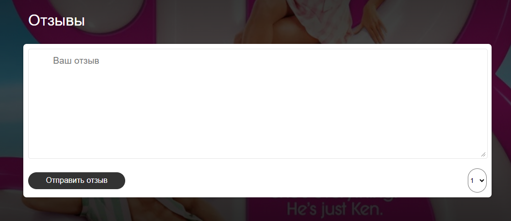
    - Написанный отзыв отображается последним на странице фильма.
    - При попытке отправить отзыв повторно, возникает предупреждение ``Вы уже писали отзыв `` и отзыв не отправляется.</br>
    
    - При попытке оставить отзыв содержащий JavaScript код, например такой как представлен ниже:</br>
    ``` html
        <script>alert(1);</script>
    ```
    возникает ошибка, имеющая следующий вид:``В вашем сообщении не должно быть спец символов. ``. Пример представлен ниже:</br>
    
    - После попытки ввода недопустимых символов(например спец. символов, таких как ``` <script> alert(1); </script> ```) остается возможность оставить допустимый отзыв.
    - __BUG:__ При попытке отправить пустой отзыв возникает предупреждение об использовании спец. символов.</br>
    
    - После написания отзыва в текстовое поле 'Ваш отзыв' и нажатия кнопки 'Отправить отзыв', комментарий отобразится в самом низу страницы фильма.
    - Отзывы с рейтингом 3 и ниже отображаются с красным фоном ``rgba(255, 229, 229, 0.9)``.</br>
    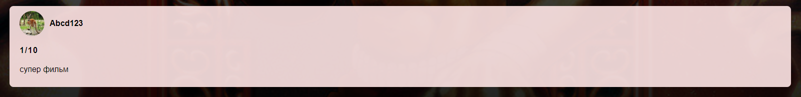
    - Отзывы с рейтингом от 4 до 6 отображаются с желтым фоном ``rgba(255, 240, 195, 0.9)``.</br>
    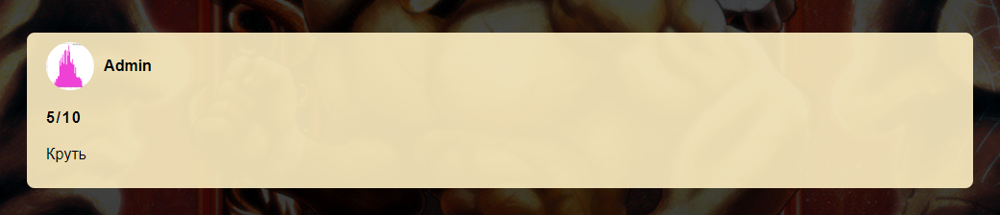
    - Отзывы с рейтингом от 7 отображаются с зеленым фоном ``rgba(189, 230, 189, 0.9)``.</br>
    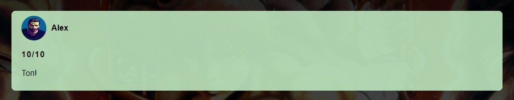
    - В отзывах отображается текущая аватарка пользователя. Аватарка должна быть круглой размером 50px*50px. С центрированным, актуальным фото пользователя.</br>
    
    - Необходимо оставить отзыв на странице фильма. Перейти через навигационное меню в Мой профиль -> [Настройки](https://movie-hub.ru/settings). Сменить аватарку. Проверить, что аватарка на отзыве, оставленном ранее, изменилась на новую.

1. Добавление фильма в избранное.
    - На странице фильма должен отображаться постер фильма в левом верхнем углу страницы. Размер постера 250px * 420px. В левом верхнем углу должен отражаться флажок размером 35px * 35px.</br>
    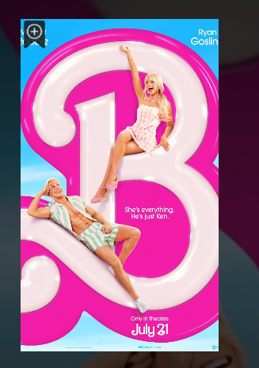
    - После нажатия на флажок на карточке фильма, происходит его добавление в избранное.
    - Переходим на страницу фильма. После нажатия на флажок на карточке фильма, происходит его добавление в избранное.
    - [Нажимаем на Мои фильмы на навигационном меню](https://movie-hub.ru/watchlist/films). Кликаем на крестик на карточке фильма. Фильм успешно удаляется из избранного.
    - Нажимаем на Мои фильмы на навигационном меню. Кликаем на карточку фильма, таким образом попадаем на страницу фильма. Нажимаем на флажок добавления/удаления в избранное. Фильм успешно удаляется из избранного.

1. Интерфейс страницы
    - В основной части страницы отображается информация о фильме с использованием следующего шрифта Montserrat, sans-serif. Название фильма с размером шрифта 57px. Остальная информация написана шрифтом 22px. Включает в себя год релиза, страну и жанры фильма. А также текстовое описание сюжета.</br>
    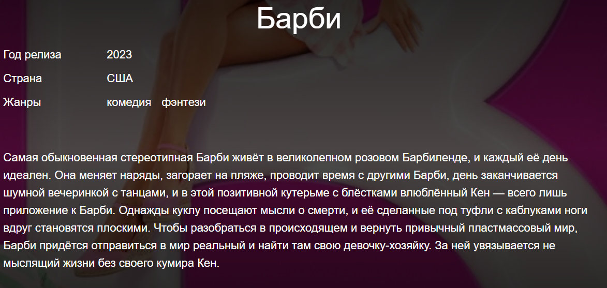
    - Под постером присутствует блок с оценкой фильма размером 350px * 100px с скруглением 10px. Данный блок содержит оценку фильма размером 60px * 60px, количество отзывов и тестовое поле оставить отзыв, при нажатии на которое страница переходит на форму написания отзыва.</br>
    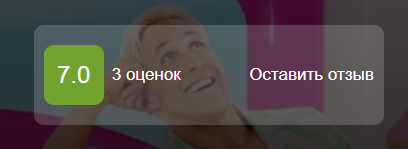
    - Под блоком с оценкой содержится блок с актерами, сыгравшими в данном фильме. Карточка актера - круг с размерами 100px * 100px. Под кругом отображается имя актера написанное 18px Montserrat, sans-serif шрифтом. При нажатии на карточку актера, происходит редирект на соответствующую страницу актера.</br>
    
    - На странице фильма присутствует элемент похожие фильмы. Заголовок 'Похожие фильмы' отображается и использованием шрифта 26px Montserrat, sans-serif. Карточка фильма представляет собой прямоугольник размером 200px * 300px. С подписанным ниже названием фильма шрифтом 18px Montserrat, sans-serif. Также на постере присутствует флажок в левом верхнем угле добавление в избранное фильма с размером 35px * 35px. Пресутсвуют элементы перемотки ленты - 2 круглые кнопки слева и справа цветом #4b0e0e и размером 50px * 50px.</br>
    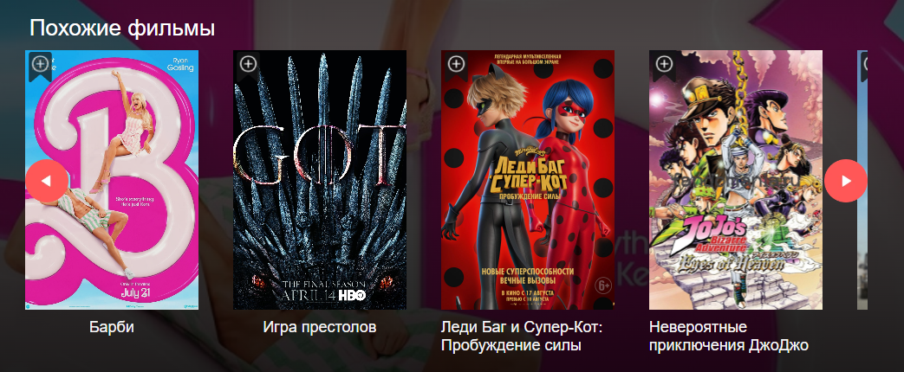

## Страница актера

<a id="actorPage"></a>

1. Добавление актера в избранное:
    - Переходим на страницу фильма. Кликаем на иконку актера. Кликаем на флажок добавления актера в избранное. Кликаем на элемент навигационного меню “Мои фильмы”. Далее любимые актеры. Любимый актер отображается корректно.
    - __BUG:__ Переходим через навигационное меню в Мои фильмы. Далее любимые актеры. При попытке удалить любимого актера(нажатие крестика на карточке актера) не происходит его удаление. Достаточно обновить страницу и карточка актера снова появляется.
    - __BUG:__ Переходим на страницу фильма. Далее на страницу актера, который был ранее добавлен в любимые актеры. При попытке удалить любимого актера (нажатие флажка на карточке актера) не происходит его удаление.
    - __BUG:__ При переходе на страницу актера, горит флажок, избранного актера, хотя его нет в любимых.

1. Интерфейс страницы
    - На странице актера должен отображаться фото актера в левом верхнем углу страницы. Размер фото 250px * 420px. В левом верхнем углу должен отражаться флажок размером 35px * 35px.</br>
    
    - В основной части страницы отображается информация об актере с использованием следующего шрифта Montserrat, sans-serif. Название фильма с размером шрифта 57px. Остальная информация написана шрифтом 22px. Включает в себя дата рождения, страну и жанры. А также текстовое описание биографии актера.</br>
    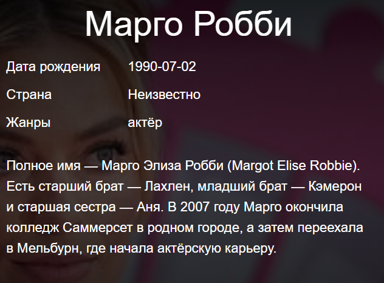
    - __BUG:__ Пункт жанры в описании актера не уместен.

## Авторизация и регистрация

<a id="regAuth"></a>

### Регистрация

- Проверка успешной регистрации с использованием валидных данных (существующий и валидный email (удовтретворяет условию /^[a-zA-Z0-9.]+@[a-zA-Z0-9.]+$/), имя пользователя латиницей или цифрами от 4 символов и выше, паролем латиницей длиннее 8 символов и содержащим хотя бы 1 цифру и 1 букву, датой рождения больше 6 лет от текущей даты).
- Если один из полей пуст, то появится ошибка: `` -Обязательное поле ``</br>


1. Поле e-mail
    - __BUG:__ При заполнении кириллицей появляется ошибка (хотя есть адреса и домены с кириллическими символами).
    - При наличии в базе введенной почты выдается ошибка в том, что такая почта уже существует.

1. Поле имени пользователя
    - При заполнении кириллицей появляется ошибка.
    - При заполнении поля 3 символами и меньше появляется ошибка: `` Логин должен быть длиннее 4 символов и состоять из латинских букв, цифр, - и _ ``.</br>
    
    - При заполнении смайликом появляется ошибка: `` Логин должен быть длиннее 4 символов и состоять из латинских букв, цифр, - и _ ``.</br>
    
    - При заполнении спец. символами возникает ошибка: `` Логин должен быть длиннее 4 символов и состоять из латинских букв, цифр, - и _ ``.</br>
    
    - При наличии в базе введенного логина выдается ошибка: `` Логин уже используется ``.</br>
    

1. Поля пароля и подтверждения пароля
    - При пустых полях появляется ошибка: `` - Обязательно поле ``.</br>
    
    - При несоответствии полей пароля и повторения пароля появляется ошибка: `` Пароли не одинаковые ``.</br>
    
    - При заполнении кириллицей появляется ошибка: `` Пароль должен содержать не менее 8 символов, иметь хотя бы одну заглавную букву, строчную латинскую букву и цифру ``.</br>
    
    - При заполнении пароля без цифр появляется ошибка: `` Пароль должен содержать не менее 8 символов, иметь хотя бы одну заглавную букву, строчную латинскую букву и цифру ``.
    - При заполнении пароля без букв появляется ошибка: `` Пароль должен содержать не менее 8 символов, иметь хотя бы одну заглавную букву, строчную латинскую букву и цифру ``.
    - При попытке заполнения пароля меньше чем 8 символами (латиницей и содержащим хотя бы 1 цифру и 1 букву), появляется ошибка: `` Пароль должен содержать не менее 8 символов, иметь хотя бы одну заглавную букву, строчную латинскую букву и цифру ``.

1. Поле дня рождения
    - При попытке ввода дня меньше 6 лет назад выдается ошибка.
    - __BUG:__ При попытке ввода дня больше 100 лет назад выдается ошибка, хотя есть люди старше 100 лет.
    - Ввод любых символов, помимо цифр блокируется.

### Авторизация

- При вводе существующего имени и правильного пароля авторизации (и аутентификация) проходят успешно. Успешная вход в аккаунт.
- При вводе неправильного пароля появляется ошибка `` Ошибка пароля или логина ``.</br>

- При вводе несуществующего имени появляется ошибка `` Ошибка пароля или логина ``.
- При нажатии кнопки “Войти” с незаполненными полями имени и пароля появляется ошибка`` - Обязательно поле ``.</br>


### Интеграция

- После успешной регистрации происходит автоматическая авторизация ([успешный вход на главную страницу](https://movie-hub.ru)).
- В случае неуспешного заполнения хотя бы одного и полей, регистрация блокируется.
- При нажатии кнопки "Зарегистрироваться" произойдет [переход на страницу регистрации](https://movie-hub.ru/registration).
- При нажатии кнопки "Авторизоваться" произойдет [переход на страницу авторизации](https://movie-hub.ru/login).

## Настройки

<a id="setup"></a>

По-умолчанию запрещено изменять данные профиля, необходимо нажать на кнопку редактирования.

1. Аватарка
    - У нового пользователя отображается аватарка по умолчанию.
    - При нажатии на кнопку изменения аватарки появляется системный интерфейс выбора файла для загрузки на сайт.
    - Предлагаемые расширения загружаемых файлов jpg, jpeg, png, webp.
    - Загруженное изображение сразу отображается.
    - Изменение аватарки применяется после нажатия кнопки "сохранить".

1. Дата рождения
    - Дата рождения соответствует дате, указанной при регистрации
    - Дата рождения отображается в формате ДД.ММ.ГГГГ.
    - При попытке ввода дня меньше 6 лет назад выдается ошибка.
    - __BUG:__ При попытке ввода дня больше 100 лет назад выдается ошибка, хотя есть люди старше 100 лет.
    - Невозможно сохранить незаполненое поле даты рождения.
    - Изменения email применяются после нажатия "сохранить".

1. Email
    - При пустом поле появляется ошибка.
    - При заполнении поля невалидной почтой (без символа @) появляется ошибка.
    - __BUG:__ При заполнении кириллицей появляется ошибка (хотя есть адреса и домены с кириллическими символами).
    - При наличии в базе введенной почты выдается ошибка в том, что такая почта уже существует.

1. Пароль и подтверждение пароля
    - При заполнении валидным паролем (латиницей длиннее 8 символов и содержащим хотя бы 1 цифру и 1 букву) изменение пароля проходит успешно.
    - При заполнении невалидным паролем (латиницей менее 8 символов и несодержащим хотя бы 1 цифру и 1 букву) появляется ошибка.
    - При пустых полях изменение пароля не произойдёт.
    - При несоответствии полей пароля и повторения пароля появляется ошибка.
    - При валидных данных нас перебрасывает в режим чтения с уже новыми данными.

## Статистика по фильмам

<a id="stats"></a>

- После написания отзыва на фильм, в раскрывающемся списке “Мой профиль” в навигационного меню, в панели “Статистика”, появляются столбики гистограммы с соответствующими текущему фильму жанрами.</br>

- В случае отсутствия отзывов на фильмы, в раскрывающемся списке “Мой профиль” в навигационного меню, в панели “Статистика”, будут отсутствовать гистрограммы по жанрам.</br>

- числа правее (над столбиками) соответствуют средней оценке в комментариях к данному фильму.
- числа левее гистограммы отражают количество комментариев, к фильмам в данном жанре.
- __BUG:__ пункт Последние фильмы” отображает посещенные страницы фильмов справа-налево.

## Расширенный поиск по фильмам и актерам

1. Поиск по фильмам
    - При вводе названия фильма (любой длинной), рейтинга от 0 до 10, даты выпуска от текущего времени и позже, выборе определенных жанров, в ответе возвращаются соответствующие фильмы.
    - При нажатии на кнопку поиска без настройки фильтров выдаются все существующие фильмы.
    - __BUG:__ При вводе символов в поля рейтинга поиск выдаёт список всех фильмов.</br>
    </br>
    
    - Когда флажок в неактивном положении выдаётся список фильмов вне зависимости от возрастных ограничений.</br>
    
    - Когда флажок в активном положении выдаётся список фильмов только 18+.</br>
    
    - __BUG:__ При вводе нулевого дня и нулевого месяца ещё не наступившего года в ответе возвращаются все существующие фильмы.</br>
    </br>
    
    - При вводе одного актера результаты поиска выдают соответствующие фильмы с выбранным актером.
    - __BUG:__ При вводе нескольких актёров поиск фильма срабатывает только по первому актёру.</br>
    </br>
    

1. Поиск по актерам
    - При нажатии кнопки “Показать результат” выдаются все актеры/фильмы.
    - при вводе, с полным соответствием, искомого параметра целевому, выводиться соответствующий актер.
    - Если при поиске ничего не найдено, то выдается соответствующее сообщение.

## Календарь

- __BUG__ Название месяца пишется по английски.
- __BUG__ Неверное количество дней в месяце. В марте дней 31, а в календаре 30.
- __BUG__ При нажатии на пространство между днями нас редиректит на /film/undefined.</br>
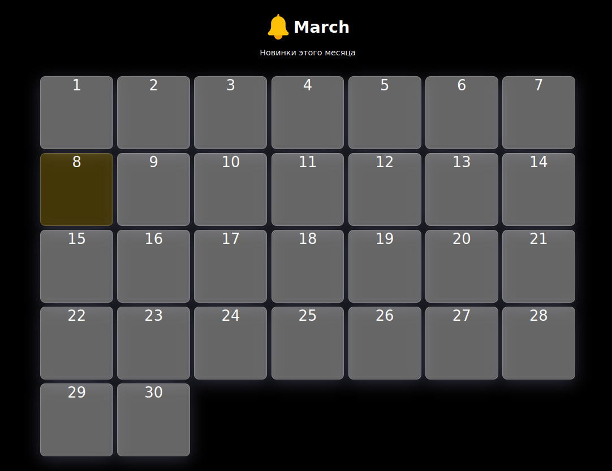
- При нажатии на ячейку с назначенным релизом фильма нас редиректит на страницу фильма.</br>
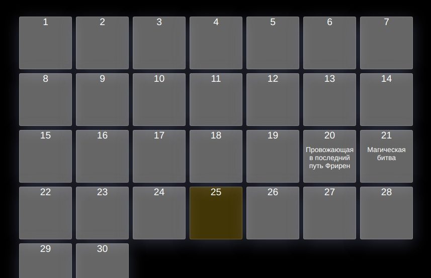
- При нажатии на колокольчик (подписка на уведомления о выходе нового фильма) в авторизованном режиме появляется табличка с предложением разрешить принимать уведомления.
- При нажатии на колокольчик (подписка на уведомления о выходе нового фильма) в неавторизованном режиме происходит редирект на авторизацию. После авторизации происходит редирект на главную страницу и появляется табличка с предложением разрешить принимать уведомления.
