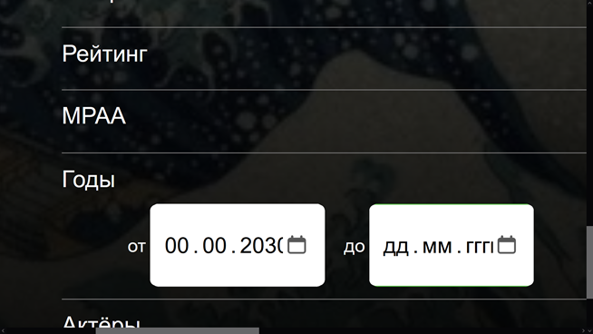

# MovieHub

[Ссылка на проект](https://movie-hub.ru/)

Проект "Кинопоиск" команды Вкладыши

MovieHub - - это агрегатор фильмов, сериалов, актёров, режиссеров и пр. В нашем сервисе пользователь получает:

- Сервис предоставляет возможность поиска фильма по тегам, году выпуска, актёрам, названию и т. д.
- Пользователи могут обсуждать понравившиеся фильмы, оценивать их и влиять на выбор других пользователей.
- Сервис предлагает подборку фильмов по тегам.
- Сервис помогает отслеживать последние фильмы и оставаться в курсе всех новинок.
- Сервис предоставляет информацию об актёрах.
- Сервис предоставляет пользователю возможность сохранять интересные ему фильмы и актеров в избранном.

# Тестовые отчеты

* [Страница фильма](#filmPage)
* [Страница актера](#actorPage)
* [Авторизация и регистрация](#regAuth)
* [Настройки](#setup)
* [Статистика](#stats)
* [Расширенный поиск по фильму и актеру](#extendedSearch)


## Страница фильма:
<a id="filmPage"></a>

1. Отзывы на странице фильма
    * Отзыв отображается на странице фильма.
    * При попытке отправить отзыв повторно, возникает предупреждение ``Вы уже писали отзыв `` и отзыв не отправляется.

    
    * При попытке оставить отзыв содержащий JavaScript код, например такой как представлен ниже:
    ``` html
    <script>alert(1);</script>
    ```
    возникает ошибка, имеющая следующий вид:``В вашем сообщении не должно быть спец символов. ``. Пример представлен ниже:
    
    

    * После попытки ввода недопустимых символов(например спец. символов, например таких как ``` <script> alert(1); </script> ```) остается возможность оставить допустимый отзыв.
    * __BUG:__ При попытке отправить пустой отзыв возникает предупреждение об использовании спец. символов.
    
    

    * После написания отзыва в инпут - "Ваш отзыв" и при нажатии кнопки "Отправить отзыв". На странице фильма самым последним (нижним) появиться, написанный отзыв.
    * Отзывы с рейтингом 3 и ниже отображаются с красным фоном.
    * Отзывы с рейтингом от 4 до 6 отображаются с желтым фоном.
    * Отзывы с рейтингом от 7 отображаются с зеленым фоном.
    * В отзывах корректно отображается текущая аватарка пользователя.
    * Необходимо авторизоваться, оставить отзыв на странице фильма. Перейти через навигационное меню в Мой профиль -> Настройки. Сменить аватарку. Проверить, что аватарка на отзыве, оставленном ранее, изменилась на новую.

1. Добавление фильма в избранное.
    * Нажимаем на лупу в навигационном меню. После нажатия на флажок на карточке фильма, происходит его добавление в избранное.
    * Нажимаем на лупу в навигационном меню. Переходим на страницу фильма. После нажатия на флажок на карточке фильма, происходит его добавление в избранное.
    * Нажимаем на Мои фильмы на навигационном меню. Кликаем на крестик на карточке фильма. Фильм успешно удаляется из избранного.
    * Нажимаем на Мои фильмы на навигационном меню. Кликаем на карточку фильма, таким образом попадаем на страницу фильма. Нажимаем на флажок добавления/удаления в избранное. Фильм успешно удаляется из избранного.

## Страница актера
<a id="actorPage"></a>

1. Добавление актера в избранное:
    * Переходим на страницу фильма. Кликаем на иконку актера. Кликаем на флажок добавления актера в избранное. Кликаем на элемент навигационного меню “Мои фильмы”. Далее любимые актеры. Любимый актер отображается корректно.
    * __BUG:__ Переходим через навигационное меню в Мои фильмы. Далее любимые актеры. При попытке удалить любимого актера(нажатие крестика на карточке актера) не происходит его удаление. Достаточно обновить страницу и карточка актера снова появляется.
    * __BUG:__ Переходим на страницу фильма. Далее на страницу актера, который был ранее добавлен в любимые актеры. При попытке удалить любимого актера (нажатие флажка на карточке актера) не происходит его удаление.
    BUG: При переходе на страницу актера, горит флажок, избранного актера, хотя его нет в любимых.


## Авторизация и регистрация
<a id="regAuth"></a>

### Регистрация

1. Поле e-mail
    * При заполнении реальным e-mail регистрации проходит успешно. Регулярное выражение валидирующее поле e-mail:
    ``
        /^[a-zA-Z0-9.]+@[a-zA-Z0-9.]+$/
    ``
    * При пустом поле появляется ошибка: `` *Обязательное поле ``
    
    
    * При заполнении поля невалидной почтой (без символа @) появляется ошибка.
    * __Bug__ При заполнении кириллицей появляется ошибка (хотя есть адреса и домены с кириллическими символами).
    * При наличии в базе введенной почты выдается ошибка в том, что такая почта уже существует.

1. Поле имени пользователя
    * При заполнении латиницей или цифрами от 4 символов и выше, регистрация проходит успешно.
    * При пустом поле появляется ошибка.
    * При заполнении кириллицей появляется ошибка.
    * При заполнении поля 3 символами и меньше появляется ошибка: `` Логин должен быть длиннее 4 символов и состоять из латинских букв, цифр, - и _ ``.
    
    
    * При заполнении смайликом появляется ошибка: `` Логин должен быть длиннее 4 символов и состоять из латинских букв, цифр, - и _ ``.
    
    
    * При заполнении спец. символами возникает ошибка: `` Логин должен быть длиннее 4 символов и состоять из латинских букв, цифр, - и _ ``.
    
    
    * При наличии в базе введенного логина выдается ошибка: `` Логин уже используется ``.
    
    

1. Поля пароля и подтверждения пароля
    * При заполнении валидным паролем (латиницей длиннее 8 символов и содержащим хотя бы 1 цифру и 1 букву) регистрация проходит успешно.
    * При пустых полях появляется ошибка: `` * Обязательно поле ``.
    
    

    * При несоответствии полей пароля и повторения пароля появляется ошибка: `` Пароли не одинаковые ``.
    
    
    
    * При заполнении кириллицей появляется ошибка: `` Пароль должен содержать не менее 8 символов, иметь хотя бы одну заглавную букву, строчную латинскую букву и цифру ``.
    
    
    * При заполнении пароля без цифр появляется ошибка: `` Пароль должен содержать не менее 8 символов, иметь хотя бы одну заглавную букву, строчную латинскую букву и цифру ``.
    * При заполнении пароля без букв появляется ошибка: `` Пароль должен содержать не менее 8 символов, иметь хотя бы одну заглавную букву, строчную латинскую букву и цифру ``.
    * При попытке заполнения пароля меньше чем 8 символами (латиницей и содержащим хотя бы 1 цифру и 1 букву), появляется ошибка: `` Пароль должен содержать не менее 8 символов, иметь хотя бы одну заглавную букву, строчную латинскую букву и цифру ``.

1. Поле дня рождения
    * При вводе дня больше 6 лет назад регистрация проходит успешно.
    * При попытке ввода дня меньше 6 лет назад выдается ошибка.
    * __Bug__ При попытке ввода дня больше 100 лет назад выдается ошибка, хотя есть люди старше 100 лет.
    * Ввод любых символов, помимо цифр блокируется.

### Авторизация

* При вводе существующего имени и правильного пароля авторизации (и аутентификация) проходят успешно. Успешная вход в аккаунт. Параметры тестового аккаунта:

``` JSON
    login: Abcd;
    password: Abcd123456;
```

* При вводе неправильного пароля появляется ошибка `` Ошибка пароля или логина ``.


* При вводе несуществующего имени появляется ошибка `` Ошибка пароля или логина ``.
* При нажатии кнопки “Войти” с незаполненным полем имени или пароля появляется ошибка`` * Обязательно поле ``.


### Интеграция

* После успешной регистрации происходит автоматическая авторизация ([успешный вход на главную страницу](https://movie-hub.ru)).
* В случае неуспешного заполнения хотя бы одного и полей, регистрация блокируется.
* При нажатии кнопки "Зарегистрироваться" произойдет [переход на страницу регистрации](https://movie-hub.ru/registration).
* При нажатии кнопки "Авторизоваться" произойдет [переход на страницу авторизации](https://movie-hub.ru/login).


## Настройки
<a id="setup"></a>

По-умолчанию запрещено изменять данные профиля, необходимо нажать на кнопку редактирования.

1. Аватарка
    * У нового пользователя отображается аватарка по умолчанию
    * При нажатии на кнопку изменения аватарки появляется системный интерфейс выбора файла для загрузки на сайт.
    * Предлагаемые расширения загружаемых файлов jpg, jpeg, png, webp.
    * Загруженное изображение сразу отображается.
    * Изменение аватарки применяется после нажатия кнопки "сохранить" .

1. Дата рождения
    * Дата рождения соответствует дате, указанной при регистрации
    * Дата рождения отображается в формате ДД.ММ.ГГГГ 
    * При попытке ввода дня меньше 6 лет назад выдается ошибка.
    * _Bug_ При попытке ввода дня больше 100 лет назад выдается ошибка, хотя есть люди старше 100 лет.
    * Невозможно сохранить незаполненое поле даты рождения.
    * Изменения email применяются после нажатия "сохранить"

1. Email
    * При пустом поле появляется ошибка.
    * При заполнении поля невалидной почтой (без символа @) появляется ошибка.
    * __Bug__ При заполнении кириллицей появляется ошибка (хотя есть адреса и домены с кириллическими символами).
    * При наличии в базе введенной почты выдается ошибка в том, что такая почта уже существует.

1. Пароль и подтверждение пароля
    * При заполнении валидным паролем (латиницей длиннее 8 символов и содержащим хотя бы 1 цифру и 1 букву) изменение пароля проходит успешно.
    * При заполнении невалидным паролем (латиницей менее 8 символов и несодержащим хотя бы 1 цифру и 1 букву) появляется ошибка.
    * При пустых полях изменение пароля не произойдёт.
    * При несоответствии полей пароля и повторения пароля появляется ошибка.
    _* При совпадении уникальных данных (телефон, email) появляется сообщение о совпадении._
    * При валидных данных нас перебрасывает в режим чтения с уже новыми данными.


## Статистика по фильмам
<a id="stats"></a>

* После написания отзыва на фильм, в раскрывающемся списке “Мой профиль” в навигационного меню, в панели “Статистика”, появляются столбики гистограммы с соответствующими текущему фильму жанрами.


* В случае отсутствия отзывов на фильмы, в раскрывающемся списке “Мой профиль” в навигационного меню, в панели “Статистика”, будут отсутствовать гистрограммы по жанрам.


* числа правее (над столбиками) соответствуют средней оценке в комментариях к данному фильму.
* числа левее гистограммы отражают количество комментариев, к фильмам в данном жанре.
* BUG: пункт Последние фильмы” отображает посещенные страницы фильмов справа-налево.


## Расширенный поиск по фильмам и актерам

### Поиск по фильмам

* При вводе названия фильма (любой длинной), рейтинга от 0 до 10, даты выпуска от текущего времени и позже, выборе определенных жанров, в ответе возвращаются соответствующие фильмы.
* При нажатии на кнопку поиска без настройки фильтров выдаются все существующие фильмы.
_* При выборе определенных жанров будут выдаваться соответствующие фильмы._
* __BUG:__ При вводе символов в поля рейтинга поиск выдаёт список всех фильмов.


* Когда флажок в неактивном положении выдаётся список фильмов вне зависимости от возрастных ограничений.


* Когда флажок в активном положении выдаётся список фильмов только 18+.


* __BUG:__ При вводе нулевого дня и нулевого месяца ещё не наступившего года в ответе возвращаются все существующие фильмы.

__

_* При вводе валидного диапазона дат в ответе возвращаются соответствующие фильмы._
_* При вводе одного актёра поиск фильма срабатывает полностью._
* __BUG:__ При вводе нескольких актёров поиск фильма срабатывает только по первому актёру.


### Поиск по актерам

* При нажатии кнопки “Показать результат” выдаются все актеры/фильмы
* при вводе, с полным соответствием, искомого параметра целевому, выводиться соответствующий актер
* Если при поиске ничего не найдено, то выдается соответствующее сообщение
